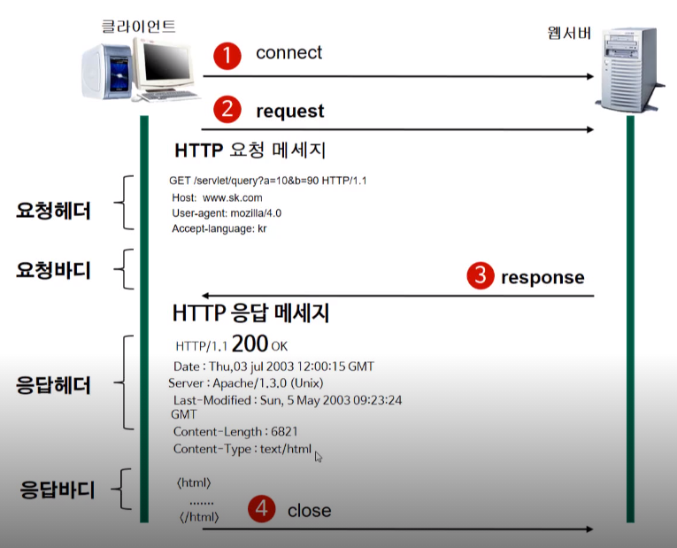

# HTTP 프로토콜

## ❗️HTTP 프로토콜이란?
* HTTP(Hypertext Transfer Protocol)은 인터넷상에서 데이터를 주고 받기 위한 서버/클라이언트 모델을 따르는 프로토콜로 80번 포트를 사용한다.
* 애플리케이션 레벨의 프로토콜로 TCP/IP 위에서 작동한다.
* HTTP로 보낼 수 있는 데이터는 HTML문서, 이미지, 동영상, 오디오, 텍스트 문서 등 여러 종류가 있다.

## ❗️HTTP 특징과 장단점
* HTTP 메시지는 HTTP 서버와 클라이언트에 의해 해석된다.
* 연결 상태를 유지하지 않는 `비연결성 프로토콜`이다. 서버가 클라이언트에게 받은 요청을 응답 결과로 만들어서 응답을 하고 나면 바로 클라이언트와의 연결을 끊는다.
    
* 요청이 끝나고 나면 `서버는 클라이언트의 이전 상황을 알 수 없다`. 이런 특징을 `무상태(Stateless)`라고 한다.

### 장점
* 계속 서버와 클라이언트의 연결상태를 유지하는 것이 아니기 때문에 `클라이언트와 서버간의 최대 연결수보다 훨씬 많은 요청과 응답을 처리 가능`하다.
* `불특정 다수`를 대상으로 하는 서비스에 적합하다.

### 단점
* 위에서 언급한 대로 연결을 끊어버리기 때문에 무상태(Stateless)에 돌입한다.
* 이를 해결하기 위해 Cookie와 Session이 등장했다.

## ❗️HTTP 동작방식

* **서버**: 어떠한 자료에 대한 접근을 관리하는 네트워크상의 시스템(요청을 받아 응답을 보내준다.)
* **클라이언트**: 그자료에 접근할 수 있는 프로그램(웹 브라우저, 핸드폰 어플리케이션 등)
* **connect**: 클라이언트가 원하는 서버에 접속
* **request**: 클라이언트가 서버에 요청하는 메세지
* **response**: 서버가 요청에 대한 응답결과를 클라이언트에게 보내는 메세지. 응답이 끝나면 바로 연결을 끊는다.

### HTTP 구조

* HTTP는 TCP/IP 위에서 작동하는 Stateless 프로토콜이며 `Method`, `Path`, `Version`, `Headers`, `Body` 등으로 구성된다.
* HTTP는 암호화가 되지 않은 평문 데이터를 전송하는 프로토콜이기 때문에 비밀번호나 주민등록번호와 같은 암호화가 필요한 데이터를 전송하기 위해 [HTTPS](02.%20HTTP%20vs%20HTTPS.md)가 등장한다.

## ❗️References
* [effortDev](https://shlee0882.tistory.com/107)
* [sujeong.log](https://velog.io/@sujeong/2-%EC%9B%B9%EC%9D%98-%EB%8F%99%EC%9E%91-HTTP-%ED%94%84%EB%A1%9C%ED%86%A0%EC%BD%9C-%EC%9D%B4%ED%95%B4)