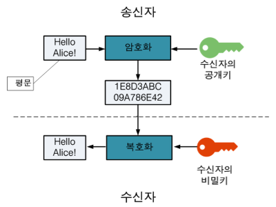
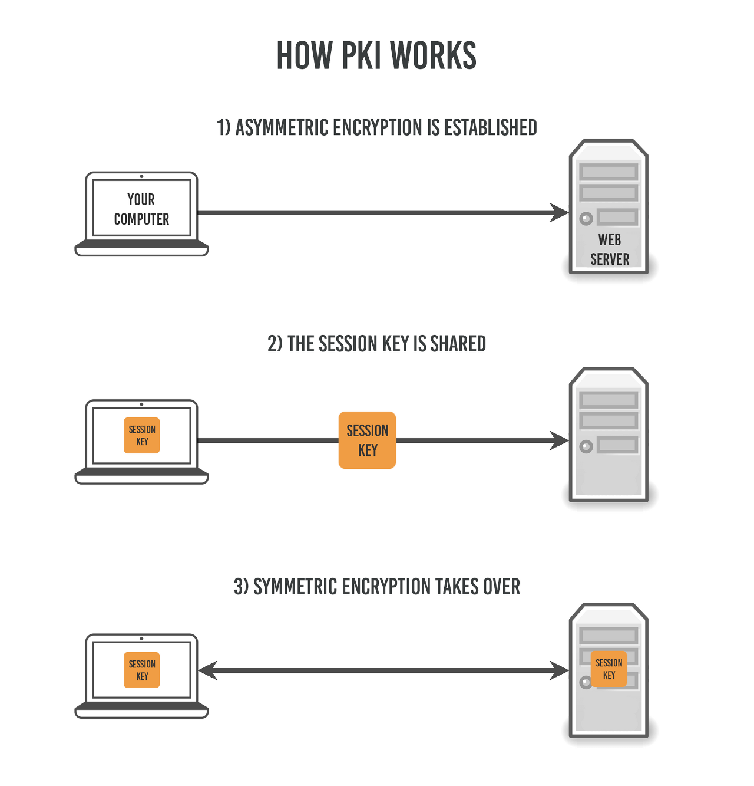

# HTTP vs HTTPS

## ❗️HTTP란?
* [이전 문서](01.%20HTTP%20프로토콜.md) 에서 정의와 특징, 동작방식을 알아봤다.

## ❗️HTTPS란?
* Hyper Text Transfer Protocol `over Secure Socket Layer`의 약자로 `HTTP over TLS`, `HTTP over SSL`, `HTTP Secure` 등으로 불린다.
* `HTTP에 데이터 암호화가 추가된 프로토콜`이다. 
* 443번 포트를 사용하며, 네트워크 상에서 중간에 제 3자가 정보를 볼 수 없도록 암호화를 지원한다.

## ❗️암호화 방식
* HTTPS는 `대칭키 암호화 방식`과 `비대칭키 암호화 방식`을 모두 사용한다.

### 대칭키 암호화
* 클라이언트와 서버가 동일한 키를 사용해 암호화/복호화를 진행한다.
* 키가 노출되면 매우 위험하지만 연산속도가 빠르다.
* 군대의 암구호같은 개념

### 비대칭키 암호화
* 1개의 쌍으로 구성된 공개키와 개인키를 암호화/복호화 하는데 사용한다.
* 키가 노출되어도 비교적 안전하지만 연산속도가 느리다.
* `공개키/개인키 암호화 방식`을 이용해 데이터를 암호화한다. 공개키와 개인캐는 서로를 위한 1쌍의 키이다.
  * 공개키: 모두에게 공개가능한 키
  * 개인키: 나만 가지고 알고 있어야 하는 키
* 암호화를 공개키로하는가 개인키로 하는가에 따라 얻는 효과는 다음과 같다.
    
  * 공개키 암호화: 공개키로 암호화를 하면 개인키로만 복호화 할 수 있는 방식 → 개인키는 나만 가지고 있으므로 `나만 데이터를 확인`할 수 있다.
  * 개인키 암호화: 개인키로 암호화하면 공개키로만 복호화할 수 있는 방식 → 공개키는 모두에게 공개되어 있고 암호화를 개인키로 했으므로 내가 인증한 정보임을 알려 `신뢰성을 보장`할 수 있다.

## ❗️HTTPS의 동작방식

* HTTPS는 `연결과정(handshake)`에서 먼저 서버와 클라이언트 간 세션키를 교환한다.
* `세션키`는 주고 받는 데이터를 `빠른 연산 속도`로 암호화 하기 위해 사용되는 `대칭키`이다.
* 이 `세션키를 클라이언트와 서버가 교환`할 때 `비대칭키`를 사용하여 `안정성`을 얻는다.

## ❗️HTTP vs HTTPS
* HTTP는 암호화 기능이 없기 때문에 보안에 취약한 반면 HTTPS는 안전하게 데이터를 주고 받을 수 있다.
* 암호화/복호화 과정때문에 필연적으로 HTTP보다 속도가 느리다.
* 또한 HTTPS는 인증서를 발급하고 유지하기 위한 추가 비용이 발생한다.
* 노출되어도 상관없는 단순한 데이터를 다룰 땐 HTTP를, 개인 정보와 같은 민감한 데이터를 다룰 땐 HTTPS를 이용하는 것이 좋다.

## ❗️References
* [망나니개발자](https://mangkyu.tistory.com/98)
* [TIPTOPSECURITY](https://tiptopsecurity.com/how-does-https-work-rsa-encryption-explained/)