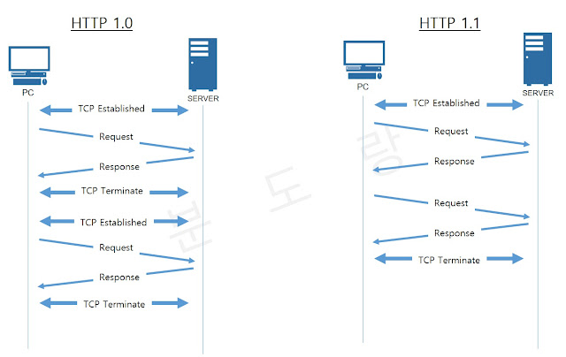
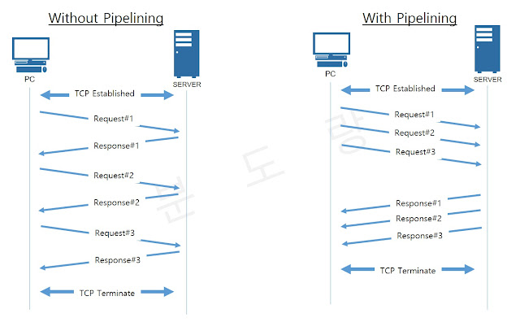
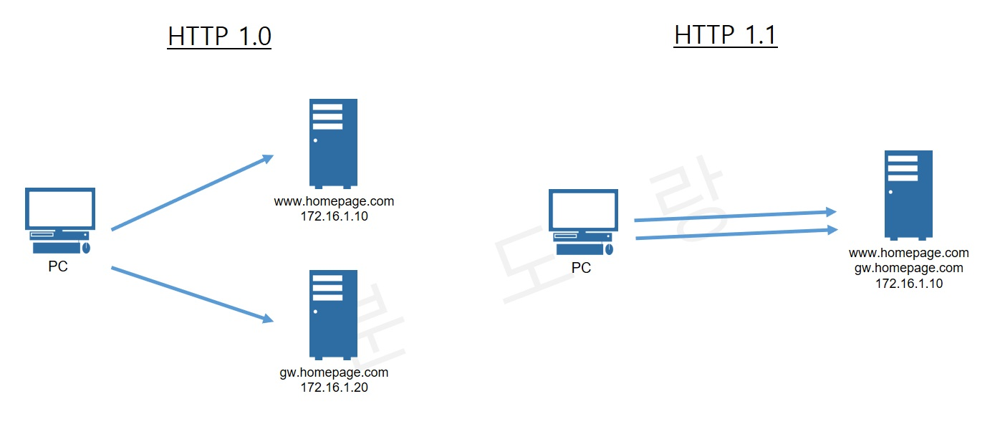

# HTTP 1.0 & 1.1

## ❗️HTTP 1.0
* 브라우저 친화적인 프로토콜
* 요청 및 응답에 대한 메타 데이터를 포함하는 헤더 필드 제공(Status code, Content-Type 등)
* `Response`: Content-Type에 Http 파일 외에도 스크립트, 스타일 시트, 미디어 등을 전송 가능
* `Method`: GET, HEAD, POST
* `Connection 특성`: 응답 직후 종료

### 단점
* 각 모든 요청에 따라 새로운 연결을 열고 응답이 전송된 후 즉시 닫기 때문에 새로운 `연결이 설정 될 때마다 TCP 3-way Handshake가 발생`한다.

## ❗️HTTP 1.1
* 오늘날 가장 많이 사용되는 HTTP 버전
* `Method`: GET, HEAD, POST, PUT, DELETE, TRACE, OPTIONS
* `connection 특성`: long-lived
* HTTP 1.1의 가장 큰 특징은 다음 세 가지로 표현된다.
  1. 커넥션 유지 (Persistent Connection)
  2. 호스트 헤더 (Host Header)
  3. 강력한 인증 절차 (Improved Authentication Procedure)

### 1. 커넥션 유지 (Persistent Connection)
* HTTP 프로토콜은 클라이언트-서버 간 데이터를 주고 받는 응용 계층의 프로토콜이다.
* HTTP를 이용한 데이터 전달은 TCP 세션 기반에서 이루어진다.
* HTTP 1.0과 1.1의 차이는 `TCP 세션을 지속적으로 유지`할 수 있는가 없는가에 있다.
    
* HTTP 1.0은 요청 컨텐츠마다 TCP 세션을 새로 맺는다. (`1 GET / 1 Connection`)
* HTTP 1.1은 Persistent 기능을 이용하여 한개의 TCP 세션을 통해 여러 컨텐츠 요청이 가능하다. (`N GET / 1 Connection`)
* 이를 통해 서버는 TCP 세션 처리 부하를 줄일 수 있기에 좋고 그만큼 클라이언트는 응답속도가 개선되어 좋다.

### 1-1. 파이프라이닝 (Pipelining)
* Persistent 기능을 통한 커넥션 유지와 함께 HTTP 1.1에서 지원되는 기능이다.
    
* HTTP 요청은 순차적으로 이루어진다.
* 먼저 들어온 요청을 처리해야 다음 요청을 진행하는데 앞선 요청에 대한 응답이 없는 경우 그 뒤의 요청은 진행되지 못하게 되어 문제가 생긴다.
* 파이프라이닝은 이를 개선하여 각각의 요청에 대한 응답을 처리한다.
* 이는 응답 속도를 높혀 페이지 뷰의 속도를 빠르게 할 수 있는 기능이다.

### 2. 호스트 헤더 (Host Header)

* HTTP 1.0 환경에서는 하나의 IP에 여러 개의 도메인을 운영할 수 없다.
* 도메인 마다 IP를 구분해서 준비해야 해서 도메인 만큼 서버의 개수도 늘어날 수 밖에 없는 구조였다.
* HTTP 1.1에서는 `호스트 헤더의 추가`를 통해 `버츄얼 호스팅`이 가능해졌다.

### 3. 강력한 인증 절차 (Improved Authentication Procedure)
* HTTP 1.1에서 다음 2개의 헤더가 추가되었다.
  * proxy-authentication
  * proxy-authorization
* 실제 서버에서 클라이언트 인증을 요구하는 www-authentication 헤더는 HTTP 1.0에서부터 지원이 되어 왔으나 클라이언트와 서버 사이에 프록시가 위치하는 경우 프록시가 사용자의 인증을 요구할 수 있는 방법이 없었다.

### 단점
1. **HOL Blocking**
* Head Of Line Blocking은 파이프라이닝 과정에서 순차적인 여러 요청을 연속적으로 받을 때 이전에 받은 응답이 길어지면 그 이후의 응답들이 지연되는 것을 뜻한다.
* 예를 들어 다음과 같이 3개의 이미지를 받기 위해 순서대로 요청을 보냈다고 할 때 a.png의 응답이 길어지면 뒤의 응답도 그에 따라 지연된다.
    ```
    |-------- a.png ---------/
                              |--- b.png ---/
                                             |--- c.png ---/
    ```

2. **RTT(Round Trip Time) 증가**
* RTT는 요청(SYN)을 보낼 때부터 요청에 대한 응답(SYN+ACK)을 받을 때까지의 왕복시간을 뜻한다.
* TCP 상에서 동작하는 HTTP 특성상 Handshake가 반복적으로 일어나고 불필요한 RTT증가와 네트워크 지연을 초래하여 성능을 저하시키게 된다.

3. **무거운 헤더 구조**
* HTTP 1.1의 헤더에는 많은 메타정보들이 저장되어 있다. 사용자가 방문한 웹페이지는 다수의 HTTP 요청이 발생하게 되는데 이 경우, 매 요청마다 중복된 헤더값을 전송하게 되고 해당 도메인에 설정된 쿠키정보도 매 요청시 마다 헤더에 포함되어 전송값보다 헤더가 큰 경우도 생긴다.
## ❗️References
* [놀코](https://playcode.tistory.com/114)
* [분도랑](https://withbundo.blogspot.com/2021/02/http-http-10-http-11.html)
* [pageseo](https://gngsn.tistory.com/99)