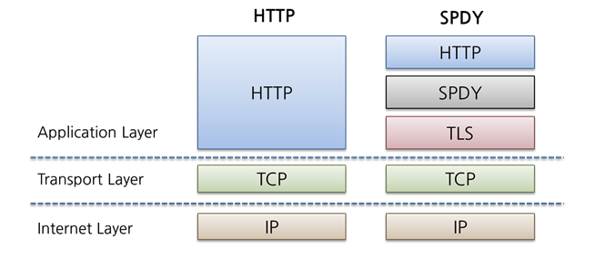
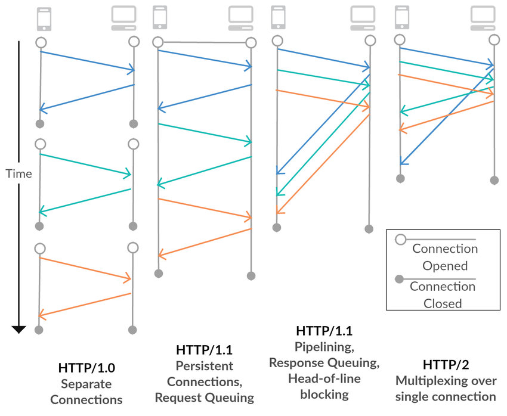

# HTTP 2

## ❗️SPDY

* 구글은 더 빠른 Web을 실현하기 위해 Latency 관점에서 HTTP를 고속화한 SPDY(스피디) 라 불리는 새로운 프로토콜을 구현했다.
* SPDY는 HTTP를 대치하는 프로토콜이 아니고 HTTP를 통한 전송을 재 정의하는 형태로 구현 되었다.
* SPDY는 실제로 HTTP/1.1에 비해 상당한 성능 향상과 효율성을 보여줬고 이는 HTTP/2 초안의 참고 규격이 되었다.

## ❗️HTTP 2
> The focus of the protocol is on performance; specifically, end-user perceived latency, network and server resource usage. One major goal is to allow the use of a single connection from browsers to a Web site. 
* HTTP2 Github 를 보면 HTTP 2는 HTTP 1의 확장으로 기존의 호환성을 유지하며 성능에 초점을 맞춘 프로토콜임을 알 수 있다.

### **Multiplexed Streams**
* HTTP 2는 `하나의 TCP 연결`을 통해 여러 데이터 요청을 stream을 통해 `병렬`로 전송할 수 있다.

### **Stream Prioritization**
* 클라이언트가 선호하는 응답 수신 방식을 지정해서 응답을 받을 수 있다.
* CSS 파일 1개와 이미지 파일 2개가 존재하고 이를 클라이언트가 요청한다고 가정하면
  * 이미지 파일보다 CSS 파일의 수신이 늦어진다면 브라우저 렌더링에 문제가 생기게 될 수 있다.
  * HTTP 2에서는 이러한 상황을 고려하여 리소스 간의 의존관계에 따른 우선순위를 설정하여 리소스 로드 문제를 해결할 수 있다.

### **Server Push**
* 서버는 요청되지 않았지만 향후 요청에서 예상되는 추가 정보를 클라이언트에 전송할 수 있다.
* 리소스 

## ❗️References
* [pageseo](https://gngsn.tistory.com/99)
* [ziyoonee.log](https://velog.io/@ziyoonee/HTTP1-%EB%B6%80%ED%84%B0-HTTP3-%EA%B9%8C%EC%A7%80-%EC%95%8C%EC%95%84%EB%B3%B4%EA%B8%B0)