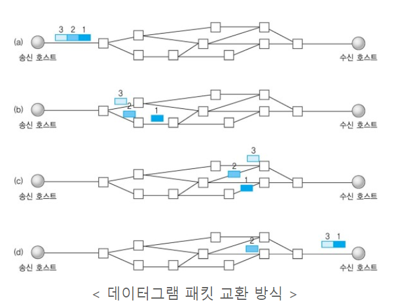

# **TCP와 UDP의 차이점**
* 전송계층에서 `데이터의 전달을 위해 사용하는 프로토콜`은 TCP와 UDP가 있다.

## ❗️**TCP(Transmission Control Protocol)**
* TCP를 해석하면 전송을 제어하는 프로토콜이라는 뜻인데 TCP의 정의가 바로 그렇다.
    > 인터넷 상에서 데이터를 메세지의 형태로 보내기 위해 IP와 함께 사용하는 프로토콜
* 일반적으로 TCP와 IP를 함께 사용하는데 `IP가 데이터의 배달을 처리`한다면 `TCP는 패킷을 추적 및 관리`하게 된다.
* TCP는 연결형 서비스를 지원하는 프로토콜로 인터넷 환경에서 기본적으로 사용한다.
* 데이터의 `흐름제어`나 `혼잡제어`의 기능도 하기 때문에 `UDP보다 속도가 느리지만 신뢰성이 있다`.
* 연속성보다 `신뢰성`있는 전송이 중요할 때에 사용하는 프로토콜이다.

### **[TCP 특징]**
* 연결형 서비스로 `가상 회선 방식`을 제공한다.

* `3-way handshaking 과정을 통해 연결을 설정`하고 `4-way handshaking을 통해 해제`한다.
* `흐름 제어 및 혼잡 제어`
* `높은 신뢰성`
* `UDP보다 속도가 느리다`
* `전이중(Full-Duplex)`, `점대점(Point to Point)` 방식

### **[TCP 서버의 특징]**
* `서버소켓은 연결만을 담당`한다.
* 연결과정에서 반환된 클라이언트 소켓은 데이터의 송수신에 사용된다.
* `서버와 클라이언트는 1대1로 연결`된다.
* 스트림 전송으로 `전송 데이터의 크기가 무제한`이다.
* 패킷에 대한 응답을 해야하기 때문에(시간 지연, CPU 소모) `성능이 낮다`.
* `Streaming 서비스에 불리`하다.(손실된 경우 재전송 요청)

## ❗️**UDP(User Datagram Protocol)**
* UDP를 해석하면 사용자 데이터그램 프로토콜이라는 뜻인데 정의는 다음과 같다.
    > 데이터를 데이터그램 단위로 처리하는 프로토콜
* 데이터그램이란 독립적인 관계를 지니는 패킷이라는 뜻이다.
* UDP는 비연결형 프로토콜이다.
* 연결을 위해 할당되는 논리적인 경로가 없다.
* 각각의 패킷은 다른 경로로 전송되고, 각각의 패킷은 독립적인 관계를 지니게 된다.
* 이렇게 `데이터를 서로 다른 경로로 독립적으로 처리`하게 된다.
* UDP는 따로 `연결을 설정하고 해제하는 과정이 존재하지 않는다`.
* 패킷에 순서를 부여하여 재조립을 하거나 흐름 제어, 혼잡 제어와 같은 기능도 처리하지 않기에 `TCP보다 빠르고 부하가 적다`.
* 하지만 그 때문에 `신뢰성있는 데이터의 전송을 보장하지는 못한다`.

### **[UDP 특징]**
* 비연결형 서비스로 데이터그램 방식을 제공한다.

* 정보를 주고 받을 때 보내거나 받는다는 신호절차를 거치지 않는다.
* UDP헤더의 체크썸 필드를 통해 최소한의 오류만을 검출한다.
* 신뢰성이 낮다
* TCP보다 속도가 빠르다

### **[UDP 서버의 특징]**
* UDP에는 연결 자체가 없어서 서버 소켓과 클라이언트 소켓의 구분이 없다.
* 소켓 대신 IP를 기반으로 데이터를 전송한다.
* 서버와 클라이언트는 `1대1`, `1대N`, `N대M`으로 연결될 수 있다.
* 데이터그램(메세지) 단위로 전송되며 그 크기는 65535바이트로, 크기가 초과하면 잘라서 보낸다.
* 흐름제어(flow control)이 없어서 패킷이 제대로 전송되었는지, 오류가 없는지 확인할 수 없다.
* 파일 전송과 같은 신뢰성이 필요한 서비스보다 성능이 중요시 되는 스트리밍같은 경우에 사용된다.

## ❗️**TCP vs UDP**

## ❗️**References**
* [코딩팩토리](https://coding-factory.tistory.com/614)