# TCP 헤더

## ❗️**TCP 헤더**
* HTTP, TCP, IP와 같은 프로토콜들은 각자 자신이 맡은 역할이 있고 보내고자 하는 데이터에 자신의 헤더를 붙혀서 데이터의 정보를 표현한다.
* TCP는 전송의 `신뢰성`과 `흐름제어`, `혼잡제어` 등의 역할을 맡고 있는 프로토콜이기 때문에 TCP 헤더에도 이러한 기능을 사용하기 위한 여러가지 값들이 담겨있다.

## ❗️**TCP 세그먼트 내 헤더 구성**
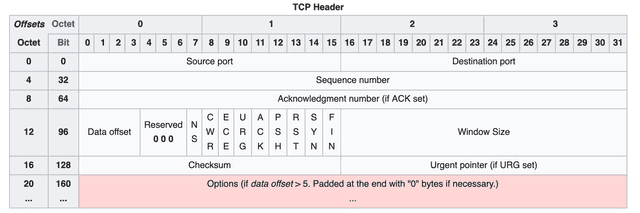
* TCP는 여러 개의 필드로 나누어진 `20 bytes`, 즉 `160 bytes`의 헤더를 사용하며, `각 필드의 비트를 0또는 1로 변경하여 정보를 나타낸다`.
* 이 `20 bytes`의 용량은 `아무 옵션도 없는 기본적인 헤더`일 때의 용량이고 `여러 옵션들을 사용하며 헤더 뒤에 옵션 필드가 추가로 붙기 때문에 최대 60 bytes까지`도 사용할 수 있다.
 
## ❗️**각 필드에 대한 설명**
### **Source port, Destination port**
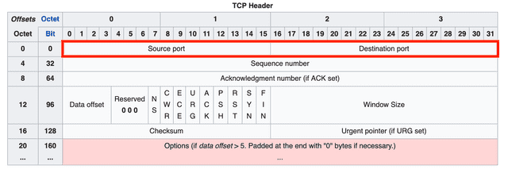
* 이 필드들은 세그먼트의 출발지와 목적지를 나타내는 필드로, 각각 16 bits를 할당받는다.
* 출발지와 목적지의 주소를 판별하기 위해서 `IP주소`와 `포트 번호`가 필요하다.
* `IP주소`는 당연히 한 계층 밑인 네트워크 계층에 있는 `IP의 헤더`에 담기기 때문에, `TCP 헤더`에는 IP주소를 나타내는 필드가 없고 `포트를 나타내는 필드만 존재`한다.

### **Sequence Number**
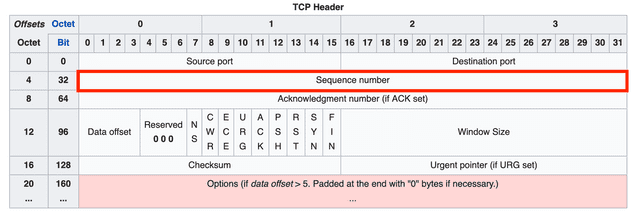
* `시퀀스 번호는 전송하는 데이터의 순서를 의미`하며, 32 bits를 할당받는다.
* 최대 4,294,967,296까지의 수를 담을 수 있기 때문에 `시퀀스 번호가 쉽게 중복되지 않는다`.
* 이 시퀀스 번호 덕분에, 수신자는 `조깨진 세그먼트의 순서를 파악하여 올바른 순서로 데이터를 재조립`할 수 있게 된다.

### **Acknowledgment Number**
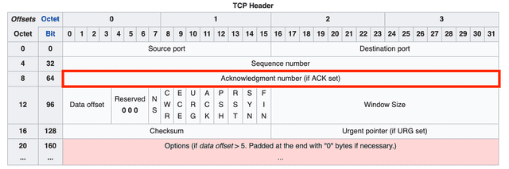
* `승인 번호는 데이터를 받은 수신자가 예상하는 다음 시퀀스 번호를 의미`하며, 32 bits를 할당받는다. 
* 연결설정과 연결해제 때 발생하는 핸드쉐이크 과정에서 `상대방이 보낸 시퀀스 번호 + 1`로 자신의 승인 번호를 만들어내지만, 실제로 데이터를 주고 받을 때는 `상대방이 보낸 시퀀스 번호 + 자신이 받은 데이터의 bytes`로 승인번호를 만든다.
* 즉, `승인 번호는 다음에 보내줘야 하는 데이터의 시작점을 의미`한다.

### **Data Offset**
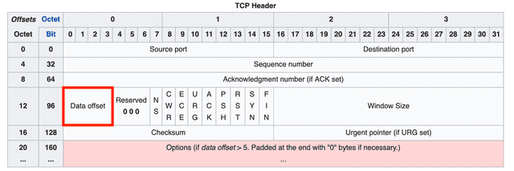
* 데이터 오프셋 필드에는 전체 세그먼트 중에서 헤더가 아닌 데이터가 시작되는 위치가 어디부터인지를 표시한다.
* 이 오프셋을 표기할 때는 `32비트 워드 단위`를 사용한다. 즉, `이 필드의 값에 4를 곱하면` 세그먼트에서 헤더를 제외한 `실제 데이터의 시작 위치`를 알 수 있다.
* 이 필드가 필요한 이유는, 밑에서 설명할 옵션(Option) 필드의 길이가 고정되어 있지 않기 때문이다.

### **Reserved**
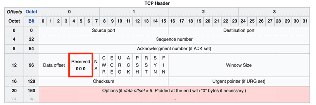
* 미래를 위해 예약된 필드로, 모두 `0`으로 채워져야 한다. 상단의 헤더 그림에도 3 bits가 `0 0 0`으로 찍혀있는 것을 확인해볼 수 있다.

### **Flags (NS ~ FIN)**
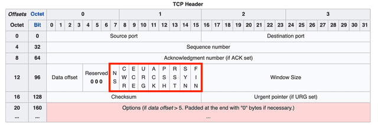
* 9개의 비트 플래그이다. 이플래그들은 현재 세그먼트의 속성을 나타낸다. 기존에는 6개의 플래그만을 사용했지만, 혼잡 제어 기능의 향상을 위해 Reserved 필드를 사용하여 NS, CWR, ECE 플래그가 추가되었다.

|필드|의미|
|:---:|:---|
|URG|`Urgent Pointer(긴급 포인터)` 필드에 값이 채워져있음을 알리는 플래그. 이 포인터가 가리키는 긴급 데이터는 높게 처리되어 먼저 처리된다.|
|ACK|`Acknowledgment(승인 번호)` 필드에 값이 채워져있음을 알리는 플래그. 이 플래그가 0이라면 승인 번호 필드 자체가 무시된다.|
|PSH|`Push` 플래그. 수신 측에게 이 데이터를 최대한 빠르게 응용 프로그램에게 전달해달라 하는 플래그이다. 이 플래그가 0이라면 수신측은 자신의 버퍼가 다 채워질 때까지 기다린다. 즉, 이 플래그가 1이라면 이 세그먼트 이후에 더 이상 연결된 세그먼트가 없음을 의미하기도 한다.|v
|RST|`Reset` 플래그. 이미 연결이 확립되어 ESTABLISHED 상태인 상대방에게 연결을 강제로 리셋해달라는 요청의 의미이다.|
|SYN|`Synchronize` 플래그. 상대방과 연결을 생성할 때, 시퀀스 번호의 동기화를 맞추기 위한 세그먼트임을 의미한다.|
|FIN|`Finish` 플래그. 상대방과 연결을 종료하고 싶다는 요청인 세그먼트임을 의미한다.|
|NS|`ECN`에서 사용하는 `CWR`, `ECE` 필드가 실수나 악의적으로 은폐되는 경우를 방어하기 위해 RFC 3540에서 추가된 필드|
|ECE|`ECN Echo` 플래그. 해당 필드가 1이면서, SYN 플래그가 1일 때는 ECN을 사용한다고 상대방에게 알리는 의미. SYN 플래그가 0이라면 네트워크가 혼잡하니 세그먼트 윈도우의 크기를 줄여달라는 요청의 의미이다.|
|CWR|이미 ECE 플래그를 받아서, 전송하는 세그먼트 윈도우의 크기를 줄였다는 의미이다.|

### **Window Size**
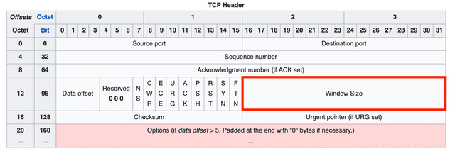
* 윈도우 사이즈 필드에는 한번에 전송할 수 있는 데이터의 양을 의미하는 값을 담는다. 2^16=65535 만큼의 값을 표현할 수 있고 단위는 바이트이므로, 윈도우의 최대 크기는 64KB 라는 말이 된다.
* 요즘같이 대용량 고속 통신 환경에서는 이 최대크기가 충분치 않은 경우가 있다. 그 때 비트를 왼쪽으로 시프트하는 방식으로 윈도우 사이즈의 최대크기를 키울 수 있는 방식도 사용하고 있으며 시프트 횟수는 옵션 필드의 `WSCALE 필드`에 표기한다.

### **Checksum**
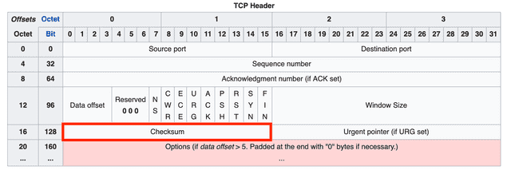
* 체크섬은 데이터를 송신하는 중에 발생할 수 있는 오류를 검출하기 위한 값이다.
* 송신측에서 전송할 모든 데이터를 16비트 워드 단위로 구분하고 1의 보수를 취한 후 이를 더해서 데이터와 함께 송신한다.
* 수신측에서도 검사합이 포함된 수신 메세지를 16비트 워드 단위로 구분하고 1의 보수를 취한 후 더한 값이 0이면 오류가 없는 것이고 0이 아니면 오류가 있는 것이다.

### **Urgent Pointer**
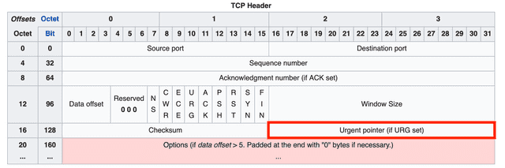
* 말 그대로 긴급 포인터이다. URG 플래그가 1이라면 수신측은 이 포인터가 가르키고 있는 데이터를 우선 처리한다.

### **Options**
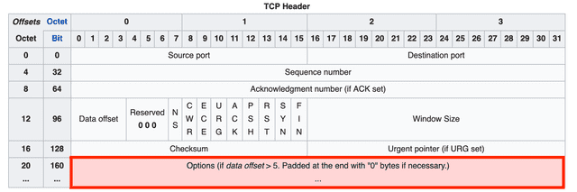
* 옵션 필드는 TCP의 기능을 확장할 때 사용하는 필드들이며, 이 필드는 크기가 고정된 것이 아니라 가변적이다. 그래서 수신측이 어디까지가 헤더고 어디서부터 데이터인지 알기 위해 위에서 설명한 데이터 오프셋 필드를 사용한다.
* 데이터 오프셋 필드는 `20 ~ 60 bytes`의 값을 표현할 수 있다고 했는데, 아무런 옵션도 사용하지 않은 헤더의 길이, 즉 `Source Port 필드부터 Urgent Pointer 필드까지의 길이가 20 bytes`이고, 옵션을 모두 사용했을 때 `옵션 필드의 최대 길이가 40 bytes`이기 때문이다.
* 만약 데이터 오프셋 필드의 값이 5, 즉 20 bytes(5*4 bytes)보다 크지만 TCP의 옵션을 하나도 사용하고 있지 않다면, 초과한 bytes 만큼 이 필드를 0으로 채워줘야 수신 측이 헤더의 크기를 올바르게 측정할 수 있다.

## ❗️**References**
* [KT](http://www.ktword.co.kr/test/view/view.php?no=1889)
* [Evans Library](https://evan-moon.github.io/2019/11/10/header-of-tcp/)