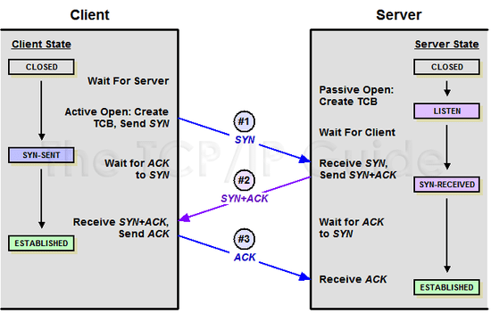
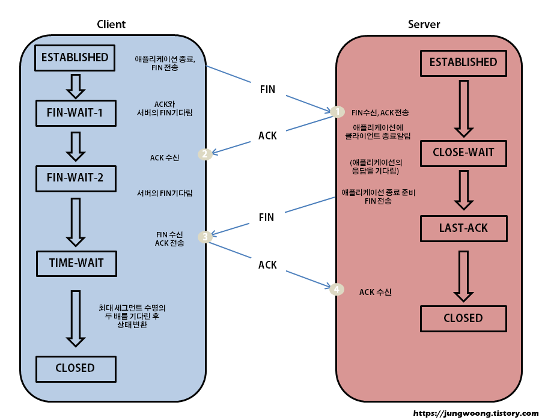

# **TCP 3-way & 4-way handshake**

## ❗️TCP 3-way handshake
* 연결하고자 하는 `두 장치 간의 논리적 접속을 성립`하기 위해 사용하는 연결 확인 방식으로 `3번의 확인 과정`을 거친다고 해서 3-way handshake라고 부른다.

    
* `SYN (Synchronize sequence numbers)` - 연결 확인을 위해 보내는 `무작위 숫자의 값`
* `ACK (Acknowledgements)` - 클라이언트나 서버로부터 받은 `SYN 값에 1을 더해` SYN을 잘 받았다는 확인을 해준다.
* `ISN (Initial Sequence Numbers)` - 클라이언트나 서버가 각각 처음으로 생성한 SYN

|상태|설명|
|:---|:---:|
|CLOSED|연결 수립을 시작하기 전의 기본상태(연결 없음)|
|LISTEN|포트가 열린 상태로 연결 요청 대기 중|
|SYN-SENT|SYN 요청을 한 상태|
|SYN-RECEIVED|SYN 요청을 받고 상대방의 응답을 기다리는 중|
|ESTABLISHED|연결의 수립이 완료된 상태, 서로 데이터를 교환할 수 있다.|

* 클라이언트와 서버가 SYN과 ACK를 주고받는 예시
    
## ❗️TCP 4-way handshake
* 3-way handshake와 반대로 `가상 회선 연결을 해제`하기 위해 주고 받는 확인 방식이다.` 4번의 확인 과정`을 거친다고 하여 4-way handshake라고 부른다.

    
* `FIN(Finish)` - TCP 연결을 종료한다는 메세지 

|상태|설명|
|:---|:---:|
|CLOSED|연결 수립을 시작하기 전의 기본상태(연결 없음)|
|ESTABLISHED|연결의 수립이 완료된 상태, 서로 데이터를 교환할 수 있다.|
|CLOSE-WAIT|상대방의 FIN을 받은 상태. 상대방 FIN에 대한 ACK를 보내고 어플리케이션에 종료를 알린다.|
|LAST-ACK|CLOSE-WAIT 상태를 처리 후 자신의 FIN요청을 보내고 FIN에 대한 ACK를 기다리는 상태.|
|FIN-WAIT1|자신이 보낸 FIN에 대한 ACK를 기다리거나 상대방의 FIN을 기다린다.|
|FIN-WAIT2|자신이 보낸 FIN에 대한 ACK를 받았고 상대방의 FIN을 기다린다.|
|CLOSING|상대방의 FIN에 ACK를 보냈지만 자신의 FIN에 대한 ACK를 못 받은 상태.|
|TIME-WAIT|모든 FIN에 대한 ACK를 받고 연결 종료가 완료된 상태. 새 연결과 겹치지 않도록 일정 시간동안 기다린 후 CLOSED로 전이한다.|

## ❗️References
* [조무래기 코딩](https://seongonion.tistory.com/74)