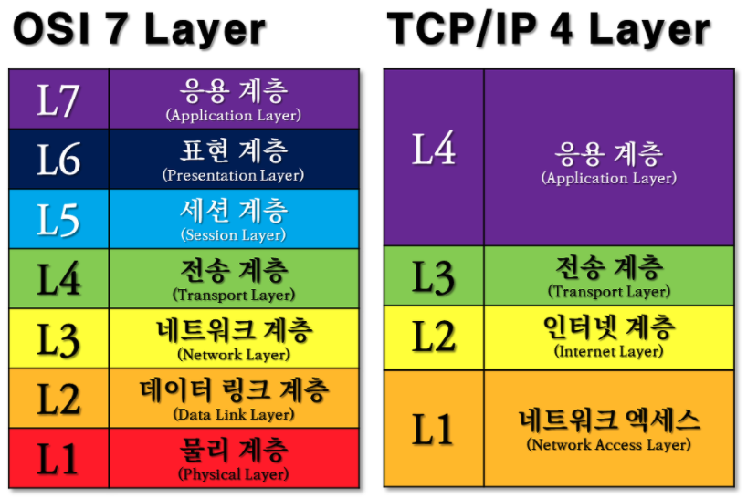
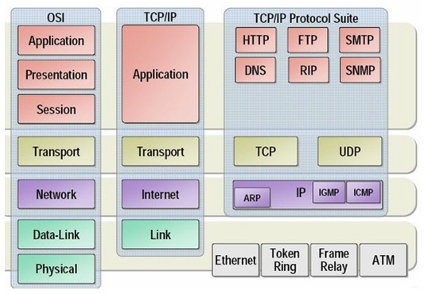

# TCP/IP 4계층

## TCP/IP

* `OSI 참조 모델을 기반`으로 `상업적이고 실무적으로 이용될 수 있도록 단순화`하여 만든 것이 `TCP/IP` 모델이다.
* 가장 기반이 되는 프로토콜로 실제 대다수 프로그램은 TCP/IP로 통신하고 있다.
* ARPANET이 개발된 이후 현재의 인터넷으로 발전해나가는 과정에서 대부분의 데이터 통신이 TCP와 IP기반으로 이루어졌기에 인터넷 프로토콜 그 자체를 표현하는 용어가 되었다.

---

## 1계층 - 네트워크 엑세스(Network Access Layer / Network Interface Layer)
* `OSI 7계층의 1계층, 2계층`인 `물리계층`과 `데이터 링크 계층`에 해당한다.
* 물리적인 주소로 MAC을 사용한다.
* LAN, 패킷망 등에 사용된다.
* 데이터 단위 - `Frame`
* 장비 - 브릿지, 스위치

## 2계층 - 인터넷 계층(Internet Layer)
* `OSI 7계층의 3계층`인 `네트워크 계층`에 해당한다.
* 통신 노드간의 IP패킷을 전송하는 기능과 라우팅 기능을 담당한다.
* 프로토콜 – `IP, ARP, RARP`
* 데이터 단위 - `Packet`
* 장비 - 라우터

## 3계층 전송 계층(Transport Layer)
* `OSI 7계층의 4계층`인 `전송 계층`에 해당한다.
* 통신 노드 간의 연결을 제어하고, 신뢰성 있는 데이터 전송을 담당한다.
* 프로토콜 – `TCP, UDP`
* 데이터 단위 - `Segment`
* 장비 - 게이트웨이

## 4계층 응용 계층(Application Layer)
* `OSI 7계층의 5계층, 6계층, 7계층`인 `세션 계층`, `표현 계층`, `응용 계층`에 해당한다.
* TCP/UDP 기반의 응용 프로그램을 구현할 때 사용한다.
* 프로토콜 – `FTP, HTTP, SSH`
* 데이터 단위 - `Data, Message`

## References
* [테크연](https://lxxyeon.tistory.com/155)
* [joeyful.log](https://velog.io/@jehjong/%EA%B0%9C%EB%B0%9C%EC%9E%90-%EC%9D%B8%ED%84%B0%EB%B7%B0-TCPIP-4%EA%B3%84%EC%B8%B5)