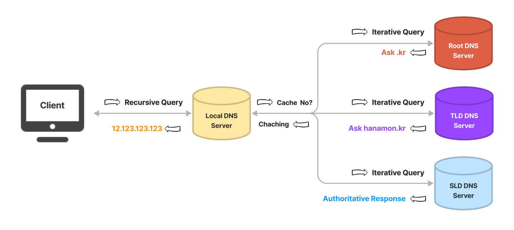
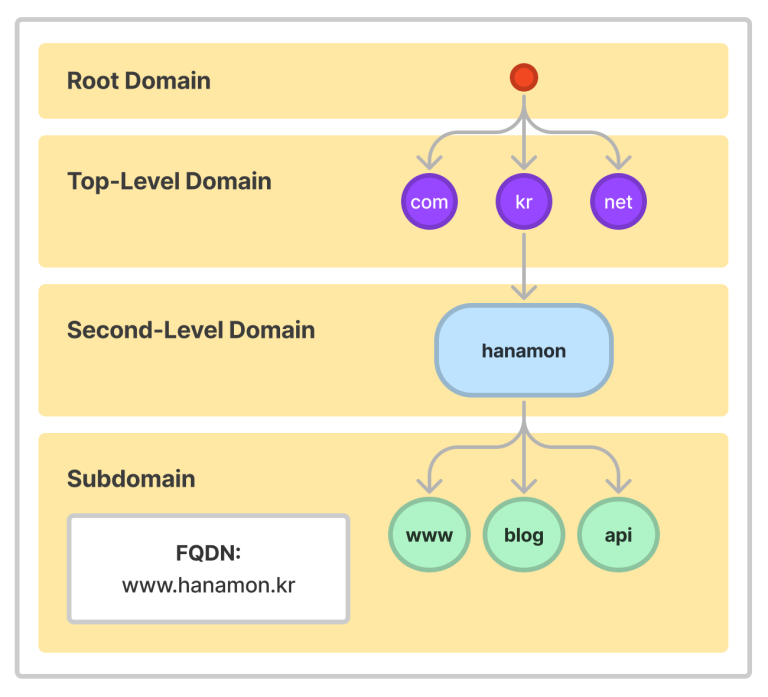

# **DNS**

## ❗️**도메인 이름 시스템(Domain Name System)이란?**

* `도메인 이름 시스템(Domain Name System)`은 사람이 읽을 수 있는 `도메인 이름을` 컴퓨터가 읽을 수 있는 `IP로 변환`한다.
* `DNS 서버`(`네임 서버`)는 이름을 IP 주소로 변환하여 도메인 이름을 웹 브라우저에 입력할 때 최종 사용자를 어떤 서버에 연결할 것인지를 제어한다. 이 요청을 `쿼리`라고 한다.
* DNS는 `국제적 단위`로 웹사이트 IP 주소와 도메인 주소를 이어주는 환경/시스템이다.
* `상위 기관`에서 인증된 기관에게 `도메인을 생성하거나 IP 주소로 변경`할 수 있는 `권한을 부여`한다.
* DNS는 이처럼 상위 기관과 하위 기관과 같은 `‘계층 구조’`를 가지는 `분산 데이터베이스 구조`를 가진다.

## ❗️**DNS 구성 요소**
* DNS는 아래 세가지 요소로 구성되어있다.
  1. `도메인 네임 스페이스(Domain Name Space)`
  2. `네임 서버(Name Server)` = 권한 있는 DNS 서버
  3. `리졸버(Resolver)` = 권한 없는 DNS 서버

## ❗️**도메인 네임 스페이스(Domain Name Space)**

* DNS는 전세계적인 거대한 분산 시스템이다.
* 도메인 네임 스페이스는 이러한 DNS가 저장 관리하는 계층적 구조를 의미한다.

### **계층적 도메인 레벨(Hierarchical Domain Level)**
* 도메인 네임 스페이스 트리구조는 최상위 레벨부터 순차적으로 `계층적 소속 관계`를 나타낸다.
* 하위 기관의 네임 스페이스를 할당하고 관리하는 방식은 각 하위 기관의 관리 책임자에게 위임된다.
* 이러한 위임 구조는 호스트의 증가에 대한 관리가 효율적으로 이루어지는 것을 가능하게 한다.

### **Fully Qualified Domian Name(FQDN) 전체 도메인 이름**
* 도메인의 전체 이름을 표기하는 방식이다.
* 일반적으로 도메인 네임은 앞에 www가 붙는 것을 의미하기 때문에 이러한 용어가 나왔다.
  * 도메인 이름: example.com
  * 호스트 이름: www
  * FQDN: www.example.com

## ❗️**네임 서버(Name Server)**
* 문자열로 표현된 도메인 이름을 실제 컴퓨터가 통신할 때 사용하는 IP 주소로 변환시키기 위해서 `도메인 네임 스페이스의 트리구조에 대한 정보`가 필요한데 이러한 정보를 가지고 있는 서버를 `네임 서버`라고 한다.
* 데이터베이스 역할(저장, 관리), 찾아주는 역할, 요청 처리 응답 구현

1. `Root DNS서버`
* ICANN이 직접 관리하는 서버이다.
* TLD DNS 서버 IP주소를 저장하고 안내하는 역할을 한다.

2. `Top-Level Domain(TLD) DNS 서버`
* 도메인 등록 기관이 관리하는 서버이다.
* `SLD(Authoritative) DNS 서버의 주소를 저장하고 안내하는 역할`을 한다.
* 도메인 판매 업체(가비아 등)의 DNS 설정이 변경되면 도메인 등록 기관으로 전달되기 때문에 어떤 도메인이 어떤 판매업체에서 구매했는지 알수 있다.

3. `Second-Level Domain(SLD) DNS 서버`
* 권한의 의미인 `Authoritative DNS 서버`라고도 하며 `실제로 개인 도메인과 IP 주소의 관계가 기록되는 서버`이다.
* 개인 DNS 구축이나 도메인/호스팅 업체의 네임서버를 뜻한다.

4. `권한없는 DNS 서버(Resolver 서버)`
* DNS 서버는 도메인 네임 스페이스를 위한 권한 있는 DNS서버와 권한이 없는 DNS 서버로 구분된다.
* 위 1, 2, 3은 권한 있는 DNS서버이다.
* 네임 스페이스를 위한 권한 있는 DNS서버는 IP주소와 도메인 이름을 매핑한다.
* 네임 스페이스를 위한 권한 없는 DNS 서버는 질의를 통해 IP주소를 알아내거나 캐시한다.

## ❗️**리졸버(Resolver)**
* 리졸버는 웹 브라우저와 같은 DNS `클라이언트의 요청을 네임 서버로 전달`하고 `네임 서버로부터 정보(도메인 이름과 IP주소)를 받아 클라이언트에게 제공`하는 기능을 수행한다.
* 리졸버는 이 과정에서 수많은 네임서버에 접근하여 사용자로부터 요청 받은 도메인의 IP 정보를 조회한다.

## ❗️**도메인 네임으로 IP를 찾는 과정**
1. 클라이언트가 웹 브라우저에 도메인 네임을 입력한다.
2. 웹 브라우저는 이전의 방문기록을 찾는다.
   * 브라우저 캐시 확인
   * OS 캐시 확인
   * 라우터 캐시 확인
   * ISP 캐시 확인
3. ISP에서 DNS Iterative하게 쿼리를 날린다.
4. ISP는 Authoritative DNS 서버에서 최종적으로 IP주소를 응답받는다.
5. ISP는 해당 IP주소를 캐시한다.
6. 웹 브라우저에게 응답한다.
## ❗️References
* [AWS](https://aws.amazon.com/ko/route53/what-is-dns/)
* [hanamon](https://hanamon.kr/dns%EB%9E%80-%EB%8F%84%EB%A9%94%EC%9D%B8-%EB%84%A4%EC%9E%84-%EC%8B%9C%EC%8A%A4%ED%85%9C-%EA%B0%9C%EB%85%90%EB%B6%80%ED%84%B0-%EC%9E%91%EB%8F%99-%EB%B0%A9%EC%8B%9D%EA%B9%8C%EC%A7%80/)