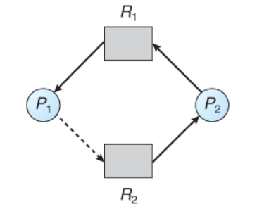

# 교착상태

# **교착상태란?**
* **교착상태(Dead Lock)** 은 둘 이상의 프로세스들이 자원을 점유한 상태에서 서로 다른 프로세스가 점유하고 있는 자원을 요구하며 무한정 기다리는 현상을 뜻한다.

   

* 교착상태의 필요조건
  * **상호배제(Mutual exclusion)**: 자원은 한 프로세스에 의해서만 점유가능. 사용 중인 자원을 다른 프로세스가 사용하려면 요청한 자원이 해제될 때까지 기다려야함
  * **점유와 대기(Hold and wait)**: 최소한 하나의 자원을 점유한 상태에서 다른 프로세스가 점유한 자원을 기다리는 프로세스가 존재해야함
  * **비선점(No preemption)**: 다른 프로세스가 점유한 자원은 강제로 빼앗을 수 없음
  * **순환대기(Circular wait)**: 각 프로세스는 순환 형태로 다음 프로세스가 요구하는 자원을 가지고 있음
  * 이 조건들을 모두 만족시키면 교착상태가 발생한다.
* 교착상태 예방 
  * 필요조건 중 하나를 제거함으로써 수행되는 기법. 자원 낭비가 심하다.
  * **상호 배제 부정**: 한번에 여러개의 프로세스가 공유 자원을 사용할 수 있도록 한다.
  * **점유 및 대기 부정**: 프로세스가 실행되기 전 필요한 모든 자원을 미리 할당하여 프로세스 대기를 없애거나 자원을 점유하지 않은 상태에서만 자원을 요구하도록 한다.
  * **비선점 부정**: 자원을 점유하고 있는 프로세스가 다른 자원을 요구할 때 점유하고 있는 자원을 반납하고, 요구한 자원을 사용하기 위해 기다리게 한다.
  * **순환대기 부정**: 자원을 선형 순서로 분류하여 고유번호를 할당하고, 각 프로세스는 현재 점유한 자원의 고유번호보다 앞이나 뒤 어느 한쪽 방향으로만 자원을 요구하도록 한다.
* 교착상태 회피 
  * 예방 기법에 비해 소극적인 방식인 만큼 시스템의 효율을 높이는 데 목적을 두고 있는 기법.
  * 현재 가용자원을 프로세스 요청시 바로 할당해 줄 것인지, 기다리게 할 것인지를 결정하는 방법이다.
  * |안정 상태|불안정 상태|
    |:-------:|:--------:|
    |시스템이 교착상태를 일으키지 않으면서 각 프로세스가 요구한 최대 요구량만큼 필요한 자원을 할당해 줄 수 있는 상태이다.|안정 상태와 달리 프로세스의 자원 할당 및 해제의 순서가 불명확하여 교착상태의 발생가능성이 있다.|   
    

    
    
   
   
  * 회피 기법에는 대표적으로 자원 할당 그래프 알고리즘과 은행원 알고리즘이 있다.
     * **자원 할당 그래프 알고리즘(Resource-Allocation Graph Algorithm)**
    

    
    
    
   

     1. 자원이 하나일 때 사용하는 방법으로 자원 할당 그래프를 이용해 교착상태를 회피하는 것.
     2. 자원 할당 그래프에 점선으로 표시된 간선인 예약 간선을 추가한다.
     3. 프로세스 시작 전에 모든 예약 간선들을 자원 할당 그래프에 표시한다.
     4. 예약 간선으로 설정한 자원에 대해서만 요청할 수 있고 사이클이 형성되지 않을 때만 자원을 할당 받는다.
     5. 사이클 생성 여부를 조사하는 데 O(n^2) 시간이 걸린다.
    * **은행원 알고리즘(Banker's Algorithm)**
    

    
    
   

     1. 자원이 두개 이상일 때 사용하는 방법으로 프로세스 시작 시 자신이 필요한 각 자원의 최대(Max) 개수를 미리 선언한다.
     2. 각 프로세스에서 필요한 자원(Need) 요청이 있을 때 요청을 승인하면 시스템이 안정 상태로 유지되는 경우에만 자원을 할당한다.
     3. 불안정 상태가 예상되면 다른 프로세스가 끝날 때까지 대기한다.
* 교착상태 무시
  * 예방보다 효율적인 회피의 경우에도 성능에 큰 영향을 미칠 수 있기 때문에 데드락의 발생 확률이 비교적 낮은 경우 별다른 조치를 취하지 않는 것을 교착상태 무시라고 한다.
  * 교착상태로 인한 성능저하보다 이를 해결하기 위한 성능 저하가 더 큰 경우에 주로 택한다.
* 교착상태 발견
  * 감시/발견을 하는 detection 알고리즘으로 교착상태 발생을 체크하는 방식.

## References
* [코딩 팩토리](https://coding-factory.tistory.com/311)
* [Dev.Oh Github](https://ohjoohyung.github.io/)
* [위키 백과](https://ko.wikipedia.org/wiki/%EA%B5%90%EC%B0%A9_%EC%83%81%ED%83%9C)