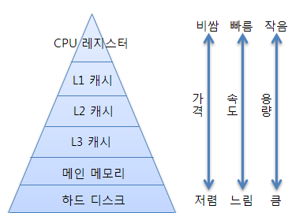
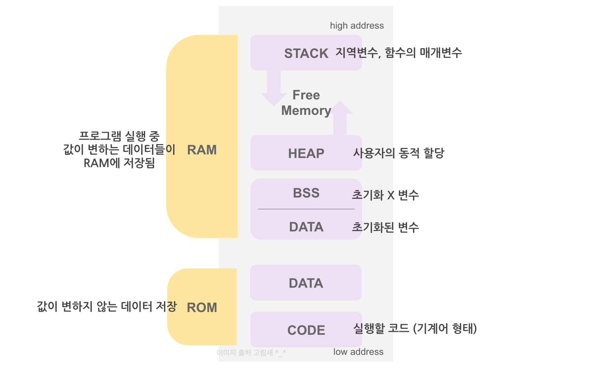

# **메모리 구조**

## **저장공간의 계층 구조**
  

  
  
   

* 데이터나 프로그램을 저장하는 저장 공간은 `계층 구조`를 가진다.
* CPU에서 가장 가까운 저장 공간인 레지스터를 시작으로 `"레지스터 → CPU 캐시 메모리 → 메인 메모리 → 보조기억장치 → 외부기억장치"` 순으로 CPU와 멀어진다.
* CPU와 멀어질수록 데이터를 저장하는 `용량이 커지고 접근 속도는 느려진다.`

## **RAM과 ROM**
  

  
  
   

* `RAM`은 `Random Access Memory`의 약자로 `휘발성 메모리`이다. 즉, `전원이 차단되면 데이터가 사라진다는 뜻`이다. 흔히 컴퓨터에 장착하는 메모리가 DRAM으로 RAM의 한 종류이다. 
* DRAM은 `CPU와 하드디스크 사이`에 위치해서 하드디스크로부터 `데이터(프로그램)`을 할당받아 CPU와 빠르게 데이터를 주고 받는다.
* 다른 RAM의 종류인 SRAM은 CPU의 캐쉬 메모리로 DRAM보다 더 빠르고 고가이다.
 
* `ROM`은 `Read Only Memory`의 약자로 `비휘발성 메모리`이다. 컴퓨터의 바이오스가 설치되어 있는 공간이다. 즉, `전원이 차단돼도 프로그램이 사라지지 않는다.` 여러 종류가 있지만 주로 사용되는 것은 `여러번 Read / Write가 가능한 EEPROM` 이다.

## **메모리 공간의 구조**
  

  
  
  

* 자세한 내용은 [프로세스에 할당된 메모리 구조](./02.%20%ED%94%84%EB%A1%9C%EC%84%B8%EC%8A%A4%EC%97%90%20%ED%95%A0%EB%8B%B9%EB%90%9C%20%EB%A9%94%EB%AA%A8%EB%A6%AC%20%EA%B5%AC%EC%A1%B0.md)에서 정리한다.

## References
* [쨀로그](https://velog.io/@goserimgoserimgo/%EB%A9%94%EB%AA%A8%EB%A6%AC-%EA%B5%AC%EC%A1%B0)
* [crocus](https://www.crocus.co.kr/1366)
* [정보공장](https://information-factory.tistory.com/270)