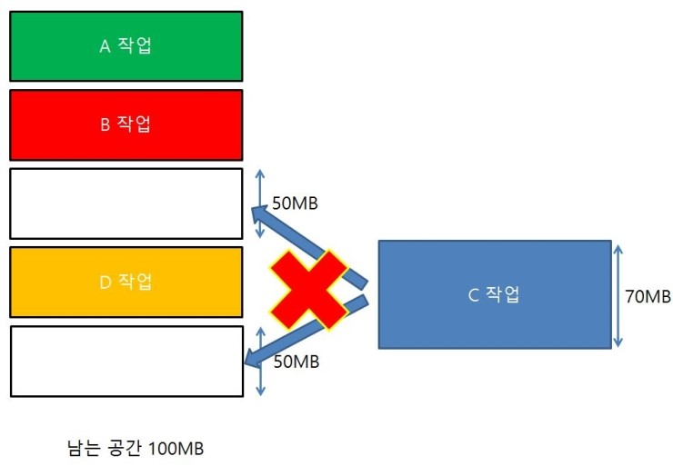
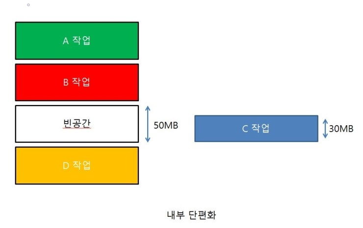
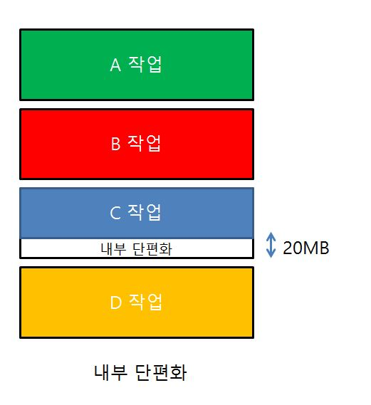

## **외부단편화와 내부 단편화**
* `외부단편화`: 총 `메모리 공간은 충분`하지만 실제로 `할당할 수 없는 경우`에 발생한다.
  
  

  
  

* `내부단편화`: 메모리 할당 시 `프로세스가 필요한 양보다 더 큰 메모리가 할당`되어 `메모리 공간이 낭비`되는 현상이다.
  

  
  
  
 

> `메모리 단편화`: `RAM에서 메모리 공간`이 `작은 조각`으로 나뉘어져 사용가능한 `메모리가 충분히 존재하지만 할당이 불가능`한 상태이다.