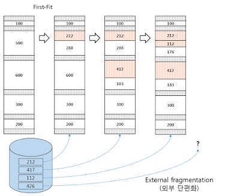
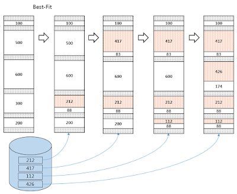
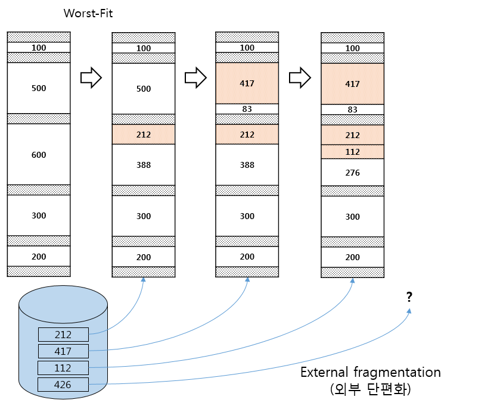

# 최초적합(First Fit), 최적적합(Best Fit), 최악적합(Worst Fit)

* 부팅 직후에는 `연속된 메모리 홀`을 가지고 있지만 `프로세스의 생성과 소멸 과정에서 불연속적인 단편화된 작은 메모리홀들`이 공간을 차지하게 된다.
* 이를 방지하기 위해 `메모리 할당 알고리즘`인 최초적합(First Fit), 최적적합(Best Fit), 최악적합(Worst Fit)을 사용한다.

## 최초적합(First Fit)
* 최초로 할당받을 수 있는 크기의 공간에 무조건 할당된다.
   

## 최적적합(Best Fit)
* 크기가 가장 근접한 공간에 할당된다.

## 최악적합(Worst Fit)
* 크기가 가장 많이 차이나는 공간에 할당된다.

* 속도면에서 `최초적합`이 가장 빠르고 최적적합과 최악적합은 느린편이다.
* 이용률 면에서는 `최초적합`과 `최적적합`이 좋은편이고 최악적합은 좋지 못하다.
* 메모리 할당 알고리즘을 사용해도 외부 단편화는 존재하긴 한다.

> 이를 해결하기 위한 `압축(Compaction)`이라는 방식이 있다. `흩어져 있는 작은 메모리 홀들을 하나의 커다란 메모리 홀로 통합`하여 사용하는 방식인데 압축을 위한 `비용이 많이 들어 비효율적`이다.

## References
* [truemind5](https://truemind5.blogspot.com/2017/05/14-1.html)
* [양햄찌가 만드는 세상](https://jhnyang.tistory.com/284?category=815411)