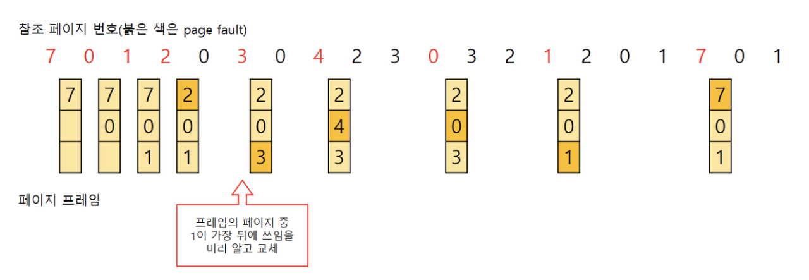
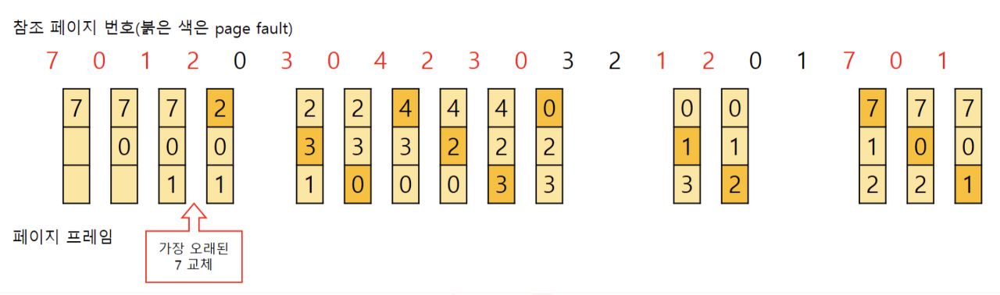
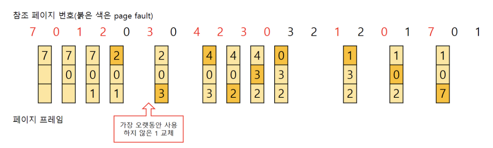
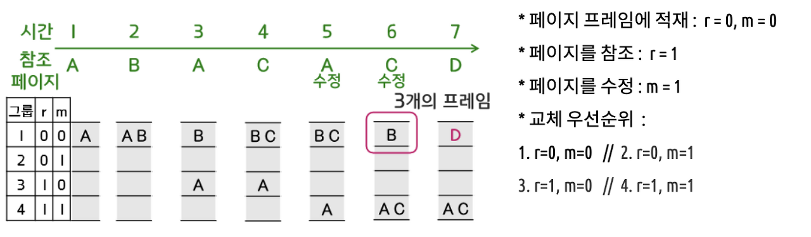

# 페이지 교체 알고리즘

## 페이지 교체 알고리즘
* 운영체제는 가상메모리를 사용하여 주기억장치보다 더 큰 용량의 프로그램을 실행하기 위해 프로그램의 일부만 주기억장치에 적재하여 사용한다.
* 페이징 기법으로 메모리를 관리하는 운영체제에서 필요한 페이지가 주기억장치에 적재되지 않았을 시 어떤 페이지 프레임을 선택하여 교체할 것인지 결정하는 방법을 `페이지 교체 알고리즘`이라고 한다.

## 페이지 교체 알고리즘의 종류
* `OPT` - Optimal: `앞으로 가장 오랫동안 사용되지 않을 페이지` 교체
* `FIFO` - First In First Out: `교체한지 가장 오래된 페이지` 교체
* `LRU` - Least Recently Used: `가장 오랫동안 사용되지 않은 페이지` 교체
* `LFU` - Least Frequently Used: `참조 횟수가 가장 작은 페이지` 교체
* `MFU` - Most Frequently Used: `참조 횟수가 가장 많은 페이지` 교체
* `NUR` - Not Used Recently: `최근에 사용하지 않은 페이지` 교체

---

## OPT(Optimal)

* 가장 이상적인 방식이지만 프로세스가 앞으로 사용할 페이지를 미리 알아야 하므로 불가능하다.
* 비교 연구 목적을 위해 사용된다.

## FIFO(First In First Out)

* `메모리에 가장 먼저 올라온 페이지를 먼저 내보내는 간단한 방식`으로 초기화 코드에 대해 적절하다.
* `들어온 시간을 따로 저장하거나 올라온 순서를 큐에 저장`한다.
* 직관적으로 생각할 때 `프레임의 수가 많아질수록 페이지 결함의 횟수는 감소`한다.

## LRU(Least Recently Used)

* `가장 오랫동안 사용하지 않았던 데이터가 앞으로도 사용할 확률이 적다는 전제`를 갖고 페이지 교체를 하는 방식이다.
* 이를 `시간 지역성(temporal locality)`이라고 한다.
* `사용된 시간을 카운터에 저장`하여 `가장 오랫동안 참조되지 않은 데이터를 제거`한다.
* 큐로 구현가능하다.
* 프로세스가 주기억장치에 접근할때마다 참조된 페이지 시간을 기록해야 하므로 막대한 `오버헤드가 발생`하고 카운터나 큐, 스택과 같은 `별도의 하드웨어가 필요`하다.

## LFU(Least Frequently Used)
* 페이지의 참조 횟수로 교체할 페이지 결정
* `LRU는 직전 참조된 시점을 반영하는 방식`이지만 `LFU는 참조횟수를 통해 장기적 시간규모에서의 참조성향을 고려`할 수 있다.
* 가장 최근에 불러온 페이지가 교체될 수 있다. `구현이 복잡`하고 막대한 `오버헤드가 발생`한다.

## MFU(Most Frequently Used)
* `가장 많이 사용된 페이지는 앞으로는 사용되지 않을 것이라는 전제`를 갖고 페이지 교체를 하는 방식이다.

## NUR = NRU(Not Used Recently, Not Recently Used)

* `최근에 사용하지 않은 페이지를 교체하는 방식`으로 `교체되는 페이지의 참조 시점이 가장 오래되었다는 것을 보장하지는 못한다`.
* `적은 오버헤드`로 `적절한 성능`을 낸다.
* 각 페이지마다 두개의 비트, 참조 비트(Reference Bit)와 변형 비트(Modified Bit)가 사용된다.

## References
* [CORE DATA](https://doh-an.tistory.com/)