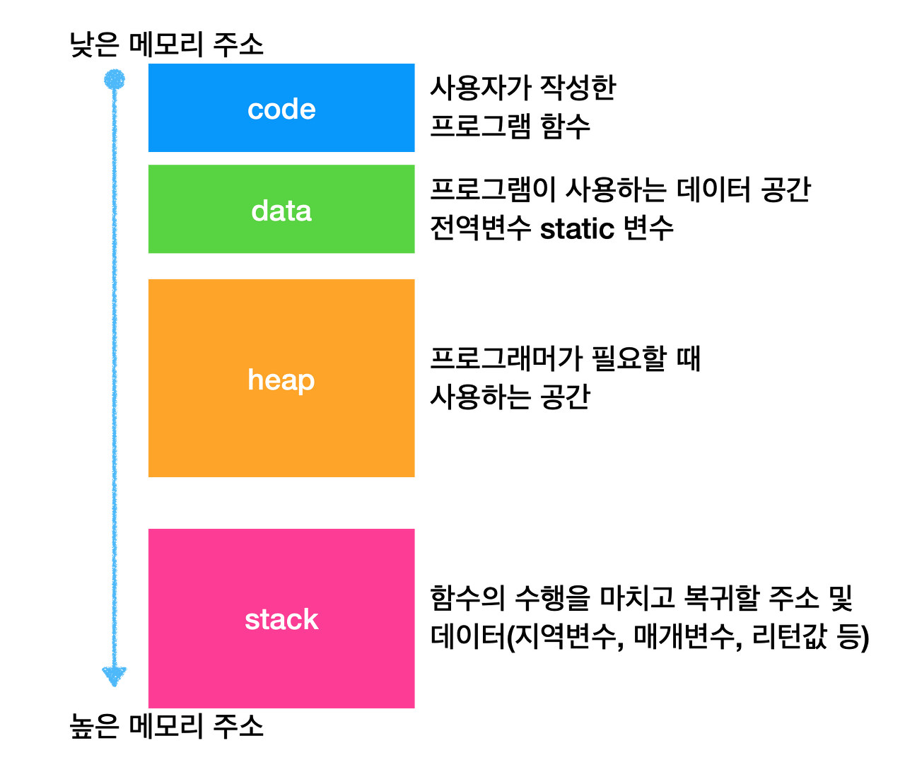

# 프로세스 메모리 구조

## 프로세스 메모리 영역
---
* 프로세스의 주소 공간은 코드(code), 데이터(data), 스택(stack), 힙(heap) 영역으로 구성된다.

## code 영역
* `사용자가 작성한 프로그램 함수들의 코드`가 `CPU에서 수행할 수 있는 기계어 명령 형태로 변환되어 저장`되는 공간
* `컴파일(compile) 타임에 결정`되고 중간에 코드를 바꿀 수 없게 `Read-Only`로 되어있다.

## data 영역
* `전역 변수 또는 static 변수 등 프로그램이 사용하는 데이터를 저장`하는 공간
* 전역 변수 또는 static 값을 참조한 코드는 컴파일이 완료되면 data 영역의 주소값을 가르키도록 바뀐다. 전역변수가 변경 될 수도 있어 `Read-Write`로 되어있다.
 
## stack 영역
* `호출된 함수의 수행을 마치고 복귀할 주소 및 데이터(지역변수, 매개변수, 리턴값 등)를 임시로 저장`하는 공간
* 이 영역은 함수 호출시 기록하고 함수의 수행이 완료되면 사라진다. 메커니즘은 자료구조(stack)에서 배운 `LIFO(Last In First Out)` 방법을 따른다. `컴파일 시 stack 영역의 크기가 결정`되기 때문에 무한정 할당 할 수 없다. 따라서 재귀함수가 반복해서 호출되거나 함수가 지역변수를 메모리를 초과할 정도로 너무 많이 가지고 있다면 `stack overflow`가 발생한다.
 
## heap 영역
* `프로그래머가 필요할 때마다 사용하는 메모리 영역`
* `heap 영역은 런타임에 결정`된다. 자바에서는 객체가 heap영역에 생성되고 GC에 의해 정리된다.
    
 
  
## 커널 메모리 영역
---
* `운영체제도 하나의 프로세스`이기 때문에 `커널 역시 동일한 주소 공간`인 code, data, stack 영역을 갖는다.
 
## code 영역
* 시스템 콜, 인터럽트 처리 코드
* CPU, 메모리 등 자원 관리를 위한 코드
* 편리한 인터페이스 제공을 위한 코드
 
## data 영역

* PCB(Process Controll Block) : 현재 수행 중인 프로세스의 상태, CPU 사용 정보 등을 유지하기 위한 자료구조
* CPU, Memory 등 하드웨어 자원을 관리하기 위한 자료구조가 저장
 
## stack 영역

* 각 Process의 커널 스택을 저장
* 프로세스는 함수 호출시 자신의 복귀 주소를 저장하지만, 커널은 커널 내의 주소가 된다.
* 각각의 프로세스마다 별도의 스택을 두어 관리한다.

## References
* [장장스:티스토리](https://zangzangs.tistory.com/107)