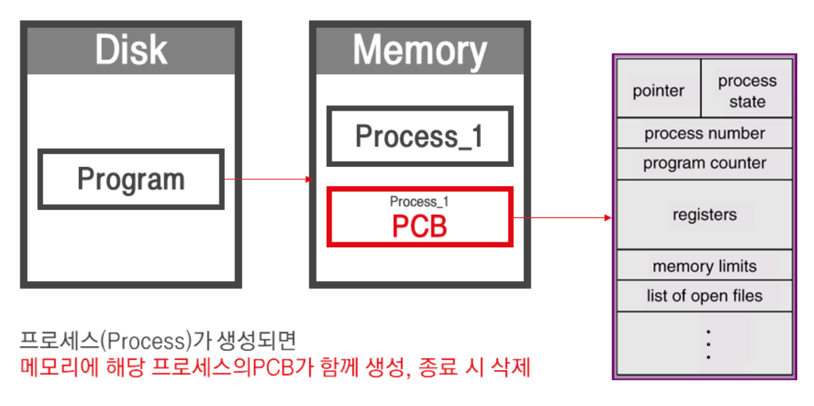
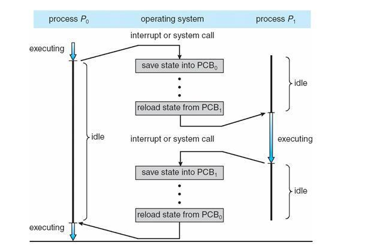

# Context switching
# **Context란?**
* CPU가 해당 `프로세스를 실행하기 위한 해당 프로세스의 정보들`
* Context는 프로세스의 `PCB(Process Control Block)`에 저장된다 
* PCB의 저장정보
  * `프로세스 상태`: 생성, 준비, 수행, 대기, 중지
  * `프로세스 번호`
  * `프로그램 카운터`
  * `레지스터`

 

  

# **Context switching이란?**
* `멀티프로세스 환경`에서 CPU가 `어떤 하나의 프로세스를 실행하고 있는 상태`에서 `인터럽트 요청에 의해 다음 우선 순위의 프로세스가 실행`되어야 할 때 `기존의 프로세스의 상태 또는 레지스터 값(Context)를 저장`하고 CPU가 다음 프로세스를 수행하도록 `새로운 프로세스의 상태 또는 레지스터값(Context)를 교체`하는 작업
* Context switching은 `다음 상황`에서 일어난다. 다음 프로세스는 `스케쥴러가 결정`한다
  * `I/O 인터럽트`
  * `CPU 사용시간 만료`
  * `자식 프로세스 Fork`
  * `인터럽트 처리를 기다릴 때`

# **Context switching 단점**
* 스위칭 과정에서 `다음 프로세스가 바로 excute하는 것이 아니라 idle상태를 유지하다가 excute`한다.
* `CPU가 이전 프로세스의 상태를 PCB에 저장`하고 `다음 프로세스의 상태를 PCB에서 가져와야 하기 때문`인데 이 도중에는 `CPU가 아무런 일도 하지 못하게 된다`.
* 때문에 컨텍스트 스위칭이 너무 잦으면 `오버헤드가 발생`하여 성능이 떨어진다.

# **프로세스와 스레드의 Context switching** 
* `스레드가 프로세스보다 빠른 이유중 하나가 컨텍스트 스위칭`이다.
* 스레드는 컨텍스트 스위칭 될때 text, data, heap 영역은 프로세스 것이기 때문에 `자신의 PCB에는 스택 및 간단한 정보만 저장`한다.
* 때문에 컨텍스트 스위칭 속도가 훨씬 빠르다.

## References
* [으뜸별](https://beststar-1.tistory.com/26)
* [Crocus](https://www.crocus.co.kr/1364)