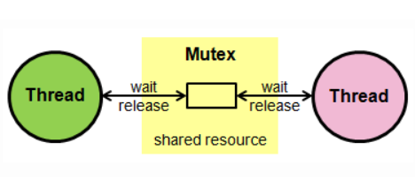

# 프로세스 동기화
* 여러 프로세스, 여러 스레드가 동시에 접근하면서 문제가 생기는 것을 막는 방법에는 `유저 동기화 방법`과 `커널 동기화 방법` 두가지로 나뉘는데 유저 동기화는 `임계구역(Critical section)`, 커널 동기화는 `Mutex(Mutual exclusion), Semaphore` 가 있다.

# **임계 구역(Critical Section)**
* `여러 프로세스가 데이터를 공유하며 수행`될 때, 각 프로세스에서 공유 데이터를 접근하는 프로그램 코드 블록
* `공유 데이터에 여러 프로세스가 접근`할 때 `잘못된 결과`를 만들 수 있기 때문에, 한 프로세스가 `임계 구역을 수행`할 때 `다른 프로세스들은 접근하지 못하도록 해야 한다`.
* 프로그래밍 시, `성능 향상`을 위해 `임계영역을 최소화`하는 설계를 해야 한다.
* 이 때 데이터를 **`한 번에 하나의 프로세스만 접근할 수 있도록 제한하는 동기화 방식`**에 대표적으로 **`뮤텍스(Mutex)`** 와 **`세마포어(Semaphore)`** 가 있다.

# **뮤텍스(Mutex)**
* 임계 구역을 가진 스레드들의 실행시간이 서로 겹치지 않게 실행되는 `상호배제`를 이루게 하는 기술
* **`한 프로세스에 의해 소유될 수 있는 Key`**를 기반으로 한 상호배제 기법
  * Key에 해당하는 어떤 객체가 있고, 이 객체를 `소유한 스레드/프로세스만이 공유자원에 접근가능`하다
* 다중 프로세스들의 공유 리소스에 대한 접근을 조율하기 위해 `동기화(Synchronization)` 또는 `락(Lock)`을 사용한다.

   

# **세마포어(Semaphore)**
* 멀티 프로그래밍 환경에서 공유된 자원에 대한 접근을 제한하는 방법
* **`Signaling 메커니즘`**. `현재 공유자원에 접근할 수 있는 쓰레드, 프로세스의 수를 나타내는 값`을 두어 `상호배제`를 달성하는 기법
* 일반적으로 비교적 긴 시간을 확보하는 리소스에 대한 이용

   

# **뮤텍스와 세마포어의 차이점**
* 둘 사이의 가장 큰 차이점은 `동기화 대상의 갯수`이다.
  * `뮤텍스는 동기화 대상이 1개`일 때, `세마포어는 1개 이상`일 때 사용
* 뮤텍스는 세마포어가 될 수 없지만, 세마포어는 뮤텍스가 될 수 있다.
  * 뮤텍스는 `Binary Semaphore` 라고 볼 수 있다.
* `뮤텍스는 자원을 소유`하고 책임을 가지지만 `세마포어는 자원소유가 불가능`하다.
* `뮤텍스는 소유하고 있는 스레드만이 뮤텍스를 해제`할 수 있고 `세마포어는 signal을 통해 소유하지 않는 스레드도 해제`할 수 있다.
* `뮤텍스는 프로세스의 범위`를 가지고 `프로세스를 종료할 때 Clean up` 된다. `세마포어는 시스템 범위`에 걸쳐 있고 `파일 시스템 상의 파일로 존재`한다

## **References**
* [위키 백과](https://ko.wikipedia.org/wiki/%EC%9E%84%EA%B3%84_%EA%B5%AC%EC%97%AD)
* [Worth spreading](https://worthpreading.tistory.com/90)
* [굳세게 코딩하는 단발머리 첼씨](https://chelseashin.tistory.com/)