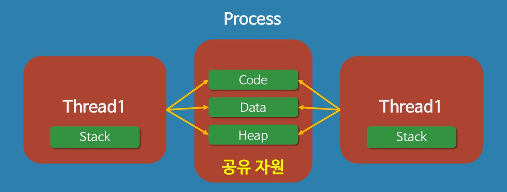
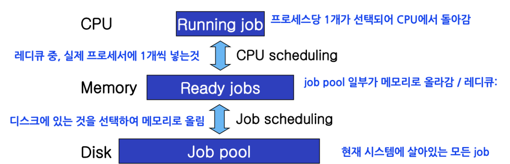
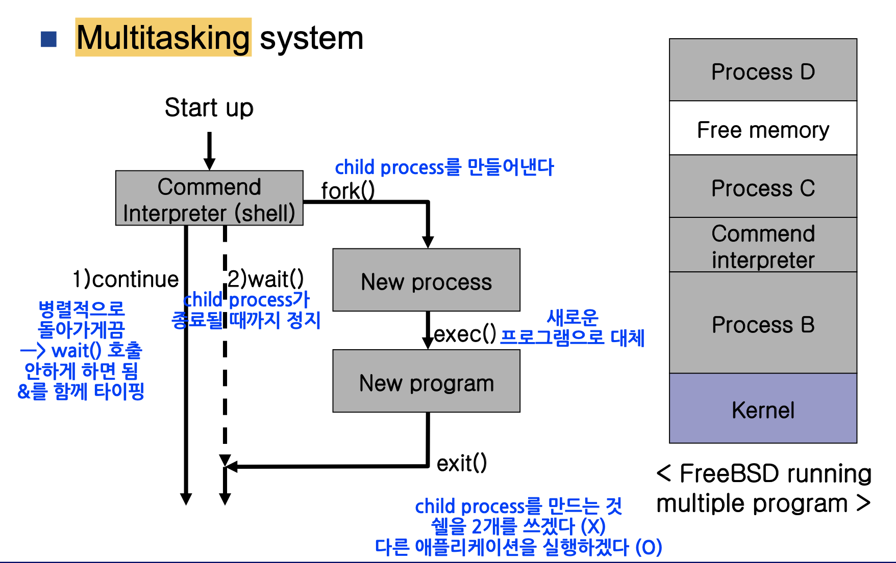

# 프로세스와 스레드의 정의와 차이점
# **프로세스(Process)** 란
* `운영체제로부터 자원을 받은 작업의 단위`
* 저장 장치에 저장되어 있는 `프로그램`이 실행되면 메모리에 올라가고 이 상태의 프로그램을 `프로세스`라고 한다
* 프로세스는 `독립적인 메모리 공간(코드, 데이터, 스택, 힙)을 할당` 받는다  

  
  

  
    

# **스레드(Thread)** 란
* `하드웨어`에서의 **스레드(Thread)**
  * `물리적으로 동시에 프로세스를 실행`할 수 있는 공간
  * CPU의 스펙에서 말하는 N코어 M스레드의 스레드, 동시에 처리할 수 있는 프로그램의 개수가 M개라는 뜻
  * 위 CPU는 N개의 물리적 코어, M개의 논리적 코어를 가졌다
* `소프트웨어`에서의 **스레드(Thread)**
  * **`논리적으로 제약을 받지 않는 프로세스를 여러개로 나누어서 처리하는 단위`**
  * 하나의 소프트웨어적 스레드가 하나의 하드웨어적 스레드에서 처리될 수도 있지만, 프로세스 하나가 하드웨어적 스레드에 적재되어 여러 소프트웨어적 스레드를 실행할 수도 있다 
  * 여러 프로세스가 번갈아 가면서 하나의 하드웨어적 스레드를 사용하기도 한다
  

  
    

# **멀티테스킹과 멀티스레딩**
## **멀티테스킹(Multi-tasking))** 

    

  * **`운영체제 안`**에서 스케쥴러에 의해 **`여러 프로세스`**가 실행되는 것
  * 운영체제는 여러 프로그램을 하나의 코어에서 막힘없이 실행을 해야 하기 때문에 하나의 프로세스당 일정 시간만 할당하여 동작하게 하는 것을 프로그램이 끝날때까지 반복하는 **`시분할 방식`**을 이용한다
  * 여러 개의 task를 자주 번갈아가며 수행하다보니 사용자는 동시에 여러 task가 수행되고 있다고 느끼게 된다
## **멀티스레딩(Multi-threading))** 
  * 운영체제가 아닌 **`프로그래머`**가 **`하나의 프로세스`**가 실행되는 짧은 시간에 **`여러 스레드`**가 어떤 순서로 실행이 되는지 결정하는 방식
  * 여러 스레드간의 `자원 공유가 가능`하다
  
## **References**
  * [개발장 velog](https://velog.io/@raejoonee)
  * [By I, Cburnett, CC BY-SA 3.0](https://commons.wikimedia.org/w/index.php?curid=2233446)
  * [seo's IT world](http://sjkitpro.blogspot.com/2018/07/heap.html)
  * [PaperCraft](https://blog.naver.com/whdgml1996/221589462999)
  * [dev_v velog]()