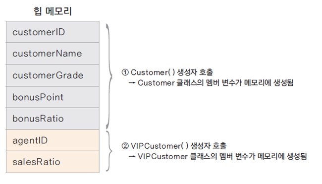
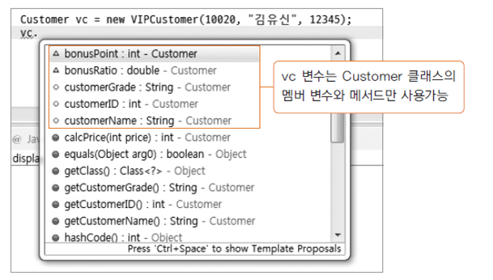
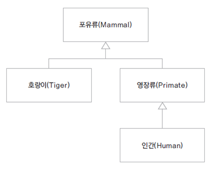

# 03. 상속에서 클래스 생성 과정과 형 변환

## 하위 클래스가 생성 되는 과정

- 하위 클래스를 생성하면 상위 클래스가 먼저 생성 됨 

- new VIPCustomer()를 호출하면 Customer()가 먼저 호출 됨

- 클래스가 상속 받은 경우 하위 클래스의 생성자에서는 반드시 상위 클래스의 생성자를 호출 함

Customer.java
```java
public Customer() {
		customerGrade = "SILVER";
		bonusRatio = 0.01;
		
		System.out.println("Customer() 생성자 호출");
}
```

VIPCustomer.java
```java
public VIPCustomer() {
		customerGrade = "VIP";
		bonusRatio = 0.05;
		salesRatio = 0.1;
		
		System.out.println("VIPCustomer() 생성자 호출");
}
```

## super 키워드

- 하위 클래스에서 가지는 상위 클래스에 대한 참조 값

- super()는 상위 클래스의 기본 생성자를 호출 함

- 하위 클래스에서 명시적으로 상위 클래스의 생성자를 호출하지 않으면 super()가 호출 됨<br>
  ( 이때 반드시 상위 클래스의 기본 생성자가 존재 해야 함)

- 상위 클래스의 기본 생성자가 없는 경우 ( 다른 생성자가 있는 경우 ) 하위 클래스에서는 생성자에서는 super를 이용하여 
명시적으로 상위 클래스의 생성자를 호출 함

- super는 생성된 상위 클래스 인스턴스의 참조 값을 가지므로 super를 이용하여 상위 클래스의 메서드나 멤버 변수에 접근할 수 있음

Customer.java
```java
// 디폴트 생성자 없애고 매개 변수가 있는 생성자 추가
public Customer(int customerID, String customerName) {
		this.customerID = customerID;
		this.customerName = customerName;
		
		customerGrade = "SILVER";
		bonusRatio = 0.01;
		System.out.println("Customer(int, String) 생성자 호출");
}
```

VIPCustomer.java
```java
// super를 이용하여 상위 클래스의 생성자 명시적으로 호출
public VIPCustomer(int customerID, String customerName) {
		super(customerID, customerName);
		
		customerGrade = "VIP";
		bonusRatio = 0.05;
		salesRatio = 0.1;
		
		System.out.println("VIPCustomer(int, String) 생성자 호출");
}
```

CustomerTest.java
```java
public class CustomerTest {

	public static void main(String[] args) {
		
		Customer customerLee = new Customer(10010, "이순신");
		customerLee.bonusPoint = 1000;
		System.out.println(customerLee.showCustomerInfo());
		
		VIPCustomer customerKim = new VIPCustomer(10020, "김유신");
		customerKim.bonusPoint = 10000;
		System.out.println(customerKim.showCustomerInfo());
	}
}
```
- 출력 결과


## 상속에서 인스턴스 메모리의 상태 

- 항상 상위 클래스의 인스턴스가 먼저 생성되고, 하위 클래스의 인스턴스가 생성 됨


## 형 변환(업캐스팅)

- 상위 클래스로 변수를 선언하고 하위 클래스의 생성자로 인스턴스를 생성

	Customer customerLee = new VIPCustomer();

- 상위 클래스 타입의 변수에 하위 클래스 변수가 대입;

	VIPCustomer vCustomer = new VIPCustomer();
	addCustomer(vCustomer);

	int addCustomer(Customer customer){


	}

- 하위 클래스는 상위 클래스의 타입을 내포하고 있으므로 상위 클래스로의 묵시적 형 변환이 가능함

- 상속 관계에서 모든 하위 클래스는 상위 클래스로 형 변환(업캐스팅)이 됨 <br>
   ( 그 역은 성립하지 않음) 


## 형 변환과 메모리

- Customer vc = new VIPCustomer(); 에서 vc가 가리키는 것은?

- VIPCustomer() 생성자에 의해 VIPCustomer 클래스의 모든 멤버 변수에 대한 메모리는 생성되었지만, <br>
  변수의 타입이 Customer 이므로 실제 접근 가능한 변수나 메서드는 Customer의 변수와 메서드임


  					  

## 클래스의 계층구조가 여러 단계인 경우



- Human은 내부적으로 Promate와 mammal의 타입을 모두 내포하고 있음

	Primate pHumman = new Humman();

	Mammal mHumman = new Humman();

## 다음 강의
[04. 메서드 재정의하기(overring)](../04.%20%EB%A9%94%EC%84%9C%EB%93%9C%20%EC%9E%AC%EC%A0%95%EC%9D%98%20%ED%95%98%EA%B8%B0(overriding)/)