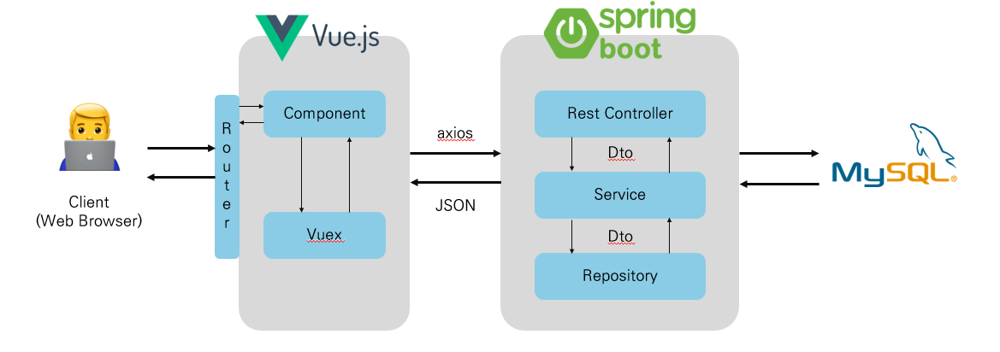

 
<h1 align='center' style="color:#337ea9; font-style: italic; font-weight: bolder">
    발전하는 개발자, 최규헌입니다.
</h1>
        
### ***교육 수료 내용***

#### Seoul National University of Technology - Computer Science & Engineering 2013.03 ~ 2020.08

#### SSAFY 9th 2023.01 ~ </h4>
 

### ***수상 내용***

#### 삼성 청년 소프트웨어 아카데미(SSAFY) 공통 프로젝트 최우수상
#### 삼성 청년 소프트웨어 아카데미(SSAFY) 공통 프로젝트 UCC 우수상

 

### ***웹 페이지***

<h4>

[Github](https://github.com/kuma93)

</h4>

 

### 어제보다 더 많이 알고, 더 잘 하기 위해 노력하는 신입 백엔드 개발자 최규헌입니다.

* JSP나 Servlet을 활용한 프로젝트부터 SpringBoot, JPA, React를 활용한 프로젝트까지 수행해 본 경험이 있습니다. 
* 많은 사용자가 만족할 수 있는 서비스를 만드는 개발자가 되는 것이 목표입니다.
* 새로운 것을 배우는 데 거리낌이 없고 배운 것을 활용하는 것을 좋아합니다.
* 코드를 작성할 때 팀 컨벤션의 중요성에 대해서 이해하고 있고 일정관리와 형상관리의 중요성 또한 이해하고 팀원이 코드나 협업 툴만으로도 충분히 의도를 이해할 수 있게끔 노력합니다.

   

<h1 align='center' style="color:#337ea9; font-style: italic; font-weight: bolder">Skills</h1>   

### ***Languages***
<!--Java-->

* 삼성 청년 소프트웨어 아카데미(이하 SSAFY)에서 Java에 대한 교육을 이수했고 Java의 문법을 이해하고 활용할 수 있으며 JVM의 동작 방식과 GC의 동작 원리, 디자인패턴을 이해하고 있습니다. 서버를 구축할 때 SpringBoot, JPA 등 Java 기반의 프레임워크를 주로 사용 했습니다.
<!--Python-->

* Python의 문법을 이해하고 활용할 수 있으며 알고리즘 및 자료구조를 활용해서 문제를 해결할 수 있습니다. 또한 간단한 플라스크 서버를 구축해본 경험이 있습니다.

<!--JavaScript-->
<!--TypeScript-->

* ES6의 문법을 이해하고 활용할 수 있으며 JS의 타입을 지정하여 예기치 못한 에러를 방지하는 TypeScript를 사용하여 코드에 적용할 수 있습니다.

 

### ***Back-End***
<!--Spring Framework-->

* SSAFY에서 Spring Framework에 대한 교육을 이수했고 객체의 라이프 사이클과 IoC에 대해서 이해하고 있습니다. MVC모델의 서버를 구축할 수 있습니다.

<!--Spring Boot-->

* SSAFY에서 Spring Boot에 대한 교육을 이수했고 Spring Boot에 내장된 다양한 기능을 사용해본 경험이 있고 서버를 구축해 팀프로젝트를 진행한 경험이 있습니다. 

<!--JPA-->
<!--MyBatis-->

* MyBatis를 통해 동적 쿼리를 작성할 수 있습니다. 이를 통해 조건에 맞는 검색 기능을 구현한 경험이 있습니다.
* JPA의 관계형 데이터베이스와 객체 간 매핑에 대한 개념을 이해하고 양방향 매핑을 할 수 있습니다. 또한 JPQL, QueryDSL을 사용해 보다 복잡한 쿼리도 작성할 수 있습니다.
* 주로 프로젝트를 진행할 때 JPA와 MyBatis를 혼용하는 식으로 사용했습니다.

<!--MySQL-->

* MySQL의 계정이나 Transaction의 Isolation level에 대해 이해하고 있으며 설정할 수 있습니다. DDL, DML, TCL을 의도에 맞게 작성할 수 있습니다.

  

### ***Front-End***
<!--Vue.js-->

* SSAFY에서 Vue.js에 대한 교육을 이수했고 컴포넌트 구성, axios를 통한 api 호출, Vuex를 사용한 상태관리를 할 수 있습니다.

<!--React.js-->
<!--Redux-->

* React에서 제공하는 여러 라이브러리를 사용할 수 있고, axios를 통한 api 호출, Redux를 사용한 상태관리를 할 수 있습니다.
* SPA 기반 동적 웹페이지를 생성할 수 있습니다.

<!--HTML-->
<!--CSS-->

* HTML과 CSS를 활용해서 각 요소를 구성하고 스타일을 편집할 수 있습니다. 전역 스타일 설정과 각 요소 scope의 스타일 설정을 할 수 있습니다.

<!--Bootstrap-->

* 부트스트랩 라이브러리의 각 요소와 b 태그 안의 속성들에 대해서 이해하고 활용할 수 있습니다.

 

### ***Tools***
<!--IntelliJ-->
<!--Eclise--><!--VisualStudioCode-->

* 자바의 경우 IntelliJ, Eclipse를 활용해서 코드를 생성, 수정할 수 있고 단축키를 숙지하고 있습니다.
* 파이썬과 프론트 코드를 생성, 수정하기 위해 Visual Studio Code를 사용합니다.

<!--github-->

* 형상 관리를 위해 Github를 사용합니다. Git Flow에 대해 이해하고 활용할 수 있습니다.

<!--Jira-->

* 일정 관리를 위해 JIRA를 사용합니다. JQL에 대해 이해하고 필터와 대시보드를 생성 및 활용할 수 있습니다.

      

<h1 align='center' style="color:#337ea9; font-style: italic; font-weight: bolder">Project Experiences</h1>

## ***VODA*** - Voice Over Diverse Assistance

### **프로젝트 개요 & 주요 기능**
[Github](https://github.com/project-VODA/VODA)
* 2023.07.04 ~ 2023.08.18
* 시각장애인의 영상통화간 ***상대의 표정을 분석***해서 안내해주거나 상대가 자신의 표정을 보낼 수 있는 비언어적 소통을 돕는 서비스입니다.
* 시각장애인 복지관에서 인터뷰 진행 후 ***색상 인식 서비스***를 추가 했습니다.
* 전체 웹페이지는 두 가지 모드를 지원합니다.
  * **심플 모드** - WCAG(웹 콘텐츠 접근성 가이드라인) 을 준수해서 명도대비율이 높으며 각 요소들의 크기가 크고 스크린 리더가 모두 읽을 수 있으며 요소들의 숫자를 필요한 것들만 남겨 최소한으로 줄인 모드입니다.
  * **디테일 모드** - 일반적인 웹 페이지의 형태인 모드입니다.

### **수행한 역할**
* Back-End - 회원 기능(마이페이지, 회원가입, 메일 인증, 임시 비밀번호 발급, 정보 수정, 유저 환경설정), 친구 기능(친구 검색, 추가, 삭제), 고객의 소리함(CRUD) 및 댓글(CRUD) api 구현
* Front-End - 전체 api에 대한 axios 요청, 토글에 따른 스크린 타입 제어, router, Redux 상태관리, 전역 스타일 및 세부 컴포넌트 scope style 제어, 컴포넌트 구현
* 프로젝트 기획 - 핵심 기능과 추가 기능 기획
* 트러블 슈터 - 백엔드, 프론트엔드를 모두 수행했기 때문에 대부분의 버그나 스타일 상의 트러블을 잡을 수 있었습니다.
* Jira Leader - 장, 단기 과제 선정 및 과제 분배 

### **아키텍처**

### **사용한 기술**
* Back-End - Spring Boot, JPA, MyBatis, MySQL
* Front-End - React.js, Redux

### **회고**
* 실제 사용자인 **시각장애인 복지관에 찾아가서 인터뷰를 진행**할 만큼 열정을 가지고 진행한 프로젝트였습니다.
* 팀원 6인으로 진행했으나 Front-End를 해본 인원이 없어 모두가 생소한 기술을 열정 하나로 학습과 실제 결과물까지 낼 수 있었습니다.
* **풀스택 개발 경험**을 통해 프로젝트의 전체에 대한 이해도가 깊어졌고 이 경험은 앞으로 큰 자산이 될 것 같습니다. 
* **WebRTC**와 **AI**라는 생소한 기술 도메인을 웹에 융합하는 과정에서 신기술에 대해서 어떻게 접근하고 이해해야 하는지, 해당 파트의 팀원과 어떻게 협업해야 하는지에 대해서 배웠습니다.
* **효율적인 협업**을 위해 팀 컨벤션(코드, 깃플로우)를 적극 사용했으며 Jira를 통한 일정관리를 통해 어느 한 명도 뒤쳐지지 않는 결과를 낼 수 있었습니다.
* 형상관리, 일정관리에 더해 트러블슈팅이나 회의같은 다른 항목들도 **문서화**하고 기록함으로써 **협업**에서의 중요한 부분, 마인드셋을 배울 수 있었습니다.
* STT, TTS를 보다 폭넓게 활용해서 챗봇과 같은 추가기능을 도입하여 보다 시각장애인의 사용성을 향상시키면 좋겠다는 생각을 했습니다.

   

## ***ChartFlow***
[Github](https://github.com/KUMA93/ChartFlow)
### 프로젝트 개요 & 주요 기능
* 2023.08.28 ~ 2023.10.06
* 주식 입문자를 위한 차트 기반의 **모의 투자** 시뮬레이션 서비스
* 게이미피케이션의 요소로 **랭킹**, **칭호** 등의 기능을 제공하며 커뮤니티 기능이 존재

### 역할
* Back-End - 회원 기능(회원가입, 메일 인증, 임시 비밀번호 발급), 댓글(CRUD), 대댓글(CRUD), 차트게임(매수, 매도, 스킵, 턴 종료, 게임 생성, 게임 정보 조회, 차트 정보 조회) api 구현
* Front-End - 구현한 api에 대한 axios 연동
* 프로젝트 기획 - 차트 게임 기능 기획, 칭호 획득 방식 기획
* Jira Leader - 장, 단기 과제 선정 및 과제 분배 

     

### 아키텍처

### 사용한 기술
* Back-End - Spring Boot, JPA, MySQL, Redis
* Front-End - React.js, Amcharts
* Infra - EC2, Jenkins

### 회고
* 시기가 하반기 공채와 겹쳤기 때문에 취업 위주의 스케쥴 진행 이슈로 완성도가 다소 아쉬운 프로젝트였습니다.
* 방대한 데이터를 다뤘기 때문에 DB상에서 **인덱스를 관리하여 성능을 80% 이상 개선**했습니다.
* 후에 여유가 생긴다면 개인적으로 기능들의 예외처리, 기록들에 대한 api 연동, 권한 설정에 대해 추가 진행할 예정입니다.

   

## ***TripMate***

### **프로젝트 개요 & 주요 기능**
[Github](https://github.com/KUMA93/TripMate)
* 2023.05.18 ~ 2023.05.25
* 엔데믹 상황에서의 국내 여행 수요 증가에 부합하는 지도 기반 **여행지 추천, 여행지 평가, 지역별 날씨 정보 서비스**입니다.

  

### **수행한 역할**
* Back-End - 회원 기능 전반, 핫플레이스(관광지 추천 게시판 CRUD), 
* Front-End - 전체 api에 대한 axios 요청, 돋보기 모드에 따른 요소 제어, router, Vuex 상태관리, 컴포넌트 구현
* 프로젝트 기획 - 핵심 기능과 추가 기능 기획
* Jira Leader - 장, 단기 과제 선정 및 과제 분배 

  

### **아키텍처**

### **사용한 기술**
* Back-End - Spring Boot, MyBatis, MySQL
* Front-End - VUE.js

### **회고**
* 팀원도 2명이고 일주일 간의 짧은 시간 내에 완성한 간단한 프로젝트였지만 배운 것을 통해 능동적으로 결과물을 만들어 내는 것이 주는 즐거움을 깨달았습니다.
* 개발자로서 진행해 본 프론트엔드와 백엔드가 완성된 첫 프로젝트여서 애착도 많이 갔습니다. 이론적으로 학습한 것과 실제 프로젝트를 진행하면서 코드를 작성할 때의 어려움이 다르다는 것을 느꼈습니다.

