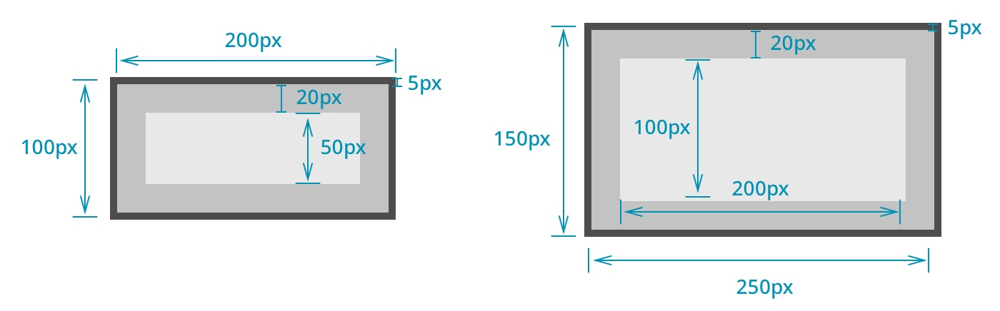

# box-sizing 속성
* `width: 200px` 이고 `height: 100px`, `padding: 20px`, `border: 5px solid black`인 요소는 화면상에 어떻게 나타날까? 아래 사진 중에 왼쪽 처럼 계산될까 아니면 오른쪽처럼 계산될까?
<p align="center">

</p>

## content-box
* 답은 기본적으로는 오른쪽 처럼 그려지게 된다. width를 200px로 설정했다고 할지라도 전체 너비가 200px이 되는 것이 아닌, 여기에 padding과 border-width가 더해져서 그려지게 된다.
* 이런 계산 방법을 `content-box`라고 하며, box-sizing 속성을 content-box로 주게 되면 이와 같이 계산하게 된다. 
* 기본적으로 CSS에서 위처럼 요소를 렌더링하는 이유는 box-sizing 속성의 `기본 값이 content-box`이기 때문이다.

## 예제
```css
<style>
.content-box {
    box-sizing: content-box;
    width: 200px;
    height: 100px;
    padding: 20px;
    border: 5px solid black;
    background-color: white;
}
.content-box .child{
    width: 200px;
    background-color: #ddd;
}
</style>
<div class="content-box">
    <div class="child">200px child</div>
</div>
```
<style>
.content-box {
    box-sizing: content-box;
    width: 200px;
    height: 100px;
    padding: 20px;
    border: 5px solid black;
    background-color: white;
}
.content-box .child{
    width: 200px;
    background-color: #ddd;
    color: black;
}
</style>
<div class="content-box">
    <div class="child">200px child</div>
</div>

## border-box
* 위 예시에서 왼쪽처럼 요소를 렌더링하고 싶다면 box-sizing 속성을 border-box로 주면 된다. 단 이 값은 IE8 이상에서만 사용할 수 있다.

## 예제
```css
<style>
.border-box {
    box-sizing: border-box;
    width: 200px;
    height: 100px;
    padding: 20px;
    border: 5px solid black;
    background-color: white;
}
.border-box .child{
    width: 200px;
    background-color: #ddd;
    color: black;
}
</style>
<div class="border-box">
    <div class="child">200px child</div>
</div>
```
<style>
.border-box {
    box-sizing: border-box;
    width: 200px;
    height: 100px;
    padding: 20px;
    border: 5px solid black;
    background-color: white;
}
.border-box .child{
    width: 200px;
    background-color: #ddd;
    color: black;
}
</style>
<div class="border-box">
    <div class="child">200px child</div>
</div>

## content-box에서 width:100%일 때의 문제
* CSS에서 width 속성을 100%로 주면 부모의 width 만큼 너비가 설정된다. 하지만 content-box일 때 width: 100%에 이어 padding이나 border를 주게 될 경우 부모의 영역을 초과해서 너비가 정해지는 문제가 생길 수 있다.
* 이런 문제를 해결하기 위해서는 box-sizing을 `border-box로 설정`하거나 width를 `auto로 설정`하여 해결할 수 있다. width의 기본 값은 auto이므로 width를 아예 적어주지 않아도 정상적으로 동작한다.

## 예제
```css
<style>
.container1 {
    width: 300px;
    border: 5px solid black;
    background-color: white;
}
.container1 > div {
    padding: 20px;
    background-color: #ddd;
    margin-bottom: 20px;
    border: 3px solid #2e88b5;
}
.container1 .child1{
    width: 100%; /* 문제! */
}
.container1 .child2{
    width: 100%;
    box-sizing: border-box; /* 해결방법 1 */
}
.container1 .child3{
    width: auto; /* 해결방법 2 */
}
.container1 .child4{
    /* width의 기본 값: auto */
}
</style>
<div class="container1">
    <div class="child1"></div>
    <div class="child2"></div>
    <div class="child3"></div>
    <div class="child4"></div>
</div>
```
<style>
.container1 {
    width: 300px;
    border: 5px solid black;
    background-color: white;
}
.container1 > div {
    padding: 20px;
    background-color: #ddd;
    margin-bottom: 20px;
    border: 3px solid #2e88b5;
}
.container1 .child1{
    width: 100%; /* 문제! */
}
.container1 .child2{
    width: 100%;
    box-sizing: border-box; /* 해결방법 1 */
}
.container1 .child3{
    width: auto; /* 해결방법 2 */
}
.container1 .child4{
    /* width의 기본 값: auto */
}
</style>
<div class="container1">
    <div class="child1"></div>
    <div class="child2"></div>
    <div class="child3"></div>
    <div class="child4"></div>
</div>