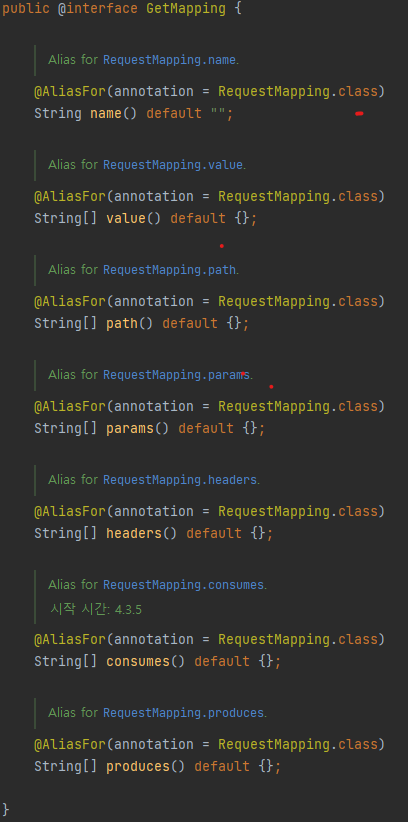

# Hello World API

## REST API 설치하기
* 브라우저에서는 GET방식 밖에 확인할 수 없으므로 REST API를 설치하여 활용한다.

  

## Hello Spring
* Spring initializr를 통해 프로젝트 생성
* IntelliJ로 Gradle 빌드
* controller 생성 후 원하는 인사말 리턴하는 메소드 작성
* 위 메소드를 다음과 같은 어노테이션을 통해 매핑

ApiController.java
```java
import org.springframework.web.bind.annotation.GetMapping;
import org.springframework.web.bind.annotation.RequestMapping;
import org.springframework.web.bind.annotation.RestController;

@RestController // 해당 Class 는 REST API 처리하는 Controller
@RequestMapping("/api") // RequestMapping URI 를 지정해주는 Annotation
public class ApiController {

    @GetMapping("/hello") // http://localhost:9090/api/hello 라는 주소가 매핑됨
    public String hello() {
        return "hello spring boot!";
    }
}
```

HelloApplication.java
```java
import org.springframework.boot.SpringApplication;
import org.springframework.boot.autoconfigure.SpringBootApplication;

@SpringBootApplication
public class HelloApplication {

	public static void main(String[] args) {
		SpringApplication.run(HelloApplication.class, args);
	}
}
```

<br/><br/><br/>  

# 사용되는 annotation  
## @Controller vs `@RestController`
  * 두 어노테이션간 가장 주요한 차이점은 `HTTP Response Body가 생성되는 방식`이다.
  * `View를 반환`하기 위해 사용하는 @Controller
  * `Data를 반환`하기 위해 사용하는 @RestController
  * @Controller도 Data를 반환할 수는 있다. 이를 위해선 `추가적으로 @ResponseBody 어노테이션을 사용하여 Json 형태로 데이터를 반환` 할 수 있다.
  * @RestController는 `@Controller + @ResponseBody` 의 개념이며 모든 메소드가 뷰 대신 객체로 작성된다.  


## @RequestMapping 과 @GetMapping
  * 특정 uri로 요청을 보내면 Controller에서 어떠한 방식으로 처리할지 정의하는데 이 때 `요청을 특정 메소드와 매핑하기 위해 사용하는 것이 @RequsestMapping`이다.
  * value는 요청받을 url을 설정하게 된다
  * method는 어떤 요청으로 받을지 정의하게 된다. (GET, POST, PUT, DELETE 등, 이번 예제에선 GET 메소드만을 정의했기 때문에 생략했다.)
  * @RequestMapping은 `클래스`와 `메소드` 둘 다 붙일 수 있다.
    ```java
    @RequestMapping(value = "/URL", method = 메소드) // @RequestMapping 사용 문법
    ```
    ```java
    @RequestMapping("/api") // 간단하게 활용한 이번 예제
    public class ApiController {}
    ```
  * @GetMapping은 `메소드`에 붙여 @RequestMapping 어노테이션과 매핑해준다.
  * 위에서 언급했듯이 @PostMapping, @PutMapping, @DeleteMapping 등 다른 요청으로도 처리할 수 있다. 이번 예제에선 GetMapping만 사용했다.
    ```java
    @GetMapping("/URL") // @GetMapping 사용문법
    ```
    ```java
    @GetMapping("/hello")
    public String hello() {
        return "hello spring boot!";
    } // 이번 예제, @RequestMapping을 받아서 http://localhost:9090/api/hello 로 매핑해준다
    ```

    
