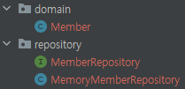

# 회원 관리 예제

## 비즈니스 요구사항 정리
* 데이터: 회원ID, 이름
* 기능: 회원 등록, 조회
* 아직 데이터 저장소가 선정되지 않음

  

* 컨트롤러: 웹 MVC의 컨트롤러 역할
* 서비스: 핵심 비즈니스 로직 구현
* 레포지토리: 데이터베이스에 접근, 도메인 객체를 DB에 저장하고 관리
* 도메인: 비즈니스 도메인 객체, 예) 회원 주문, 쿠폰 등등 주로 데이터베이스에 저장하고 관리됨  

  

* 데이터 저장소가 선정되지 않은 상태이기 때문에 인터페이스로 구현 클래스를 변경할 수 있도록 설계한다.
* 데이터 저장소는 RDB, NoSQL 등 다양한 저장소를 고민중인 상황으로 가정
* 개발을 진행하기 위해서 초기 개발 단계에서는 구현체로 가벼운 메모리 기반의 데이터 저장소 사용

## 회원 도메인과 리포지토리 만들기
* 회원 객체와 리포지토리 인터페이스, 그에 따른 구현체를 만들어 준다.  
      

    Member.java
    ```java
    public class Member {

    private Long id;
    private String name;

    ...(getter, setter)
    }
    ```

    MemberRepository.interface
    ```java
    public interface MemberRepository {
    Member save(Member member);
    Optional<Member> findById(Long id);
    Optional<Member> findByName(String name);
    List<Member> findAll();
    }
    ```

    MemoryMemberRepository.java
    ```java
    public class MemoryMemberRepository implements MemberRepository {
        private static Map<Long, Member> store = new HashMap<>();
        private static long sequence = 0L;

        @Override
        public Member save(Member member) {
            member.setId(++sequence);
            store.put(member.getId(), member);
            return member;
        }

        @Override
        public Optional<Member> findById(Long id) {
            return Optional.ofNullable(store.get(id));
        }

        @Override
        public List<Member> findAll() {
            return new ArrayList<>(store.values());
        }
        @Override
        public Optional<Member> findByName(String name) {
            return store.values().stream()
                .filter(member -> member.getName().equals(name))
                .findAny();
        }
        public void clearStore() {
            store.clear();
        }
    }


## 회원 리포지토리 테스트 케이스 작성
* 개발한 기능을 실행해서 테스트 할 때, 자바의 메인 메서드를 통해서 실행하거나, 웹 애플리케이션의 컨트롤러를 통해서 해당 기능을 실행할 수 있다. 
* 하지만 이런 방법은 준비하고 실행하는데 오래 걸리고 반복 실행하기 어렵고 여러 테스트를 한번에 실행하기 어렵다는 단점이 있다.
* 자바는 JUnit이라는 프레임워크로 테스트를 실행해서 이러한 문제를 해결한다.
    src/test/java/MemoryMemberRepositoryTest.java  
    
* [코드](../hello-spring\src\test\java\hello\hellospring\repository\MemoryMemberRepositoryTest.java)
## 회원 서비스 개발
* Service는 Repository보다 비즈니스에 가깝게 네이밍 해야 한다.
* 회원 가입을 수행하는 join 메소드 안에서 사용할 중복을 확인할validateDuplicateMember 메소드를 작성 해준다.
* 전체 회원 정보를 조회하는 findMembers 메소드는 위의 리포지토리에서 구현한 findAll()을 사용한다.
* [코드](../hello-spring/src/main/java/hello/hellospring/service/MemberService.java)

## 회원 서비스 테스트
* 테스트 하고자 하는 클래스에서 "***ctrl + shift + t***"로 테스트 간편하게 생성 가능
* 테스트에서는 한글로 작성해도 괜찮다. -> 프로덕트 코드가 아닌 이상 직관적으로 한글로 사용하는 경우가 많다.
* "***given, when, then***"패턴으로 테스트를 짜는 연습을 해야한다.
* 각 테스트의 데이터 독립성을 보장하기 위해 리포지토리 테스트에서 사용한 메모리 clearstore() 메소드를 @AfterEach 어노테이션과 함께 적용해주어야 한다.
* 기존 MemberService.java 의 memberRepository 선언부
    ```java
    private final MemberRepository memberRepository = new MemoryMemberRepository();
    ```
* DI(Dependency Injection) 가능하게 변경한 MemberService.java의 선언부
    ```java
    private final MemberRepository memberRepository;
    public MemberService(MemberRepository memberRepository) {
        this.memberRepository = memberRepository;
    }
    ```
* @BeforeEach 어노테이션을 통해 각 테스트 실행 전에 호출되어 테스트가 서로 영향이 없도록 항상 새로운 객체를 생성하고 의존관계도 새로 맺어준다.
```java
@BeforeEach
public void beforeEach() {
    memberRepository = new MemoryMemberRepository();
    memberService = new MemberService(memberRepository);
}
```


* [코드](../hello-spring/src/test/java/hello/hellospring/service/MemberServiceTest.java)