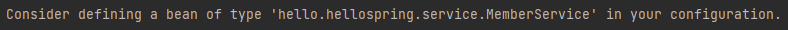

# 스프링 빈과 의존관계

## 컴포넌트 스캔과 자동의존관계 설정
* [MemberController 코드](../hello-spring/src/main/java/hello/hellospring/controller/MemberController.java)
* 회원 컨트롤러가 회원서비스와 회원 리포지토리를 사용할 수 있게 의존관계를 준비한다.
* 생성자에 **@Autowired** 가 있으면 스프링이 연관된 객체를 스프링 컨테이너에서 찾아서 넣어준다. 이렇게 객체 의존관계를 외부에서 넣어주는 것을 **DI(Dependency Injection)**, 의존성 주입이라고 한다.
    ```java
    @Autowired
    public MemberController(MemberService memberService) {
        this.memberService = memberService;
    }
    ```
* [03. 회원 관리 예제의 MemberService 테스트](../03.%20회원%20관리%20예제/README.md) 에서는 개발자가 직접 주입했고, 이번 예제에서는 @Autowired에 의해 스프링이 주입해준다.
* 스프링 컨테이너에 MemberService가 스프링 빈으로 등록되어 있지 않기 때문에 오류가 발생한다.



# **스프링 빈을 등록하는 2가지 방법**
## 1. **컴포넌트 스캔과 자동 의존관계 설정**

* **@Component** 어노테이션이 있으면 스프링 빈으로 자동 등록된다.
* `@Component 를 포함`하는 다음 어노테이션도 스프링 빈으로 자동 등록된다.
  * **@Controller**
  * **@Service**
  * **@Repository**
* MemberService 클래스에 **@Service** 어노테이션을 추가해주고 MemoryMemberRepository 클래스에 **@Repository** 어노테이션을 추가해서 스프링 빈을 등록해준다.
    ```java
    @Service
    public class MemberService {
        private final MemberRepository memberRepository;
        @Autowired
        public MemberService(MemberRepository memberRepository) {
        this.memberRepository = memberRepository;
        }
        ...
    }

    @Repository
    public class MemoryMemberRepository implements MemberRepository {}
    ```

* 스프링 컨테이너에 스프링 빈을 등록할 때 기본적으로 싱글톤으로 등록(유일하게 하나만 등록)한다. 
* 따라서 같은 스프링 빈이면 모두 같은 인스턴스가 된다. 설정으로 다른 패턴으로 설정할 수 있지만, 특별한 경우를 제외하면 대부분 싱글톤을 사용한다.


## 2. **자바 코드로 직접 스프링 빈 등록하기**
* [SpringConfig 코드](../hello-spring/src/main/java/hello/hellospring/service/SpringConfig.java)
* 따로 SpringConfig 클래스를 만들어서 의존관계를 주입해준다.
    ```java
    @Configuration
    public class SpringConfig {

        @Bean
        public MemberService memberService() {
            return new MemberService(memberRepository());
        }

        @Bean
        public MemberRepository memberRepository() {
            return new MemoryMemberRepository();
        }
    }
    ```
* DI에는 **필드 주입**, **setter 주입**, **생성자 주입** 이렇게 3가지 방법이 있다. 의존관계가 실행중에 동적으로 변하는 경우는 거의 없으므로 `생성자 주입이 권장`된다.
* 실무에서는 주로 정형화된 컨트롤러, 서비스, 리포지토리 같은 코드는 컴포넌트 스캔을 사용한다. 
* 하지만 정형화되지 않거나 상황에 따라 구현 클래스를 변경해야 하는 경우에는 스프링 빈으로 등록한다.
* 현재 가상 시나리오상 아직 데이터 저장소가 선정되지 않은 상태이므로 설정을 통해 스프링 빈으로 등록한다.
