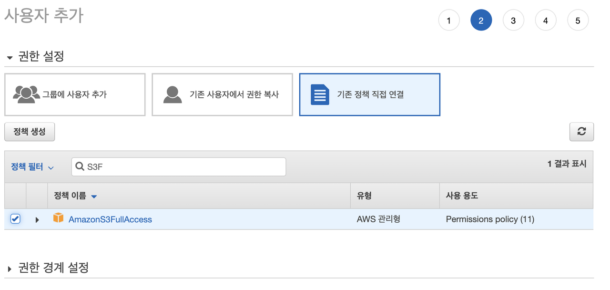

# Spring Boot와 AWS S3 연동

## 1. AWS S3 버킷 설정
* 원하는 이름으로 버킷을 설정한다.


* 버킷 설정

* 첫 번째 옵션: `새 ACL(액세스 제어 목록)을 통해 부여된 버킷 및 객체에 대한 퍼블릭 액세스 차단` 을 해제해서 객체를(이미지 파일) 업로드 할 수 있게 한다.
* 두 번째 옵션: `임의의 ACL(액세스 제어 목록)을 통해 부여된 버킷 및 객체에 대한 퍼블릭 액세스 차단` 을 해제해서 업로드한 객체를 별도로 볼 수 있게 설정한다.
* 두 옵션을 해제 하지 않으면 각각 파일 업로드 시, 업로드된 파일에 접근할 시에 403 Access Denied 오류 발생

## 2. AWS IAM 생성 
* AWS 환경이 아닌 로컬 환경에서 S3를 사용하기 위해 별도의 User가 필요하다.
* 사용자 > 사용자 추가를 클릭
* 프로그래밍 방식 액세스 클릭

* AmazonS3FullAccess를 선택

* 생성된 엑세스키와 비밀키를 csv 파일로 저장한다.

## 3. 로컬 환경에서 이미지, 동영상 업로드하기
* 프로젝트 구성을 위해 의존성을 주입해준다. Gradle을 사용한다.

### **build.gradle**
주요 사용 라이브러리   
* spring-cloud-starter-aws
* spring-boot-starter-web
* lombok
* Thymeleaf
    ```java
    plugins {
        id 'org.springframework.boot' version '2.6.3'
        id 'io.spring.dependency-management' version '1.0.11.RELEASE'
        id 'java'
    }

    group = 'com.keepseung'
    version = '0.0.1-SNAPSHOT'
    sourceCompatibility = '11'

    configurations {
        compileOnly {
            extendsFrom annotationProcessor
        }
    }

    repositories {
        mavenCentral()
    }

    dependencies {
        implementation 'org.springframework.cloud:spring-cloud-starter-aws:2.2.6.RELEASE'

        implementation 'org.springframework.boot:spring-boot-starter-thymeleaf'

        implementation 'org.springframework.boot:spring-boot-starter-web'
        compileOnly 'org.projectlombok:lombok'
        annotationProcessor 'org.projectlombok:lombok'
        testImplementation 'org.springframework.boot:spring-boot-starter-test'
    }

    tasks.named('test') {
        useJUnitPlatform()
    }
    ```

### **S3UploaderService.java**
* S3에 정적 파일을 올리는 기능을 하는 S3UploaderService.java 파일을 생성
    ``` java
    @@Slf4j
    @Service
    @RequiredArgsConstructor
    public class S3UploaderService {

        // local, development 등 현재 프로파일
        @Value("${spring.environment}")
        private String environment;

        // 파일이 저장되는 경로
        @Value("${spring.file-dir}")
        private String rootDir;
        private String fileDir;

        private final AmazonS3Client amazonS3Client;

        /**
        * 서버가 시작할 때 프로파일에 맞는 파일 경로를 설정해줌
        */
        @PostConstruct
        private void init(){
            if(environment.equals("local")){
                this.fileDir = System.getProperty("user.dir") + this.rootDir;
            }
            else if(environment.equals("development")){
                this.fileDir = this.rootDir;
            }

        }

        public String upload(MultipartFile multipartFile, String bucket, String dirName) throws IOException {
            File uploadFile = convert(multipartFile)  // 파일 변환할 수 없으면 에러
                    .orElseThrow(() -> new IllegalArgumentException("error: MultipartFile -> File convert fail"));

            return upload(uploadFile, bucket, dirName);
        }

        // S3로 파일 업로드하기
        private String upload(File uploadFile, String bucket, String dirName) {
            String fileName = dirName + "/" + UUID.randomUUID() + uploadFile.getName();   // S3에 저장된 파일 이름
            String uploadImageUrl = putS3(uploadFile, bucket, fileName); // s3로 업로드
            removeNewFile(uploadFile);
            return uploadImageUrl;
        }

        // S3로 업로드
        private String putS3(File uploadFile, String bucket, String fileName) {
            amazonS3Client.putObject(new PutObjectRequest(bucket, fileName, uploadFile).withCannedAcl(CannedAccessControlList.PublicRead));
            return amazonS3Client.getUrl(bucket, fileName).toString();
        }

        // 로컬에 저장된 이미지 지우기
        private void removeNewFile(File targetFile) {
            if (targetFile.delete()) {
                log.info("File delete success");
                return;
            }
            log.info("File delete fail");
        }

        /**
        * @param multipartFile
        * 로컬에 파일 저장하기
        */
        private Optional<File> convert(MultipartFile multipartFile) throws IOException {
            if (multipartFile.isEmpty()) {
                return Optional.empty();
            }

            String originalFilename = multipartFile.getOriginalFilename();
            String storeFileName = createStoreFileName(originalFilename);

            //파일 업로드
            File file = new File(fileDir+storeFileName);
            multipartFile.transferTo(file);

            return Optional.of(file);
        }

        /**
        * @description 파일 이름이 이미 업로드된 파일들과 겹치지 않게 UUID를 사용한다.
        * @param originalFilename 원본 파일 이름
        * @return 파일 이름
        */
        private String createStoreFileName(String originalFilename) {
            String ext = extractExt(originalFilename);
            String uuid = UUID.randomUUID().toString();
            return uuid + "." + ext;
        }

        /**
        * @description 사용자가 업로드한 파일에서 확장자를 추출한다.
        *
        * @param originalFilename 원본 파일 이름
        * @return 파일 확장자
        */
        private String extractExt(String originalFilename) {
            int pos = originalFilename.lastIndexOf(".");
            return originalFilename.substring(pos + 1);
        }

    }
    ```

* 별다른 Configuration 코드 없이 AmazonS3Client 를 DI 주입 받는다. Spring Boot Cloud AWS를 사용하게 되면 `S3 관련 Bean을 자동 생성`하기 때문이다.

## References
* [킵고잉](https://develop-writing.tistory.com/128)
* 
