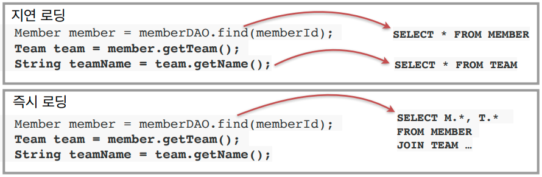

# JPA 소개

# SQL 중심적인 개발의 문제점
* 관계형 DB가 지배적인 시점에서 필연적으로 SQL 중심적인 개발이 된다.
* 문제점
  * CRUD의 무한 반복
  * SQL에 의존적인 개발
* 하지만 객체를 저장하고 활용하기 위해서는 현실적으로 관계형 데이터베이스를 사용해야 한다.

## **객체와 관계형 데이터베이스의 차이**
1. 상속
2. 연관관계
3. 데이터 타입
4. 데이터 식별 방법

## 1. **상속**
* Table 슈퍼타입 서브타입 관계가 객체지향 언어의 상속과 유사하다.

* 하지만 데이터를 저장하고 조회하는 과정이 너무 복잡하다.
  1. 객체 분해
  2. INSERT INTO ITEM
  3. INSERT INTO ALBUM
  4. 각각의 테이블에 따른 조인문 작성
  5. 각각의 객체 생성

* 자바 컬렉션에 저장, 조회한다면 매우 간단해진다.
  ```java
  list.add(album);
  Album album = list.get(albumId);
  ```

* 부모 타입으로 조회 후 다형성 활용도 가능하다.
  ```java
  Item item = list.get(albumId);
  ``` 

## 2. **연관관계**
* 객체는 참조를 사용한다: member.getTeam()
* 테이블은 외래 키를 사용한다: JOIN ON M.TEAM_ID = T.TEAM_ID
* 객체는 단방향 참조만 가능하지만 테이블은 양방향이 가능하다.
   
   

* 객체는 자유롭게 객체 그래프를 탐색할 수 있어야 한다.
 
* 하지만 관계형 데이터베이스는 처음 실행하는 SQL에 따라 탐색 범위가 결정되므로 이 범위를 벗어나면 불가능해진다.
  ```java
  member.getTeam(); // OK
  member.getOrder(); // null
  ```

* 또한, 어떤 쿼리가 날라갔고 어떻게 데이터를 조립하는지 눈에 보이지 않기 때문에 엔티티에 대한 신뢰 문제가 발생하게 되는데 다음과 같은 경우이다.
  ```java
  class MemberService {
    public void process() {
      Member member = memberDAO.find(memberId);
      member.getTeam(); // ???
      member.getOrder().getDelivery(); // ???
    }
  }
  ```

* 모든 객체를 미리 로딩해둘 수 없다.
```java
memberDAO.getMember(); // Member 조회
memberDAO.getMemberWithTeam(); // Member와 Team 조회
memberDAO.getMemberWithOrderWithDelivery(); // Member, Order, Delivery 조회
... // 이처럼 모든 경우를 가정하고 미리 로딩해둘 수 없다.
```

* 비교 부분에서도 달라진다.
```java
String memberId = "100";
Member member1 = memberDAO.getMember(memberId);
Member member2 = memberDAO.getMember(memberId);
member1 == member2; //다르다.
class MemberDAO {

 public Member getMember(String memberId) {
 String sql = "SELECT * FROM MEMBER WHERE MEMBER_ID = ?";
 ...
 //JDBC API, SQL 실행
 return new Member(...);
 }
}

//===========================================//

String memberId = "100";
Member member1 = list.get(memberId);
Member member2 = list.get(memberId);
member1 == member2; //같다.
```

# JPA 소개
* Java Persistence API
* 자바 진영의 ORM기술의 표준   

### ORM(Object-relational mapping)
* 객체는 객체대로 설계
* 관계형 데이터베이스는 관계형 데이터베이스대로 설계
* ORM 프레임워크가 중간에서 매핑
* 대중적인 언어에는 대부분 ORM 기술이 존재한다.   
 

### JPA는 애플리케이션과 JDBC 사이에서 동작
  
* JPA 동작 - 저장     

* JPA 동작 - 조회


* 동작과정에서 `패러다임의 불일치를 해결`해준다.

### JPA는 표준 명세이다.
* JPA는 인터페이스의 모음
* JPA 2.1 표준 명세를 구현한 3가지 구현체
* 하이버네이트, EclipseLink, DataNucleus


### JPA를 왜 사용해야 하는가
* SQL 중심적인 개발에서 객체 중심으로 개발
* 생산성
  * 저장: jpa.persist(member)
  * 조회: Member member = jpa.find(memberId)
  * 수정: member.setName("변경할 이름")
  * 삭제: jpa.remove(member)
* 유지보수   

  member 테이블에 tel 속성 추가할 때   
  
  jpa를 사용하지 않고 쿼리문으로 처리할 경우
  
  jpa를 사용할 경우
  
* 패러다임의 불일치 해결
  * 개발자는 자바를 통해 저장, 조회, 수정, 삭제를 수행하고 jpa는 이에 맞는 쿼리문을 날려준다.
  * 연관관계와 객체 그래프 탐색에 있어서 자유로움이 보장됨
    ```java
    member.setTeam(team);
    jpa.persist(member);

    Member member = jpa.find(Member.class, memberId);
    Team team = member.getTeam();
    ```
  * 신뢰할 수 있는 엔티티, 계층
  * JPA를 통해 비교하면 동일한 트랙잭션에서 조회한 엔티티는 같음을 보장한다.

* 성능
  * 1차 캐시와 동일성 보장
    * 같은 트랜잭션 안에서 같은 엔티티를 반환 -> 약간의 조회 성능 향상
    * DB Isolation Level이 Read Commit 이어도 애플리케이션에서 Repeatable Read 보장
  * 트랜잭션을 지원하는 쓰기 지연
    * 트랜잭션을 커밋할 때까지 INSERT SQL을 모음
    * JDBC BATCH SQL 기능을 사용해서 한번에 SQL 전송
  * 지연 로딩
    * 지연 로딩: 객체가 실제 사용될 때 로딩
    * 즉시 로딩: JOIN SQL로 한번에 연관된 객체까지 미리 조회
    * JPA는 옵션을 통해 자유롭게 전환할 수 있다.
    
* 데이터 접근 추상화와 벤더 독립성
* 표준