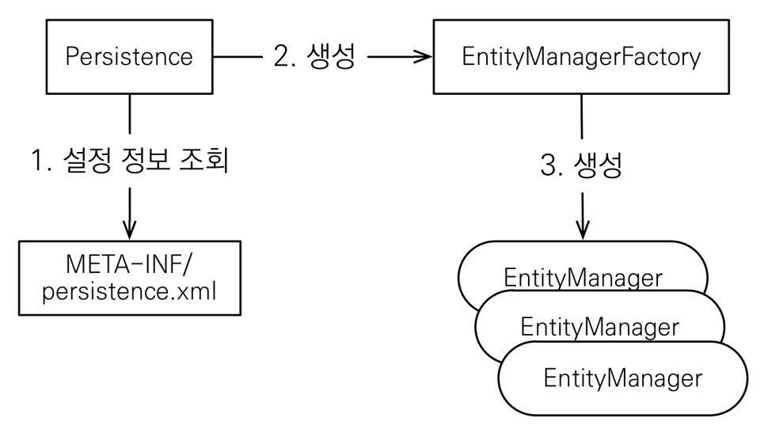

# JPA 시작하기

## h2 사용
* 배치파일 실행 후 127.0.0.1:8082
* 최고의 실습용 DB

## 프로젝트 생성
* 새 프로젝트로 생성
* [pom.xml](../ex1-hello-jpa/pom.xml)과 [main/resources/META-INF/persistence.xml](../ex1-hello-jpa/src/main/resources/META-INF/persistence.xml) 의 초기 설정 필요

## 데이터베이스 방언
* JPA는 특정 데이터베이스에 **종속되지 않는다**.
* 각각의 데이터베이스가 제공하는 SQL 문법과 함수는 조금씩 다르다.
  * 가변 문자: MySQL - VARCHAR, Oracle - VARCHAR2
  * 문자열을 자르는 함수: SQL 표준 - SUBSTRING(), Oracle - SUBSTR()
  * 페이징: MySQL - LIMIT, Oracle - ROWNUM
* `SQL 표준을 지키지 않는 특정 데이터베이스만의 고유한 기능을 방언`이라고 한다.

* 다음과 같이 속성에 지정해줌으로써 어떤 DB의 방언을 사용할지 정해주면 JPA는 이것을 SQL표준으로 자동으로 번역한다.
    ```java
    <property name="hibernate.dialect" value="org.hibernate.dialect.H2Dialect"/>
    ```

## JPA 구동 방식


## 기초 저장, 조회, 삭제, 수정
* [JpaMain.java](../ex1-hello-jpa/src/main/java/hellojpa/JpaMain.java)
* [Member.java](../ex1-hello-jpa/src/main/java/hellojpa/Member.java)

* h2 쿼리문으로 Member 테이블을 생성한다.
    ```sql
    create table Member (
        id bigint not null,
        name varchar(255),
        primary key (id)
    );
    ```
* @Entity, @Id 어노테이션으로 테이블과 데이터베이스의 PK를 매핑해준다.
    ```java
    @Entity
    public class Member {
    @Id
        private Long id;
        private String name;
        
        //Getter, Setter …
    } 
    ```

* **EntityManagerFactory**를 애플리케이션 로딩 시점에 단 한번만 만들어줘야 한다. 이후 애플리케이션 전체에서 공유한다.
* 그리고 수행 단위마다 **EntityManager** 를 만들어줘야 한다. 쓰레드간에 공유하지 않는다. 사용하고 반드시 버려야 한다.
* **EntityTransaction**을 통해 트랜잭션을 얻어줘야 한다. **JPA의 모든 데이터 변경은 트랜잭션 안에서 실행한다.**
* 저장, 조회, 삭제, 수정은 다음과 같이 수행한다.
    ```java
    // 저장

    Member member = new Member();

    member.setId(2L);
    member.setName("HelloB");

    em.persist(member);


    // 조회

    Member findMember = em.find(Member.class, 1L);
    System.out.println("findMember.id = " + findMember.getId());
    System.out.println("findMember.name = " + findMember.getName());


    // 삭제
    Member findMember = em.find(Member.class, 1L);
    em.remove(findMember);


    // 수정
    Member findMember = em.find(Member.class, 1L);
    findMember.setName("HelloJPA");

    tx.commit();
    ```

## JPQL 소개
* JPA는 SQL을 추상화한 JPQL이라는 객체 지향 쿼리 언어를 제공한다.
* 위와 같은 단순 조회가 아닌 복잡한 JOIN문이나 조건을 설정해야 할 때 쿼리문을 사용하는 것이 아닌 JPQL을 통해서 수행 가능하다.
* JPA를 사용하면 엔티티 객체를 중심으로 개발하게 된다. 여기서 문제는 검색 쿼리이다.
* 검색을 할 때도 테이블이 아닌 `엔티티 객체를 대상`으로 검색한다.
* 모든 DB 데이터를 객체로 변환해서 검색하는 것은 불가능하다.
* 애플리케이션이 필요한 데이터만 DB에서 불러오려면 결국 검색 조건이 포함된 SQL이 필요하다.
    ```java
    List<Member> result = em.createQuery("select m from Member as m", Member.class)
            .setFirstResult(5)
            .setMaxResults(8)
            .getResultList();

    for (Member member : result) {
        System.out.println("member.name = " + member.getName());
    }
    ```
* SQL과 문법이 유사하다. SELECT, FROM, WHERE, GROUP BY, HAVING, JOIN을 지원한다
* `JPQL은 엔티티 객체`를 대상으로 쿼리
* `SQL은 데이터베이스 테이블`을 대상으로 쿼리
* JPQL 사용이 가져오는 강점은 방언을 바꾸어도 JPQL문을 따로 변경하지 않아도 되는 점이다.