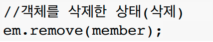

# 영속성 관리

## JPA에서 가장 중요한 2가지
* 객체와 관계형 데이터베이스 매핑하기(Object Relational Mapping)
* 영속성 컨텍스트

## 엔티티 매니저 팩토리와 엔티티 매니저의 동작 방식


* 엔티티 매니저 팩토리가 고객의 요청이 올 때마다 엔티티매니저를 생성하고 엔티티 매니저는 내부적으로 데이터베이스 커넥션을 이용해서 DB를 사용한다.

## 영속성 컨텍스트란?
* JPA를 이해하는데 가장 중요한 용어
* "엔티티를 영구 저장하는 환경"이라는 뜻
* EntityManager.persist(entity);
  * DB에 저장한다기보다 entity를 영속화 한다는 의미이다.
* 영속성 컨텍스트는 눈에 보이지 않는 논리적인 개념이다.
* 엔티티 매니저를 통해서 영속성 컨텍스트에 접근한다.


## 엔티티의 생명주기
* `비영속 (new/transient)` : 영속성 컨텍스트와 전혀 관계가 없는 새로운 상태
* `영속 (managed)` : 영속성 컨텍스트에 관리되는 상태
* `준영속 (detached)` : 영속성 컨텍스트에 저장되었다가 분리된 상태
* `삭제 (removed)` : 삭제된 상태


* [JpaMain.java 실습코드](../ex1-hello-jpa/target/classes/hellojpa/JpaMain.class)
## 비영속

* 단순 멤버 객체만 생성한 상태
## 영속

* 영속 컨텍스트에 멤버 객체를 넣어줌으로써 영속 상태가 됐다.
* 하지만 persist 시점에서 쿼리가 날라가는 것이 아닌 트랜잭션 커밋시에 날라간다.
## 준영속, 삭제




# 영속성 컨텍스트의 이점
* 1차 캐시
* 동일성(identity) 보장
* 트랜잭션을 지원하는 쓰기 지연(Transactional write-behind)
* 변경 감지(Dirty Checking)
* 지연 로딩(Lazy Loading)
## 1차 캐시에서 엔티티 조회
* 만약 다음과 같은 상황에서 member를 조회하면 1차 캐시에서 우선적으로 member를 조회한다. 1차 캐시에 값이 있으므로 DB에 SELECT쿼리를 날리지 않는다.
    ```java
    Member member = new Member();
    member.setId("member1");
    member.setUsername("회원1");

    em.persist(member);

    Member findMember1 = em.find(Member.class, "member1");
    ```
    

* 1차캐시에 없는 값을 조회할 경우 1차캐시에서 수행 후 DB에서 조회를 하고 그 값을 1차 캐시에 저장하고 반환해준다.
* 이후 같은 값을 조회할 경우 1차캐시에 그 값이 있으므로 DB에 SELECT쿼리를 날리지 않는다.
    ```java
    Member findMember2 = em.find(Member.class, "member2");
    ```
    

## 영속 엔티티의 동일성 보장
```java
Member a = em.find(Member.class, "member1");
Member b = em.find(Member.class, "member1");

system.out.println(a == b); // True
```
* 1차 캐시로 반복 가능한 읽기(REPEATABLE READ) 등급의 트랜잭션 격리 수준을 데이터베이스가 아닌 애플리케이션 차원에서 제공한다.
* 같은 트랜잭션 안에서 마치 자바컬렉션에서의 비교처럼 영속 엔티티의 동일성이 보장된다.

## 트랜잭션을 지원하는 쓰기 지연 - 엔티티를 등록할 때
```java
EntityManager em = emf.createEntityManager();
EntityTransaction transaction = em.getTransaction();
transaction.begin();

em.persist(memberA);
em.persist(memberB);
// 여기까지 INSERT SQL을 데이터베이스에 보내지 않는다.

transaction.commit(); // 커밋하는 순간 데이터베이스에 INSERT SQL을 보낸다.
```

* em.persist(memberA);


* em.persist(memberB);


* transaction.commit();

  * 쓰기 지연 SQL 저장소에 있던 INSERT SQL들이 커밋과 함께 flush 된다.
* 매번 INSERT SQL을 날린다면 최적화할 수 있는 여지가 없어지는데 JPA는 batch_size를 설정한 만큼 지연 쓰기가 된다.
 
    [persistence.xml](../ex1-hello-jpa/src/main/resources/META-INF/persistence.xml)
    ```xml
    <property name="hibernate.jdbc.batch_size" value="10"/>
    ```

## 변경 감지(Dirty Checking) - 엔티티를 수정할 때

```java
EntityManager em = emf.createEntityManager();
EntityTransaction transaction = em.getTransaction();
transaction.begin();

// 영속 엔티티 조회
Member memberA = em.find(Member.class, "memberA");

// 영속 엔티티 데이터 수정
memberA.setUsername("hi");
memberA.setAge(10);

// em.update(member)와 같은 코드가 없이 수정이 될까?
transaction.commit();
```


* JPA는 1차 캐시에 데이터가 들어오는 시점에 스냅샷을 떠두고 1차 캐시에 저장해 둔다. 
* 이 스냅샷과 엔티티의 데이터를 일일이 비교하고 변경점이 있다면 UPDATE 쿼리를 쓰기 지연 SQL 저장소에 생성한다.
* 커밋 때 쿼리를 먼저 날리고 데이터를 갱신한 뒤 커밋한다.

* 엔티티 삭제 또한 수정 때의 메커니즘과 같이 동작하고 UPDATE 쿼리 대신 DELETE 쿼리가 날아간다.

## 플러시
* 영속성 컨텍스트의 변경내용을 데이터베이스에 반영하는 것
* 영속성 컨텍스트를 플러시하는 방법
  1. **em.flush()** - 직접 호출
  2. **트랜잭션 커밋** - 플러시 자동 호출
  3. **JPQL 쿼리 실행** - 플러시 자동 호출

* 영속성 컨텍스트를 비우지 않는다.
* 영속성 컨텍스트의 변경내용을 데이터베이스에 동기화한다.
* 트랜잭션이라는 작업 단위가 중요 -> 커밋 직전에만 동기화 하면 된다.

## 준영속 상태
* 영속 상태의 엔티티가 영속성 컨텍스트에서 분리(Detached) 되는 것.
* 영속성 컨텍스트가 제공하는 기능을 사용 못함.

## 준영속 상태로 만드는 방법
1. em.detach(entity) - 특정 엔티티만 준영속 상태로 전환
2. em.clear() - 영속성 컨텍스트를 완전히 초기화
3. em.close() - 영속성 컨텍스트를 종료

* 1차 캐시에서 특정 엔티티 혹은 모든 컨텍스트를 삭제하는 것이므로 상황에 따라서 활용해야 한다.(복잡한 애플리케이션 개발 시 외엔 활용할 일이 많지 않다.)