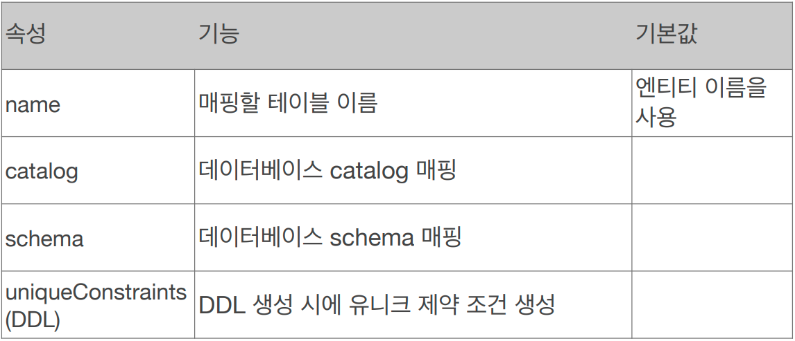
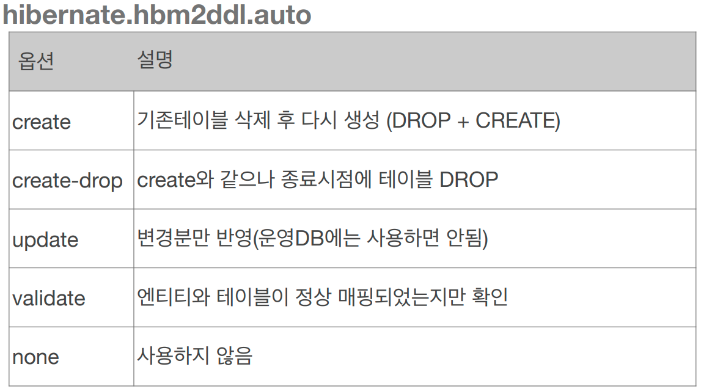
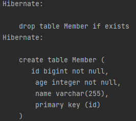
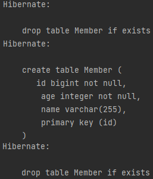
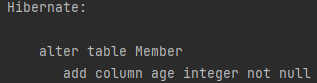
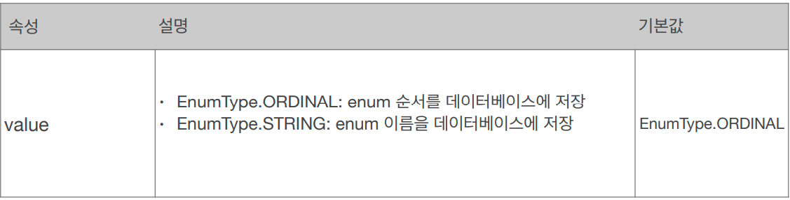
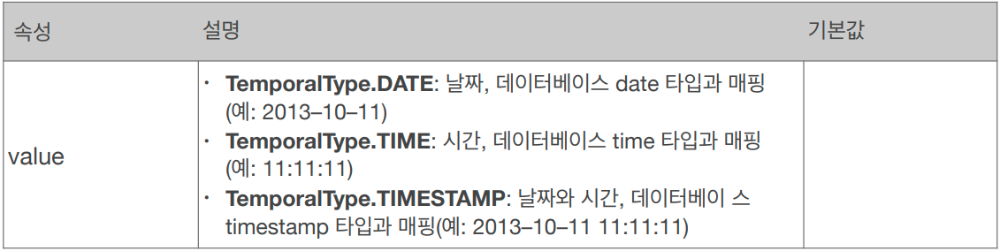
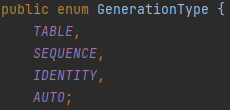
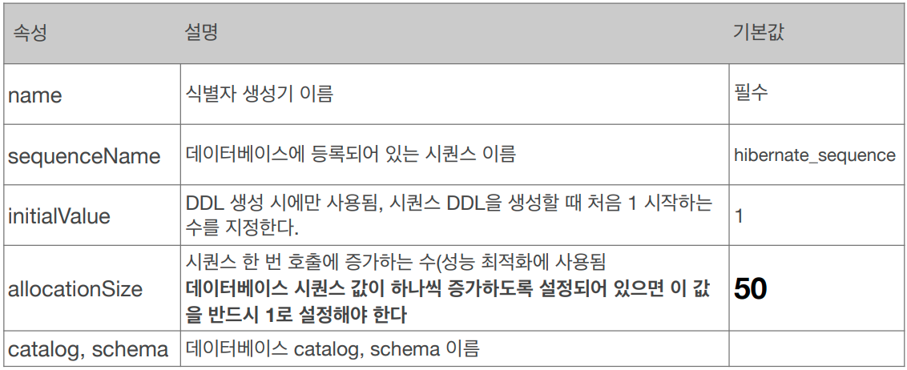
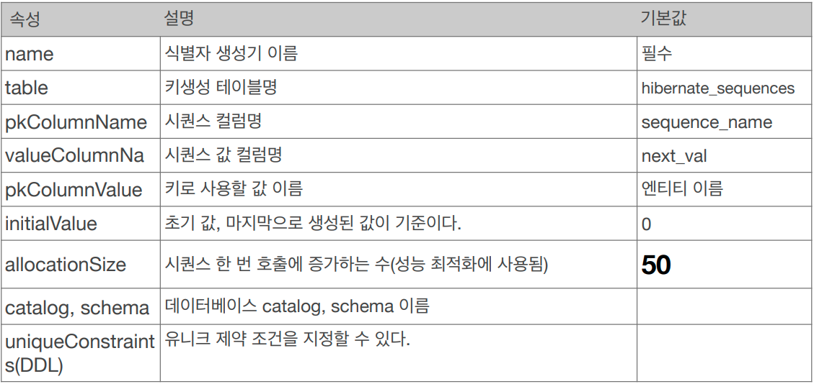

# 엔티티 매핑

## 엔티티 매핑 소개
* 객체와 테이블 매핑: @Entity, @Table
* 필드와 컬럼 매핑: @Column
* 기본 키 매핑: @Id
* 연관관계 매핑: @ManyToOne, @JoinColumn

## @Entity
* @Entity가 붙은 클래스는 JPA가 관리한다.
* JPA를 사용해서 테이블과 매핑할 클래스는 @Entity 필수
* `기본 생성자 필수`(파라미터가 없는 public 또는 protected 생성자)
* final 클래스, enum, interface, inner 클래스 사용 X
* 저장할 필드에 final 사용 X

## @Entity 속성 정리
* 속성: name
  * JPA에서 사용할 엔티티 이름을 지정한다.
  * 기본값: 클래스 이름을 그대로 사용(예: Member)
  * 같은 클래스 이름이 없으면 가급적 기본값을 사용한다.

## @Table
* @Table 은 엔티티와 매핑할 테이블 지정


## 데이터베이스 스키마 자동 생성
* DDL을 애플리케이션 실행 시점에 자동 생성
* 테이블 중심 -> 객체 중심
* 데이터베이스 방언을 활용해서 데이터베이스에 맞는 적절한 DDL 생성
* 이렇게 생성된 DDL은 개발 장비에서만 사용
* 생성된 DDL은 운영서버에서는 사용하지 않거나, 적절히 다듬은 후 사용

## 스키마 자동 생성 - 속성


### create 
* 기존 테이블 삭제 후 다시 생성(DROP + CREATE)
    ```java
    <property name="hibernate.hbm2ddl.auto" value="create"/>
    ```
    
    

### create-drop 
* drop + create + drop의 과정, 테스트 케이스를 실행 후 깔끔하게 초기화 하고 싶을 때 주로 사용
    ```java
    <property name="hibernate.hbm2ddl.auto" value="create-drop"/>
    ```
    
    

### update
* 지우는 것은 불가능 하고 추가만 가능하다. 
* 다음은 id와 name만으로 member 테이블을 생성하고 후에 age를 추가해줬을 때의 쿼리문
    ```java
    <property name="hibernate.hbm2ddl.auto" value="update"/>
    ```
    

### validate
* 엔티티와 테이블이 정상 매핑되었는지만 확인한다.
    ```java
    <property name="hibernate.hbm2ddl.auto" value="validate"/>
    ```

### none
* 아무런 기능을 사용하지 않을 때

## 데이터베이스 스키마 자동 생성의 주의사항
* `운영 장비에는 절대 create, create-drop, update를 사용하면 안된다.`
* 개발 초기 단계는 `create 또는 update`
* 테스트 서버는 `update 또는 validate`
* 스테이징과 운영 서버는 `validate 또는 none`

# 필드와 컬럼 매핑
## 요구사항 추가
1. 회원은 일반 회원과 관리자로 구분해야 한다.
2. 회원 가입일과 수정일이 있어야 한다.
3. 회원을 설명할 수 있는 필드가 있어야 한다. 이 필드는 길이 제한이 없다.
    ```java
    public class Member {
        @Id
        private Long id;

        @Column(name = "name")
        private String username;

        private Integer age;

        @Enumerated(EnumType.STRING)
        private RoleType roleType;

        @Temporal(TemporalType.TIMESTAMP)
        private Date createdDate;

        @Temporal(TemporalType.TIMESTAMP)
        private Date lastModifiedDate;

        @Lob
        private String description;

        public Member() {
        }
    }
    ```

## 매핑 어노테이션


## @Column 속성

* nullable=false 속성으로 not null을 설정해 줄 수 있다.
* unique 속성은 주로 Table에서 사용하는 것을 선호한다.

## @Enumerated 속성
* 자바의 enum 타입을 매핑할 때 사용한다.

* ORDINAL을 사용하면 integer 타입으로 enum의 순서를 데이터베이스에 저장하고 enum의 요소가 추가될 때 따로 기존의 순서를 업데이트하지 않고 그 값을 그대로 갖고 있어 혼란을 야기할 수 있으므로 `의도치 않은 ORDINAL 사용은 하면 안된다`.
* 그래서 거의 필수적으로 `@Enumerated(EnumType.SRING)` 을 사용한다.

## @Temporal 속성
* 날짜 타입(java.util.Date, java.util.Calendar)을 매핑할 때 사용
* 하지만 최신 하이버네이트에서 `LocalDate`, `LocalDateTime`을 사용하면서 생략하게 되었다.


## @Lob 속성
* 데이터베이스 BLOB, CLOB 타입과 매핑
* 따로 속성이 존재하지 않는다.
* 매핑하는 필드 타입이 문자면 CLOB, 나머지는 BLOB으로 매핑된다.

## @Transient
* 필드 매핑 X
* 데이터베이스에 저장X, 조회X
* 주로 메모리상에서만 임시로 어떤 값을 보관하고 싶을 때 사용한다.
    ```java
    @Transient
    private Integer temp;
    ```

# 기본 키 매핑

## 기본 키 매핑 어노테이션
* @Id
* @GeneratedValue

## 기본 키 매핑 방법
* 직접 할당: @Id만 사용
* 자동 생성(@GeneratedValue)   

    
  * IDENTITY: 데이터베이스에 위임, MYSQL
  * SEQUENCE: 데이터베이스 시퀀스 오브젝트 사용, ORACLE
    * @SequenceGenerator 필요
  * TABLE: 키 생성용 테이블 사용, 모든 DB에서 사용
    * @TableGenerator 필요
  * AUTO: 방언에 따라 자동 지정, 기본값

## IDENTITY 전략 - 특징
* 기본 키 생성을 데이터베이스에 위임한다.
* 주로 MySQL, PostgreSQL, SQL Server, DB2에서 사용한다.
* JPA는 보통 트랜잭션 커밋 시점에 INSERT SQL 실행
* MySQL의 AUTO_INCREMENT는 데이터베이스에 INSERT SQL을 실행한 이후에 ID 값을 알 수 있음
* IDENTITY 전략은 em.persist() 시점에 즉시 INSERT SQL문을 실행하고 DB에서 식별자를 조회한다.

## IDENTITY 전략 - 매핑
```java
@Entity
public class Member {
    @Id
    @GeneratedValue(strategy = GenerationType.IDENTITY)
    private Long id; 
```

## SEQUENCE 전략 - 특징
* 데이터베이스 시퀀스는 유일한 값을 순서대로 생성하는 특별한 데이터베이스 오브젝트(ex. 오라클 시퀀스)
* 오라클, PostgreSQL, DB2, H2 데이터베이스에서 사용한다.

## SEQUENCE 전략 - 매핑
```java
@Entity
@SequenceGenerator(
    name = “MEMBER_SEQ_GENERATOR",
    sequenceName = “MEMBER_SEQ", //매핑할 데이터베이스 시퀀스 이름
    initialValue = 1, allocationSize = 1)
public class Member {
    @Id
    @GeneratedValue(strategy = GenerationType.SEQUENCE,
    generator = "MEMBER_SEQ_GENERATOR")
    private Long id; 
```

## SEQUENCE - @SequenceGenerator 속성



## TABLE 전략
* 키 생성 전용 테이블을 하나 만들어서 데이터베이스 시퀀스를 흉내내는 전략
* 모든 데이터베이스에 적용가능하지만 성능이 떨어진다.

## TABLE 전략 - 매핑

```java
// Member 클래스에 어노테이션 추가
@Entity
@TableGenerator(
    name = "MEMBER_SEQ_GENERATOR",
    table = "MY_SEQUENCES",
    pkColumnValue = "MEMBER_SEQ", allocationSize = 1)
public class Member {
    @Id
    @GeneratedValue(strategy = GenerationType.TABLE,
    generator = "MEMBER_SEQ_GENERATOR")
    private Long id; 

// SQL 쿼리문 생성됨
create table MY_SEQUENCES (
    sequence_name varchar(255) not null,
    next_val bigint,
    primary key ( sequence_name )
)
```

## TABLE - @TableGenerator 속성


## 권장하는 식별자 전략
* 기본 키 제약 조건: not null, 유일, **변하면 안된다**.
* 미래까지 이런 조건을 만족하는 자연키는 찾기 어렵다. 그래서 대리키(대체키)를 사용한다.
* 예를 들어 주민등록번호도 기본 키로 적절하지 않다.
* 권장: `Long형(10억 이상) + 대체키 + 키 생성전략 사용`
* auto_increment, sequence, newId 등
