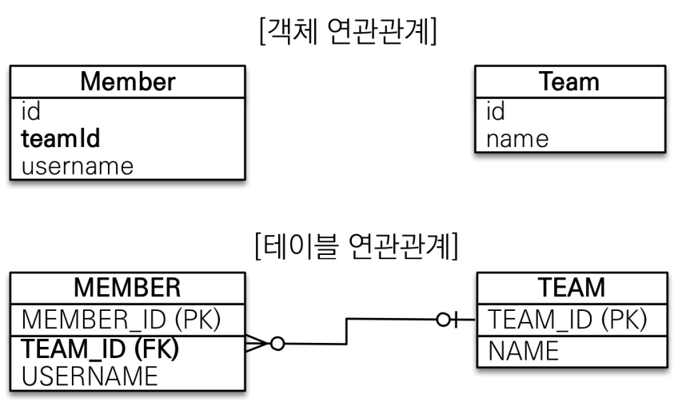
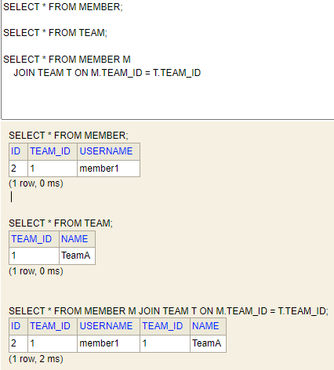
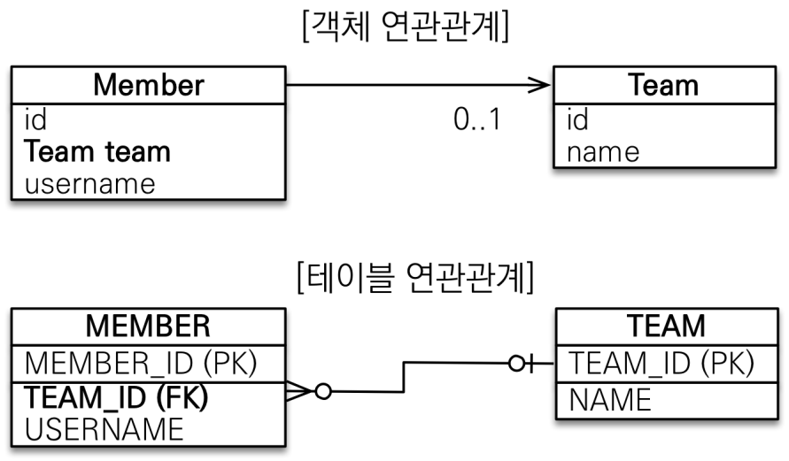
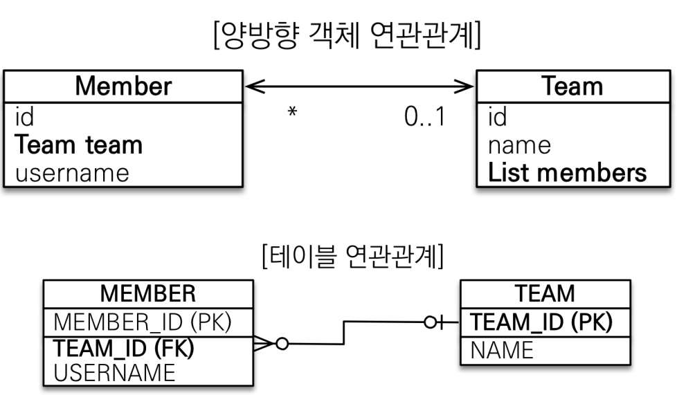
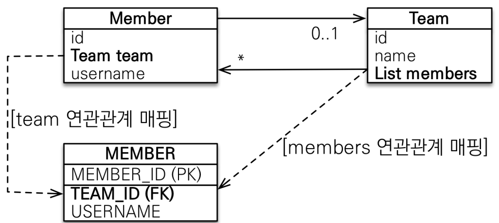
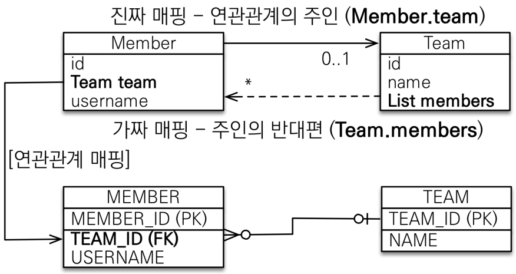

# 연관관계 매핑 기초

## 기본 용어

* `방향(Direction)`: 단방향, 양방향
* `다중성(Multiplicity)`: 다대일(N:1), 일대다(1:N), 일대일(1:1), 다대다(N:M)
* `연관관계의 주인(Owner)`: 객체 양방향 연관관계는 관리 주인이 필요
## 예제 시나리오
* 회원과 팀이 있다.
* 회원은 하나의 팀에만 소속될 수 있다.
* 회원과 팀은 다대일 관계다.

## 객체를 테이블에 맞추어 모델링

참조 대신에 외래 키를 그대로 사용
```java
@Entity
public class Member {
    @Id @GeneratedValue
    private Long id;

    @Column(name = "USERNAME")
    private String username;

    @Column(name = "TEAM_ID")
    private Long teamId;
}
```
```java
@Entity
public class Team {
    @Id @GeneratedValue
    @Column(name = "TEAM_ID")
    private Long id;
    private String name;
}
```

## 객체를 테이블에 맞춰 데이터 중심으로 모델링 하면, 협력 관계를 만들 수 없다.
팀 저장, 회원 저장, 회원 조회 시
```java
//팀 저장, 회원 저장
Team team = new Team();
team.setName("TeamA");
em.persist(team);

Member member = new Member();
member.setUsername("member1");
member.setTeamId(team.getId());
em.persist(member);

// 회원 조회
Member findMember = em.find(Member.class, member.getId());

Long findTeamId = findMember.getTeamId();
Team findTeam = em.find(Team.class, findTeamId);

tx.commit();
```



* `테이블은 외래 키로 조인`을 사용해서 연관된 테이블을 찾는다.
* `객체는 참조`를 사용해서 연관된 객체를 찾는다.
* 테이블과 객체 사이에는 이런 큰 간격이 있다.

# 단방향 연관관계

## 객체 지향 모델링


Member.java
```java
@Entity
public class Member {
    @Id @GeneratedValue
    @Column(name = "MEMBER_ID")
    private Long id;

    @Column(name = "USERNAME")
    private String username;
//    @Column(name = "TEAM_ID")
//    private Long teamId;

    @ManyToOne  // Member 입장에서 Team과 N:1이므로 ManyToOne
    @JoinColumn(name = "TEAM_ID")   // TEAM_ID의 이름을 가진 컬럼과 조인
    private Team team;
    ...
}
```

연관관계 저장, 조회, 수정
```java
//저장
Team team = new Team();
team.setName("TeamA");
em.persist(team);

Member member = new Member();
member.setUsername("member1");
member.setTeam(team);
em.persist(member);

//조회
Member findMember = em.find(Member.class, member.getId());

Team findTeam = findMember.getTeam();
System.out.println("findTeam = " + findTeam.getName());

//수정
Team newTeam = em.find(Team.class, 100L);
findMember.setTeam(newTeam);

tx.commit();
```
```
findTeam = TeamA
```   

# 양방향 연관관계와 연관관계의 주인

* 위에서 진행한 단방향 연관관계의 경우 멤버에서 팀을 참조할 수 있지만 반대의 경우는 불가능하다.
* 테이블의 관점에서 보면 외래키 하나로 양방향 연관관계를 관리 가능하지만 객체에선 불가능한 점이 가장 큰 차이점이다.

## 양방향 매핑
* 양방향 매핑시 당연하게도 테이블은 변동사항이 없다. 객체간의 양방향을 보장해주기 위한 작업이다


```java
@Entity
public class Team {

    @Id @GeneratedValue
    @Column(name = "TEAM_ID")
    private Long id;
    private String name;

    // "team"의 이름을 가진 속성과 일대다 매핑 해준다는 의미의 어노테이션
    @OneToMany(mappedBy = "team")   
    private List<Member> members = new ArrayList<>();
}
```

역방향 조회
```java
Member findMember = em.find(Member.class, member.getId());

List<Member> members = findMember.getTeam().getMembers();

for (Member m : members) {
    System.out.println("m = " + m.getUsername());
}
```
```
m = member1
```

## 연관관계의 주인과 mappedBy
* 객체와 테이블간에 연관관계를 맺는 차이를 이해해야 한다.
* 객체 연관관계 = 2개
  * 회원 -> 팀 연관관계 1개(단방향)
  * 팀 -> 회원 연관관계 1개(단방향)
  * 단방향을 2개 만든 것을 양방향이라고 부르는 것이다.
* 테이블 연관관계 = 1개
  * 회원 <-> 팀 연관관계 1개(양방향)

* 멤버가 갖고 있는 Team team과 Team이 갖고 있는 List members 중 하나로 외래키를 관리해야 하는 것이 딜레마 

* 이것을 해결하기 위해 등장한 것이 `연관관계의 주인`이다.
 
## 연관관계의 주인(Owner)
* 양방향 매핑 규칙
  * 객체의 두 관계중 하나를 연관관계의 주인으로 지정
  * `연관관계의 주인만이 외래키를 관리`
  * `주인이 아닌쪽은 읽기만 가능`
  * 주인은 mappedBy 속성 사용X
  * 주인이 아닌 경우 mappedBy 속성으로 주인 지정
* `외래키가 있는 곳을 주인으로 정한다.`


## 양방향 매핑시 가장 많이 하는 실수

* 연관관계의 주인에 값을 입력하지 않는 경우
    ```java
    Team team = new Team();
    team.setName("TeamA");
    em.persist(team);

    Member member = new Member();
    member.setName("member1");
    //역방향(주인이 아닌 방향)만 연관관계 설정
    team.getMembers().add(member);
    em.persist(member);
    ```
    ```
    ID USERNAME TEAM_ID
    1   member1  null
    ```
* 양방향 매핑시 연관관계의 주인에 값을 입력해야 한다. (순수한 객체 관계를 고려하면 항상 양쪽 다 값을 입력해야 한다.)

