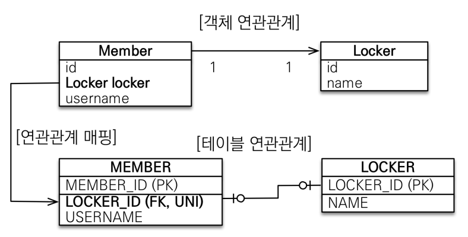
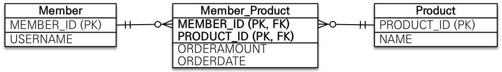

# 다양한 연관관계 매핑

## 연관관계 매핑시 고려사항 3가지
* 다중성
* 단방향, 양방향
* 연관관계의 주인

## 다중성
* 다대일: @ManyToOne
* 일대다: @OneToMany
* 일대일: @OneToOne
* 다대다: @ManyToMany

## 단방향, 양방향
* 테이블
  * 외래 키 하나로 양쪽 조인 가능
  * 사실 방향이라는 개념이 없음
* 객체
  * 참조용 필드가 있는 쪽으로만 참조 가능
  * 한쪽만 참조하면 단방향
  * 양쪽이 서로 참조하면 양방향

## 연관관계의 주인
* 테이블은 외래 키 하나로 두 테이블이 연관관계를 맺음
* 객체 양방향 관계는 참조가 2군데
* 이 둘중 테이블의 외래키를 관리할 곳을 지정해야함
* 연관관계의 주인: 외래키를 관리하는 참조
* 주인의 반대편: 외래키에 영향을 주지 않음, 단순 조회만 가능
    

# 다대일 (N:1)

## 다대일 단방향
* 가장 많이 사용하는 연관관계
* 다대일의 반대는 일대다

## 다대일 양방향
* `외래 키가 있는 쪽이 연관관계의 주인`
* 양쪽을 서로 참조하도록 개발

   

# 일대다 (1:N)

## 일대다 단방향
* 일대다 단방향은 `일(1)이 연관관계의 주인`
* 테이블 일대다 관계는 항상 `다(N) 쪽에 외래 키가 있음`
* 객체와 테이블의 차이 때문에 반대편 테이블의 외래키를 관리하는 특이하는 구조 - 권장하지 않는 방식
* @JoinColumn을 꼭 사용해야함. 그렇지 않으면 조인 테이블 방식을 사용함 - 장점도 있지만 성능상 단점이 있다.
* 일대다 단방향 매핑의 단점
  * 엔티티가 관리하는 외래키가 다른 테이블에 있음
  * 연관관계 관리를 위해 추가로 UPDATE SQL 실행 - 성능이슈(미미함)
* 일대다 단방향 매핑보다는 `다대일 양방향 매핑을 사용`하자

## 일대다 양방향
* 공식적으로는 존재하지 않으나 @JoinColumn(insertable=false, updatable=false) 속성값을 활용해서 억지로 맺을 수 있다.
* 읽기 전용 매핑을 해서 양방향처럼 사용하는 방식
* 다대일 양방향을 사용하는 것이 좋다.

   

# 일대일 (1:1)

* 일대일 관계는 그 반대도 일대일
* 주 테이블이나 대상 테이블 중 외래키 선택 가능
* 외래키에 데이터베이스 유니크(UNI) 제약 조건 추가
* 크게 네가지 방식으로 나뉨
  * 일대일: 주 테이블에 외래키 단방향
  * 일대일: 주 테이블에 외래키 양방향
  * 일대일: 대상 테이블에 외래키 단방향
  * 일대일: 대상 테이블에 외래키 양방향

## 일대일: 주 테이블에 외래키 단방향
* 다대일 단방향 매핑과 유사

## 일대일: 주 테이블에 외래키 양방향
* 마찬가지로 다대일 양방향 매핑과 유사
* `외래키가 있는 곳이 연관관계의 주인`
* 반대편은 mappedBy 적용

## 일대일: 대상 테이블에 외래키 단방향
* JPA에서 지원하지 않는다.
* 양방향 관계만 지원한다.

## 일대일: 대상 테이블에 외래키 양방향
* 사실 일대일 주테이블 외래키 양방향과 매핑 방법은 같다.
* 뒤집어놓은 상태라고 보면 된다.

## 일대일 정리
### 주 테이블에 외래키
* 주 객체가 대상 객체의 참조를 가지는 것처럼 주테이블에 외래키를 두고 대상 테이블을 찾음
* 객체지향 개발자 선호
* JPA 매핑 편리
* 장점: 주 테이블만 조회해도 대상 테이블에 데이터가 있는지 확인 가능
* 단점: 값이 없으면 외래키에 null 허용

### 대상 테이블에 외래키
* 대상 테이블에 외래키가 존재
* 전통적인 데이터베이스 개발자 선호
* 장점: 주 테이블과 대상 테이블을 일대일에서 일대다 관계로 변경할 때 테이블 구조 유지
* 단점: 프록시 기능의 한계로 지연 로딩으로 설정해도 항상 즉시 로딩됨

# 다대다 (N:M)
* 관계형 데이터베이스는 정규화된 테이블 2개로 다대다 관계를 표현할 수 없음
* 중간 연결 테이블을 추가해서 일대다, 다대일 관계로 풀어내야함

* 하지만 객체는 컬렉션을 사용해서 객체 2개로 다대다 관계가 가능하다.

## 다대다 매핑의 한계와 극복
* 편리해 보이지만 `실무에서 사용하지 않는다.`
* 연결 테이블이 단순히 연결만 하고 끝나지 않음
* 이 예시의 경우 주문시간, 수량 같은 기타 상세 데이터가 들어올 수 있음 -> 매핑 정보만 저장해야 하기 때문에 불가능
* 연결 테이블로 인해 의도치 않은 쿼리문도 등장하게 됨

* 연결 테이블을 엔티티로 승격해서 한계를 극복할 수 있으나 결국 다대일 연결과 같아진다.

## N:M 관계는 1:N, N:1로
* 테이블의 N:M 관계는 중간 테이블을 이용해서 1:N, N:1로 변경해서 사용한다.
* 실전에서는 중간 테이블이 단순하지 않다.
* @ManyToMany는 제약: 필드 추가X, 엔티티 테이블 불일치
* 실전에서 `@ManyToMany는 사용하지 않는다.`

## 각 어노테이션 속성

* @JoinColumn

* @ManyToOne

* @OneToMany
