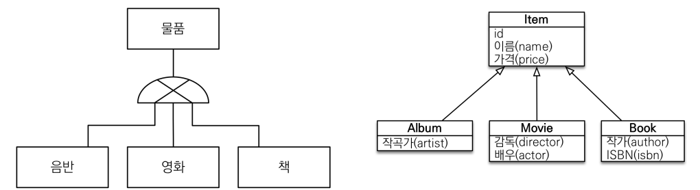
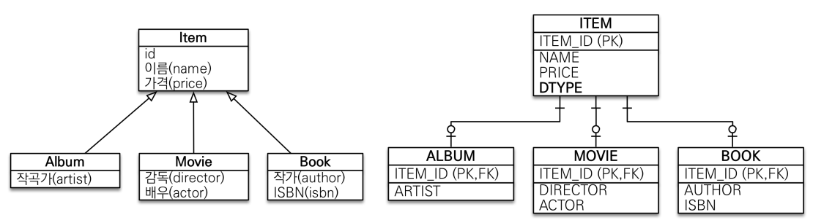
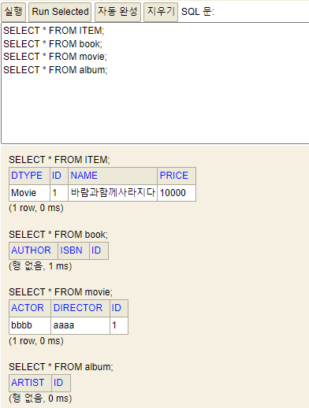
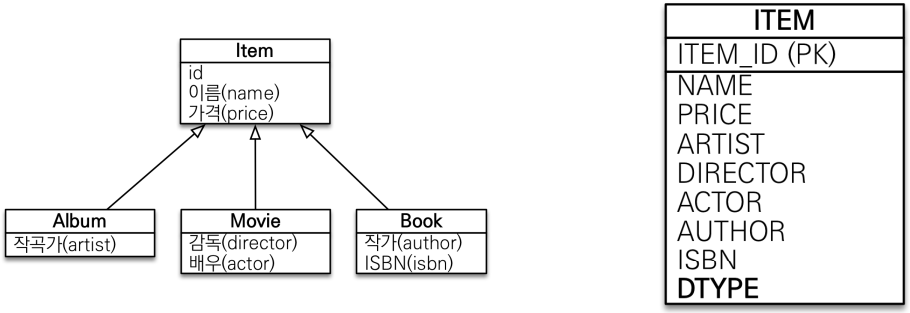
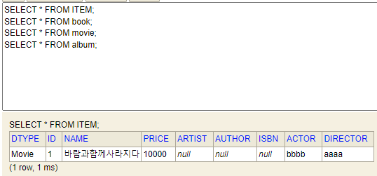
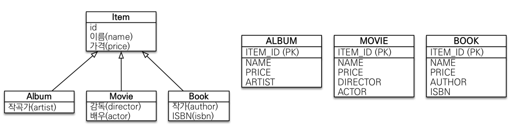

# 고급 매핑

## 상속관계 매핑
* 객체의 상속관계와 관계형 DB의 슈퍼타입 서브타입 관계를 매핑하는 것
* 관계형 데이터베이스는 상속 관계가 존재하지 않고 슈퍼타입 서브타입 관계라는 모델링 기법이 상속과 유사하다.

* 세가지 매핑 방법이 있다.
  1. 조인 전략 
  2. 단일 테이블 전략
  3. 구현 클래스마다 테이블 전략

### 주요 어노테이션
* @Inheritance(strategy = InheritanceType.XXX)
  * `JOINED` - 조인 전략
  * `SINGLE_TABLE` - 단일 테이블 전략
  * `TABLE_PER_CLASS` - 구현 클래스마다 테이블 전략
* @DiscriminatorColumn(name="DTYPE") - DTYPE 컬럼 추가(name필드에 이름 설정 가능)
* @DiscriminatorValue("XXX")

## **조인 전략**

* 장점
  * 테이블 정규화
  * 외래키 참조 무결성 제약조건 활용가능
  * 저장공간 효율화
* 단점
  * 조회시 조인을 많이 사용, 성능 저하
  * 조회 쿼리가 복잡함
  * 데이터 저장시 INSERT SQL 2번 호출

## **단일 테이블 전략**

* 장점
  * 조인이 필요 없으므로 일반적으로는 조회 성능이 빠름
  * 조회 쿼리가 단순함
* 단점
  * 자식 엔티티가 매핑한 컬럼은 모두 null 허용
  * 단일 테이블에 모든 것을 저장하므로 테이블이 커질 수 있다. 상황에 따라선 오히려 조회 성능이 느려질 수 있다.

## **구현 클래스마다 테이블 전략**

* 기본적으로 이 전략은 배제한다. 조회 성능도, 시스템적 변경시에도 매우 불리하며 이 때문에 객체지향적 측면에서나 DB적 측면에서나 추천하지 않는다.
* 장점
  * 서브 타입을 명확하게 구분해서 처리할 때 효과적이다
  * not null 제약조건 사용 가능
* 단점
  * 여러 자식 테이블을 함께 조회할 때 성능이 매우 느리다(UNION SQL 필요)
  * 자식 테이블을 통합해서 쿼리하기 어려움

# @MappedSuperclass

* 객체의 입장에서 겹치는 부분의 `공통 속성`이 존재할 때 `공통 매핑 정보를 모으는 역할`을 한다.
* 주로 등록일, 수정일, 등록자, 수정자 같은 전체 엔티티에서 `공통으로 적용하는 정보를 모을 때 사용`한다.
* 상속관계 매핑 X
* 엔티티 X, 테이블과 매핑 X
* 부모 클래스를 상속 받는 `자식 클래스에 매핑 정보만 제공`한다.
* 조회, 검색 불가능
* 따라서 추상 클래스로 생성하는 것이 권장된다.