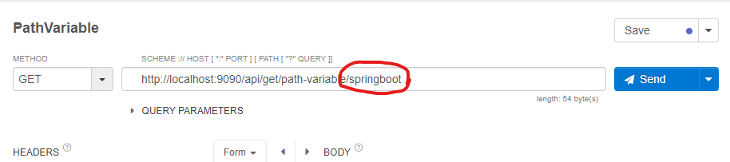
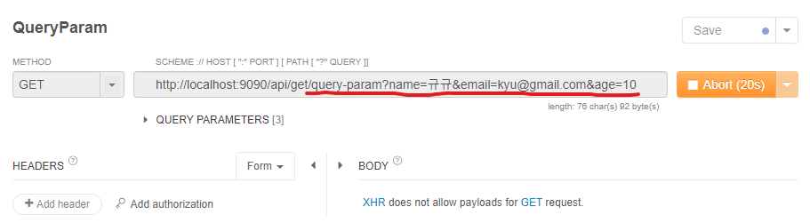
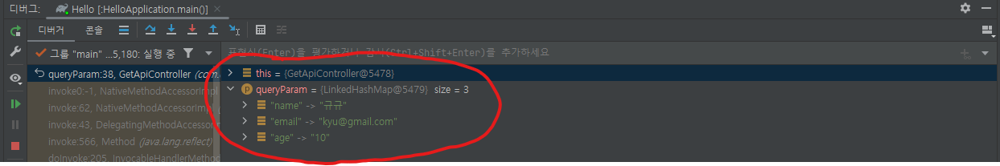
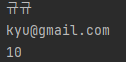

# GET API

* 메소드들의 특성


* GET 메소드는 URL에 데이터를 포함하여 데이터 조회에 적합하다.
* 바이너리 및 대용량 데이터 전송이 불가능하다.
* 요청 라인과 요청 헤더에 최대 크기 제한이 있다.(웹 서버가 제한함)

## GET 요청의 종류
1. 웹 브라우저 주소창에 URL을 입력하는 경우
2. 링크를 클릭하는 경우
3. 입력 폼의 메소드 속성값이 get인 경우

## GET 요청의 데이터 전달 형식
* GET으로 요청하는 경우 서버에 보낼 데이터는 URI에 붙인다.
```
http://localhost:9090/api/get/query-param?user=steve&email=steve@gmail.com&age=30
```
* ?: URI와 보낼 데이터를 구분(첫 파라미터)
* &: 데이터들을 구분
* =: 매개변수 이름과 값을 구분(이름:값)

## **Path Variable**

* path-variable을 사용해서 받은 resource를 식별할수 있다. 
* 받은 resource를 경로명으로 변수로서 서버단에 전달한다.
* 이번 예제에서 name이라는 데이터를 받아왔다.
  ```java
  // http://localhost:9090/api/get/path-variable/{name} "name"부분은 계속 바뀌는 변수

    @GetMapping("/path-variable/{name}")
    public String pathVariable(@PathVariable String name){

        System.out.println("PathVariable: "+name);
        return "";
    }
  ```

  
  

* name 속성을 활용해서 타 변수명과 겹치는 등의 에러를 방지할 수 있다. 이 때 어노테이션의 {}안의 값과 name 속성의 값을 일치시켜줘야 한다.

  

## **Query Parameter**
* "/users?id=123" 과 같은 get 파라미터를 사용해 서버로부터 id 변수를 얻을 수 있다. 
* Query String이 동작하는 방식이며 다음 코드와 이미지와 같이 사용자의 이름, 이메일, 나이를 변수로 받아왔다.
  ```java
  @GetMapping(path = "query-param")
    public String queryParam(@RequestParam Map<String, String> queryParam){

        StringBuilder sb = new StringBuilder();

        queryParam.entrySet().forEach( entry -> {
            System.out.println(entry.getKey());
            System.out.println(entry.getValue());
            System.out.println("\n");

            sb.append(entry.getKey()+" = "+entry.getValue()+"\n");
        });

        return sb.toString();
    }
  ``` 

  
  
  
  <br/><br/>  


* @RequestParam 어노테이션을 이용해 이름, 이메일, 나이를 변수로 받아 출력하는 메소드
  ```java
  @GetMapping("query-param02")
    public String queryParam02(
            @RequestParam String name,
            @RequestParam String email,
            @RequestParam int age
    ){

        System.out.println(name);
        System.out.println(email);
        System.out.println(age);

        return name+" "+email+" "+age;
    }
  ```
  
  
  
  <br/><br/>  
  

* 가장 많이 사용하는 형태로 @RequestParam 어노테이션을 사용하지 않고 따로 userRequest 클래스에 객체를 미리 정의해두어 입력만으로 변수를 받아올 수 있는 형태
  ```java
  @GetMapping("query-param03")
    public String queryParam03(UserRequest userRequest){

        System.out.println(userRequest.getName());
        System.out.println(userRequest.getEmail());
        System.out.println(userRequest.getAge());

        return userRequest.toString();
    }
  ```
  userRequest
  ```java
  public class UserRequest {

    private String name;
    private String email;
    private int age;

    ... getter, setter, toString 오버라이딩
  ``` 
* 이 방식에서 "address=서울시" 와 같은 값이 들어와도 해당 객체에 그 값이 없기 때문에 파싱되지 않는다.

## **Path Variable vs Query Parameter**
* 각 사용자를 위한 페이지를 만들려면 페이지마다 식별된 파라미터 경로가 필요한데 이 때 두 방식을 사용할 수 있다.
* 어떤 `resource를 식별`하고 싶을 때 `Path Variable`을 사용하고
* `정렬이나 필터링`을 하려면 `Query Parameter`를 사용하는 것이 좋다.
