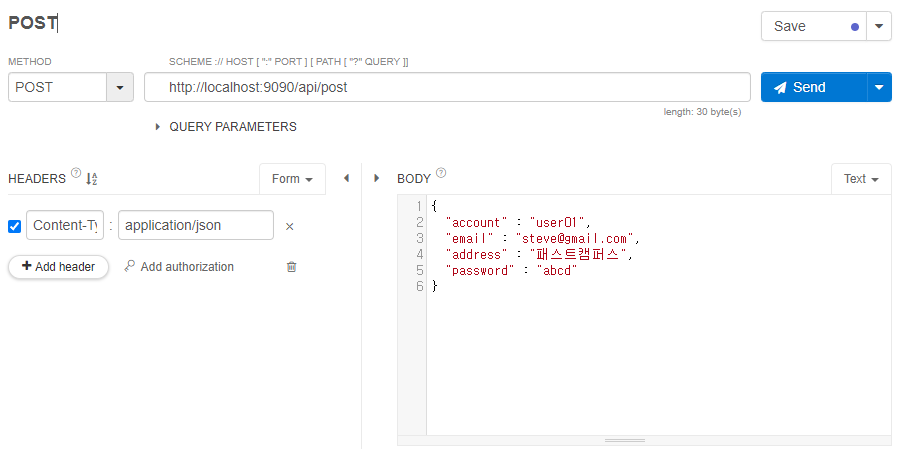
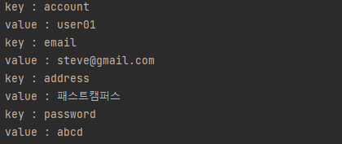
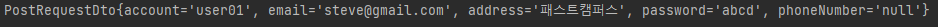

# POST API

* 데이터를 주고 받을 때 주로 JSON, XML을 이용하며 최근엔 JSON위주이다.
    ```json
    string : value
    number : value
    boolean: value { }
    object : value
    array  : value [ ]

    {
        "key" : "value"
    }

    {
        "phone_number" : "010-1155-5665", // Snake case: 단어마다 언더바(_)
        "phoneNumber" : "",   // Camel case: 자바처럼 두번째 단어부터 첫 글자 대문자로

        "age" : 10,
        "isAgree" : false,
        "account" : {
            "email" : "steve@gmail.com",
            "password" "1234"
        }
    }

    // user 조회 하는 경우
    {
        "user_list" : [
            {
                "account" : "abcd",
                "password" : "1234"
            },
            {
                "account" : "aaaa",
                "password" : "1111"
            }
            ...
        ]
    }
    {
        "account" : "abcd",
        "password" : "1234"
    }
    ```

* PUT 메소드와 비슷하게 데이터를 받을 때 다른 어노테이션을 사용하는 방법과 객체를 미리 정해두고 그냥 받는 방법이 있다.
* 첫 번째로는 @RequestBody 어노테이션을 사용하여 받는 방법이다.
    ```java
    @PostMapping("/post")
    public void post(@RequestBody Map<String, Object> requestData){
        requestData.forEach((key, value) -> {
            System.out.println("key : " + key);
            System.out.println("value : " + value);
        });
    }
    ```
    
    

* 두 번째 방법은 객체를 미리 정해두고 데이터를 받는 방식이다. 받아온 데이터를 활용하기 좋기 때문에 주로 사용된다.
 
    PostRequestDto.java
    ```java
    public class PostRequestDto {

        private String account;
        private String email;
        private String address;
        private String password;
        private String phoneNumber; // phone_number

        ...(getter, setter, toString 오버라이딩)
    }
    ```
    ```java
    @PostMapping("/post")
    public void post(@RequestBody PostRequestDto requestData){

        System.out.println(requestData);
    //  requestData.getAccount(); 와 같이 데이터를 활용할 수 있어짐
    }
    ```
    