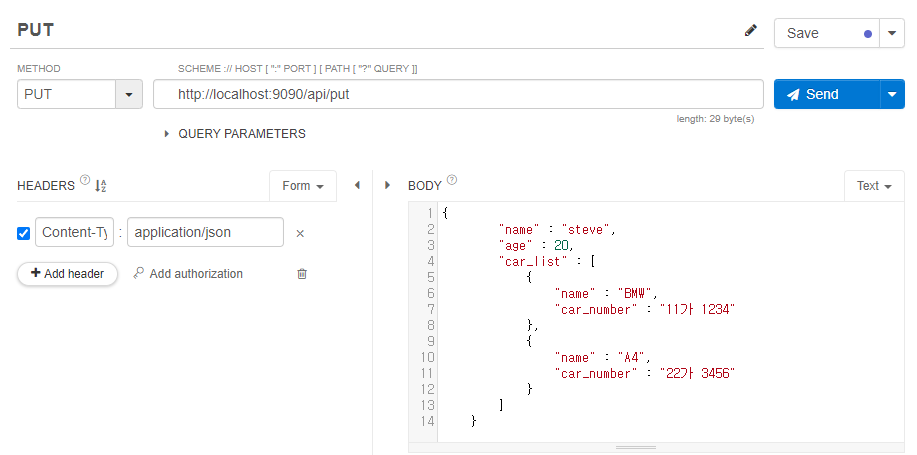
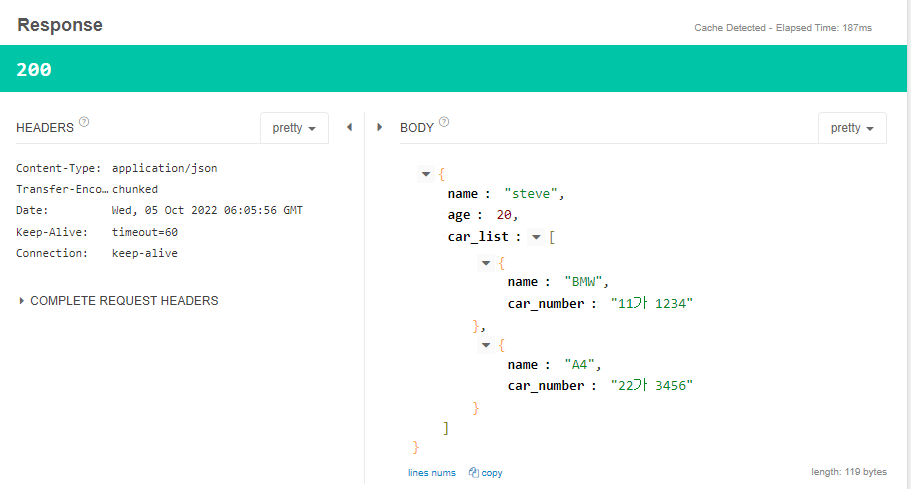

# PUT API

* JSON 디자인
    ```JSON
    {
        "name" : "steve",
        "age" : 20,
        "car_list" : [
            {
                "name" : "BMW",
                "car_number" : "11가 1234"
            },
            {
                "name" : "A4",
                "car_number" : "22가 3456"
            }
        ]
    }
    ```
    

* 입력받은 데이터가 JsonNaming이나 JsonProperty 등의 처리를 거쳐서 JSON으로 바뀌어서 Response로 내려간다.
    ```java
    @PutMapping("/put")
        public PostRequestDto put(@RequestBody PostRequestDto requestDto){
            System.out.println(requestDto);
            return requestDto;
        }
    ```
    

* PathVariable 활용 -> 활용 방법은 GET 메소드와 동일하다
    ```java
    @PutMapping("/put/{userId}")
        public PostRequestDto put(@RequestBody PostRequestDto requestDto, @PathVariable(name = "userId") Long id){
            System.out.println(requestDto);
            return requestDto;
        }
    ```
    
