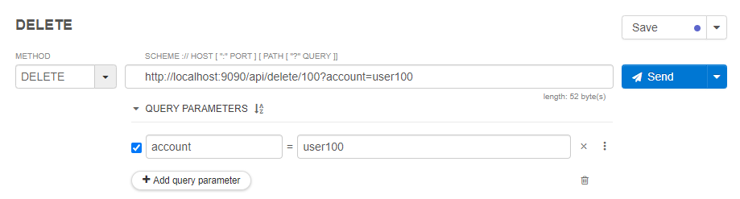
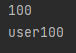

# DELETE API

* 리소스를 삭제하는 메소드로 PathVariable이 사용 가능하다.
    
    
    ```java
    @DeleteMapping("/delete/{userId}")
        public void delete(@PathVariable String userId, @RequestParam String account) {
            System.out.println(userId);
            System.out.println(account);
        }
    ```
    

