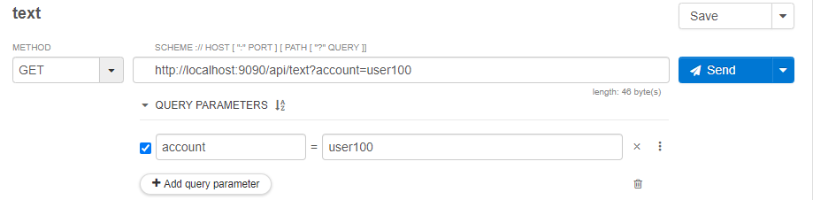
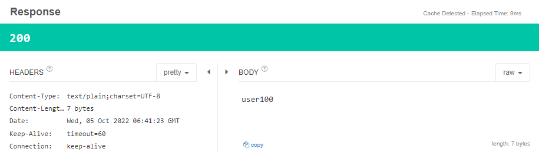
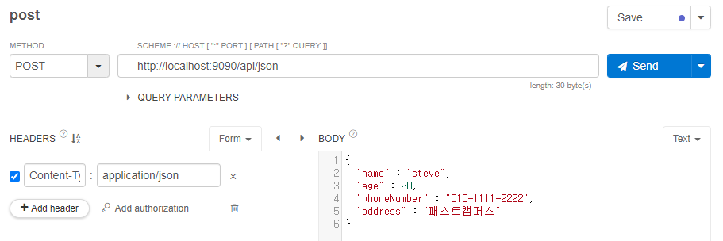
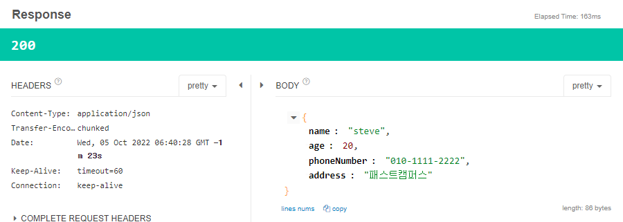
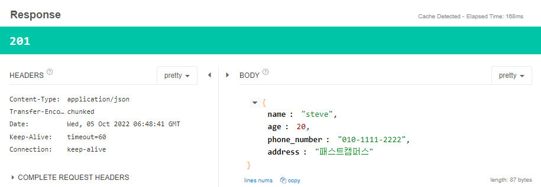
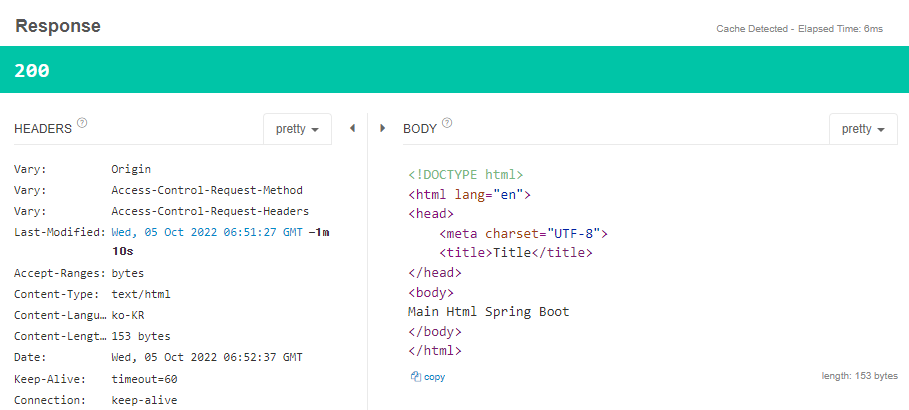
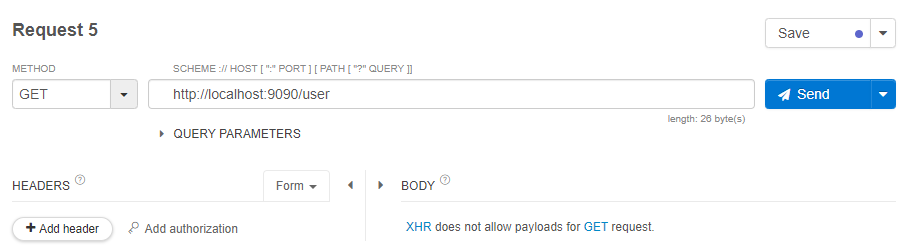
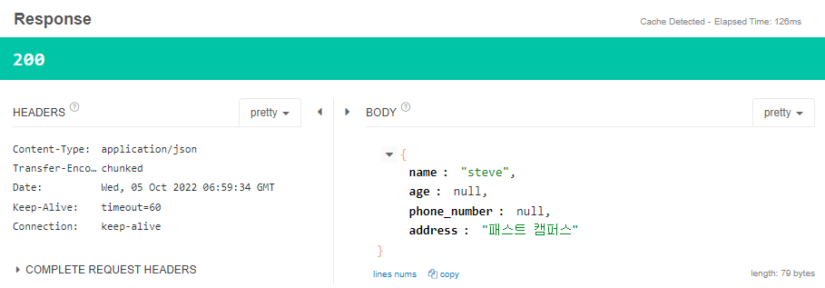
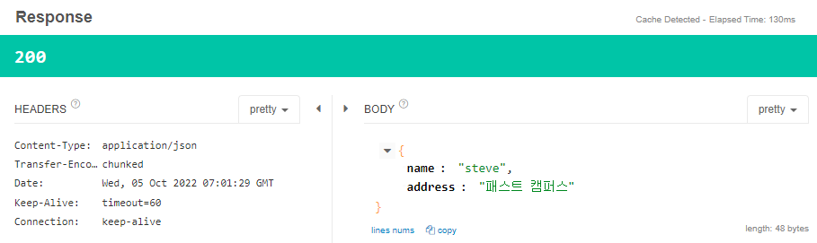

# Response 내려주기

## 리소스를 받아올 때
1. 단순 TEXT로 내려주는 경우 
   
     
   <br/><br/>  

2. JSON으로 내려주는 경우 -> 이 경우가 주를 이룬다.
   
   2-1.  

   
   
   ```java
   @PostMapping("/json")
   public User json(@RequestBody User user) {
       return user;
   }
   ```
   2-2. ResponseEntity : Body의 내용을 Object로 설정. 상황에 따라서 Http Status Code 설정.

   
   ```java
   @PutMapping("/put")
   public ResponseEntity<User> put(@RequestBody User user) {
       return ResponseEntity.status(HttpStatus.CREATED).body(user);
   }
   ```  
   <br/><br/>  

## 페이지 컨트롤러
* 다음 코드가 "http://localhost:9090/main"을 매핑 해준다. 이 때의 경로는 "resouces/static/main.html"이다.
    ```java
    @RequestMapping("/main")
        public String main(){
            return "main.html";
        }
    ```
    

* 다음 코드가 "http://localhost:9090/user"를 매핑 해준다. user() 메소드에서 따로 지정하지 않은 `age, phone_number는 각각 0, null값`으로 나온다.
    ```java
    @ResponseBody
    @GetMapping("/user")
    public User user() {
        var user = new User();
        user.setName("steve");
        user.setAddress("패스트 캠퍼스");
        return user;
    }
    ```
    
    

* age는 User클래스에서 int형으로 선언했기 때문에 0으로 초기화된 상태이다. phone_number와 같이 null값으로 받길 원하면 Integer형으로 바꿔주면 된다.
* 또, Response를 null값을 제외한 값만 내려주길 원한다면 다음과 같이 @JsonInclude 어노테이션을 사용하면 된다.
    ```java
    @JsonNaming(value = PropertyNamingStrategy.SnakeCaseStrategy.class)
    @JsonInclude(JsonInclude.Include.NON_NULL) // Null인 값을 빼주는 어노테이션(그외에도 규격에 따라 커스텀할 수 있는 옵션이 많음)
    public class User {

        private String name;
        private Integer age;
        private String phoneNumber;
        private String address;

        ...(getter, setter, toString오버라이딩)
    }
    ```
    

## 전체 코드
* /controller/ApiController
    ```java
    @RestController
    @RequestMapping("/api")
    public class ApiController {

        // TEXT
        @GetMapping("/text")
        public String text(@RequestParam String account){
            return account;
        }

        // JSON
        // req -> object mapper -> object -> method -> object -> object mapper -> json -> response
        @PostMapping("/json")
        public User json(@RequestBody User user) {
            return user;
        }

        @PutMapping("/put")
        public ResponseEntity<User> put(@RequestBody User user) {
            return ResponseEntity.status(HttpStatus.CREATED).body(user);
        }
    }
    ```
    


* /controller/PageController
    ```java
    @Controller
    public class PageController {

        @RequestMapping("/main")
        public String main(){
            return "main.html";
        }

        // ResponseEntity

        @ResponseBody
        @GetMapping("/user")
        public User user() {
            var user = new User();
            user.setName("steve");
            user.setAddress("패스트 캠퍼스");
            return user;
        }
    }
    ```

* /dto/User
    ```java
    @JsonNaming(value = PropertyNamingStrategy.SnakeCaseStrategy.class)
    @JsonInclude(JsonInclude.Include.NON_NULL) // Null인 값을 빼주는 어노테이션(그외에도 규격에 따라 커스텀할 수 있는 옵션이 많음)
    public class User {

        private String name;
        private Integer age;
        private String phoneNumber;
        private String address;

        ...(getter, setter, toString오버라이딩)
    }
    ```