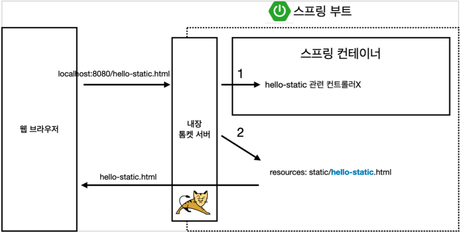
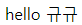
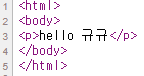
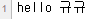
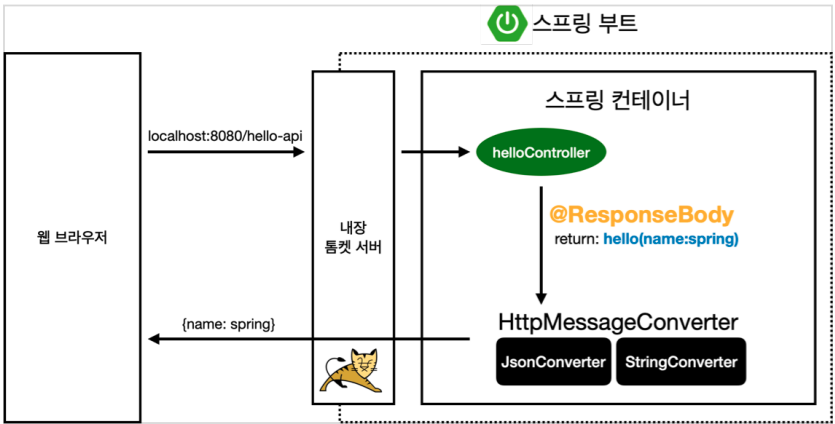
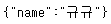

# 스프링 웹 개발 기초

* 웹을 개발하는 세 가지 방법
  * 정적 컨텐츠
  * 템플릿 엔진과 MVC
  * API

## 정적 컨텐츠
* 서버에서 별 처리 없이 파일을 그대로 웹 브라우저에 내려는 방식.
* "resouces/static/hello-spring.html" 을 생성하고 브라우저에서 "http://localhost:8080/hello-static.html"의 URL로 접속하면 관련 컨트롤러가 없을 경우 static안의 문서를 찾아서 내려준다.



## 템플릿 엔진과 MVC
* 서버에서 프로그래밍 해서 html을 동적으로 바꿔서 내려주는 것을 템플릿 엔진이라고 한다.
* 이 과정에서 사용되는 것이 MVC(Model, View, Controller)이다.
* View는 화면과 관련된 것, Controller가 서버에 관련된 비즈니스 로직같은 것을 관리한다. Model에 필요한 것들을 담아 넘겨주는 역할을 한다.
      

* 아래 메소드로 hello-mvc.html을 매핑해주면 단순 "http://localhost:8080/hello-mvc"의 경로로 접근하면 오류가 발생한다. 
* @RequestParam 어노테이션의 required= 옵션이 디폴트가 true라서 그렇다. false로 지정해주면 된다.
1. required 옵션을 안주고 디폴트로 true로 사용할 때
    ```java
    @GetMapping("hello-mvc")
    public String helloMvc(@RequestParam("name") String name, Model model) {
        model.addAttribute("name", name);
        return "hello-template";
    }
    ```
2. required 옵션 넣을 때
    ```java
    @GetMapping("hello-mvc")
    public String helloMvc(@RequestParam(value = "name", required = false) String name, Model model) {
        model.addAttribute("name", name);
        return "hello-template";
    }
    ```
      

    

    

    


## API
* JSON 형태의 데이터 포맷으로 클라이언트에게 데이터를 전달하는 방식.
* html 포맷으로 템플릿엔진이 처리해서 내려주는 mvc와 다르게 그냥 데이터 자체를 내려준다.
* mvc, api 방식의 차이
    ```java
    @GetMapping("hello-mvc")
    public String helloMvc(@RequestParam(value = "name", required = false) String name, Model model) {
        model.addAttribute("name", name);
        return "hello-template";
    }

    @GetMapping("hello-string")
    @ResponseBody
    public String helloString(@RequestParam("name") String name) {
        return "hello " + name; // "hello name"
    }
    ```
      

    

* 객체를 리턴했을 때 json으로 내려준다.
    
* @ResponseBody 를 사용
  * HTTP의 BODY에 문자 내용을 직접 반환
  * 'viewResolver' 대신에 'HttpMessageConverter'가 동작
  * 기본 문자처리: 'StringHttpMessageConverter'
  * 기본 객체처리: 'MappingJackson2HttpMessageConverter'
  * byte 처리 등등 기타 여러 HttpMessageConverter가 기본으로 등록되어 있음
* return hello 처럼 객체를 반환하면 json 형태로 내려주는 것을 알 수 있다.
    ```java
    @GetMapping("hello-api")
    @ResponseBody
    public Hello helloApi(@RequestParam("name") String name) {
        Hello hello = new Hello();
        hello.setName(name);
        return hello;
    }

    static class Hello {
        private String name;

        public String getName() {
            return name;
        }

        public void setName(String name) {
            this.name = name;
        }
    }
    ```
    