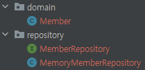

# 회원 관리 예제

## 비즈니스 요구사항 정리
* 데이터: 회원ID, 이름
* 기능: 회원 등록, 조회
* 아직 데이터 저장소가 선정되지 않음

  

* 컨트롤러: 웹 MVC의 컨트롤러 역할
* 서비스: 핵심 비즈니스 로직 구현
* 레포지토리: 데이터베이스에 접근, 도메인 객체를 DB에 저장하고 관리
* 도메인: 비즈니스 도메인 객체, 예) 회원 주문, 쿠폰 등등 주로 데이터베이스에 저장하고 관리됨  

  

* 데이터 저장소가 선정되지 않은 상태이기 때문에 인터페이스로 구현 클래스를 변경할 수 있도록 설계한다.
* 데이터 저장소는 RDB, NoSQL 등 다양한 저장소를 고민중인 상황으로 가정
* 개발을 진행하기 위해서 초기 개발 단계에서는 구현체로 가벼운 메모리 기반의 데이터 저장소 사용

## 회원 도메인과 리포지토리 만들기
* 회원 객체와 리포지토리 인터페이스, 그에 따른 구현체를 만들어 준다.  
      

    Member.java
    ```java
    public class Member {

    private Long id;
    private String name;

    ...(getter, setter)
    }
    ```

    MemberRepository.interface
    ```java
    public interface MemberRepository {
    Member save(Member member);
    Optional<Member> findById(Long id);
    Optional<Member> findByName(String name);
    List<Member> findAll();
    }
    ```

    MemoryMemberRepository.java
    ```java
    public class MemoryMemberRepository implements MemberRepository {
        private static Map<Long, Member> store = new HashMap<>();
        private static long sequence = 0L;

        @Override
        public Member save(Member member) {
            member.setId(++sequence);
            store.put(member.getId(), member);
            return member;
        }

        @Override
        public Optional<Member> findById(Long id) {
            return Optional.ofNullable(store.get(id));
        }

        @Override
        public List<Member> findAll() {
            return new ArrayList<>(store.values());
        }
        @Override
        public Optional<Member> findByName(String name) {
            return store.values().stream()
                .filter(member -> member.getName().equals(name))
                .findAny();
        }
        public void clearStore() {
            store.clear();
        }
    }


## 회원 리포지토리 테스트 케이스 작성
* 개발한 기능을 실행해서 테스트 할 때, 자바의 메인 메서드를 통해서 실행하거나, 웹 애플리케이션의 컨트롤러를 통해서 해당 기능을 실행할 수 있다. 
* 하지만 이런 방법은 준비하고 실행하는데 오래 걸리고 반복 실행하기 어렵고 여러 테스트를 한번에 실행하기 어렵다는 단점이 있다.
* 자바는 JUnit이라는 프레임워크로 테스트를 실행해서 이러한 문제를 해결한다.
    src/test/java/MemoryMemberRepositoryTest.java  

    
    ```java
    package hello.hellospring.repository;

    import hello.hellospring.domain.Member;
    import org.junit.jupiter.api.AfterEach;
    import org.junit.jupiter.api.Assertions;
    import org.junit.jupiter.api.Test;

    import java.util.List;

    import static org.assertj.core.api.Assertions.assertThat;

    class MemoryMemberRepositoryTest {

        MemoryMemberRepository repository = new MemoryMemberRepository();

        @AfterEach // 각 테스트가 끝나고 DB를 비워줄 필요가 있다. MemoryMemberRepository 클래스에 clearStore() 메소드를 구현하고 각테스트 마지막에 불러온다. @AfterEach어노테이션은 각 테스트 종료될 때마다 기능을 실행시키는 역할을 한다.
        public void afterEach() {
            repository.clearStore();
        }

        @Test
        public void save() {
            Member member = new Member();
            member.setName("spring");

            repository.save(member);

            Member result = repository.findById(member.getId()).get();

            System.out.println("result = " + (result == member)); // #1 단순 출력.
            Assertions.assertEquals(member, result); // #2 Assertion.assertEquals() 사용. 출력되는 내용은 없지만 값이 다르다면 오류코드가 출력된다.
            assertThat(member).isEqualTo(result); // #3 Assertions.assertThat() 사용
        }

        @Test
        public void findByName() {
            Member member1 = new Member();
            member1.setName("spring1");
            repository.save(member1);

            Member member2 = new Member();
            member2.setName("spring2");
            repository.save(member2);

            Member result = repository.findByName("spring1").get();

            assertThat(result).isEqualTo(member1); // 마찬가지로 출력되는 내용이 없지만 값이 다르다면 오류코드가 출력
        }

        @Test
        public void findAll() {
            Member member1 = new Member();
            member1.setName("spring1");
            repository.save(member1);

            Member member2 = new Member();
            member2.setName("spring2");
            repository.save(member2);

            List<Member> result = repository.findAll();

            assertThat(result.size()).isEqualTo(2);
        }
    }
    ```
