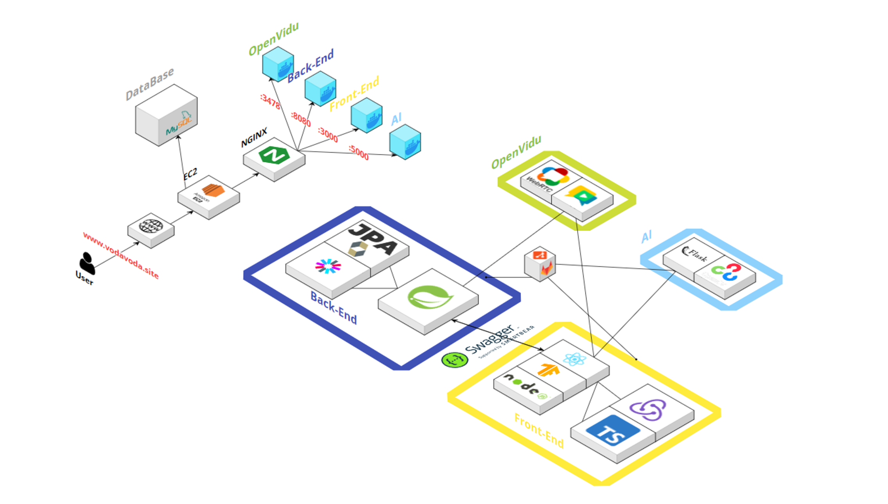
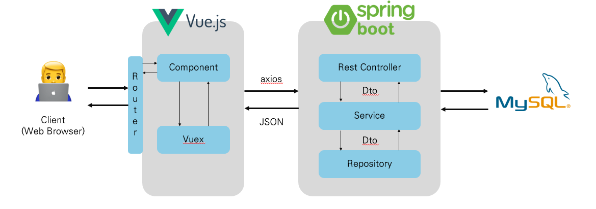

<h1 align='center' style="color:#337ea9; font-style: italic; font-weight: bolder">Project Experiences</h1>

## ***VODA***

### 프로젝트 내용 & 기간
[Github](https://github.com/project-VODA/VODA)
#### 삼성 청년 소프트웨어 아카데미(SSAFY) 공통 프로젝트 최우수상
#### 삼성 청년 소프트웨어 아카데미(SSAFY) 공통 프로젝트 UCC 우수상

* 2023.07.04 ~ 2023.08.18
* 시각장애인의 영상통화간 상대의 표정을 분석해서 안내해주거나 상대가 자신의 표정을 보낼 수 있는 비언어적 소통을 돕는 서비스입니다.
* 시각장애인 복지관에서 인터뷰 진행 후 색상 인식 서비스를 추가 했습니다.
* 전체 웹페이지는 두 가지 모드를 지원합니다.
  * 심플 모드 - WCAG(웹 콘텐츠 접근성 가이드라인) 을 준수해서 명도대비율이 높으며 각 요소들의 크기가 크고 스크린 리더가 모두 읽을 수 있으며 요소들의 숫자를 필요한 것들만 남겨 최소한으로 줄인 모드입니다.
  * 디테일 모드 - 일반적인 웹 페이지의 형태인 모드입니다.

### 역할
* Back-End - 회원 기능(마이페이지, 회원가입, 메일 인증, 임시 비밀번호 발급, 정보 수정, 유저 환경설정), 친구 기능(친구 검색, 추가, 삭제), 고객의 소리함(CRUD) 및 댓글(CRUD) api 구현
* Front-End - 전체 api에 대한 axios 요청, 토글에 따른 스크린 타입 제어, router, Redux 상태관리, 전역 스타일 및 세부 컴포넌트 scope style 제어, 컴포넌트 구현
* 프로젝트 기획 - 핵심 기능과 추가 기능 기획
* 트러블 슈터 - 백엔드, 프론트엔드를 모두 수행했기 때문에 대부분의 버그나 스타일 상의 트러블을 잡을 수 있었습니다.
* Jira Leader - 장, 단기 과제 선정 및 과제 분배 

### 아키텍처

### 사용한 기술
* Back-End - Spring Boot, JPA, MyBatis, MySQL
* Front-End - React.js, Redux, WebRTC
* AI - TF; Face-api.js, OpenCV, Yolo V5

### 회고
* 실제 사용자인 시각장애인 복지관에 찾아가서 인터뷰를 진행할 만큼 몰입해서 진행한 프로젝트였습니다.
* 팀원 6인으로 진행했으나 Front-End를 해본 인원이 없어 모두가 생소한 기술을 열정 하나로 학습과 실제 결과물까지 낼 수 있었습니다.
* Front-End와 Back-End 모두 개발한 경험을 통해 프로젝트의 전체에 대한 이해도가 깊어졌고 이 경험은 앞으로 큰 자산이 될 것 같습니다. 
* WebRTC와 AI라는 생소한 기술 도메인을 웹에 융합하는 과정에서 신기술에 대해서 어떻게 접근하고 이해해야 하는지, 해당 파트의 팀원과 어떻게 협업해야 하는지에 대해서 배웠습니다.
* 효율적인 개발을 위해 팀 컨벤션(코드, 깃플로우)를 적극 사용했으며 Jira를 통한 일정관리를 통해 어느 한 명도 뒤쳐지지 않는 결과를 낼 수 있었습니다.
* 형상관리, 일정관리에 더해 트러블슈팅이나 회의같은 다른 항목들도 문서화하고 기록함으로써 협업에서의 중요한 부분, 마인드셋을 배울 수 있었습니다.

## ***TripMate***

### 프로젝트 개요 & 주요 기능
[Github](https://github.com/KUMA93/TripMate)
* 2023.05.18 ~ 2023.05.25
* 엔데믹 상황에서의 국내 여행 수요 증가에 부합하는 지도 기반 여행지 추천, 여행지 평가, 지역별 날씨 정보 서비스입니다.

### 역할
* Back-End - 회원 기능 전반 api, 자유게시판 (CRUD) api, 핫플레이스(관광지 추천 게시판 CRUD) api, 좋아요 api 구현
* Front-End - 전체 api에 대한 axios 요청, 돋보기 모드에 따른 요소 제어, router, Vuex 상태관리, 컴포넌트 구현
* 프로젝트 기획 - 핵심 기능과 추가 기능 기획
* Jira Leader - 장, 단기 과제 선정 및 과제 분배 

### 아키텍처

### 사용한 기술
* Back-End - Spring Boot, MyBatis, MySQL
* Front-End - VUE.js

### 회고
* 팀원도 2명이고 일주일 간의 짧은 시간 내에 완성한 간단한 프로젝트였지만 배운 것을 통해 능동적으로 결과물을 만들어 내는 것이 주는 즐거움을 깨달았습니다.
* 제한된 시간 내에 주어진 요구사항을 구현해 나가는 재미와 추가기능을 고민하고 구현 방법을 모색해 나가는 과정이 개발자로서의 아이덴티티를 확립해주었습니다.
* 개발자로서 진행해 본 프론트엔드와 백엔드가 완성된 첫 프로젝트여서 애착도 많이 갔습니다. 이론적으로 학습한 것과 실제 프로젝트를 진행하면서 코드를 작성할 때의 어려움이 다르다는 것을 느꼈습니다.