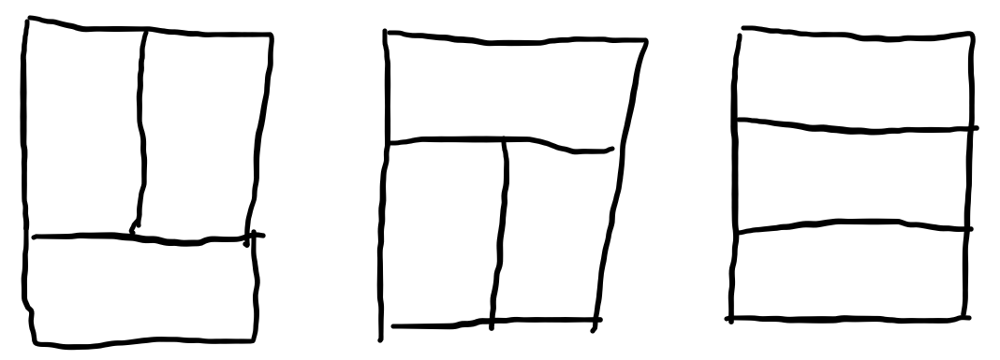
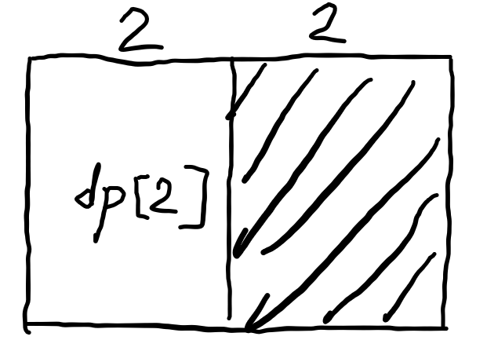
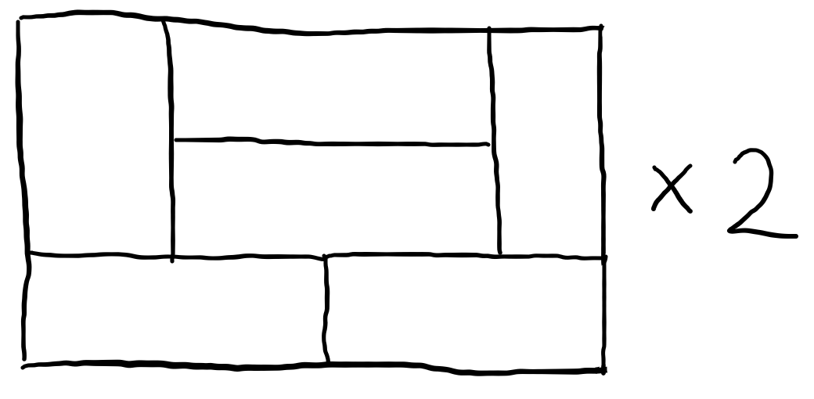
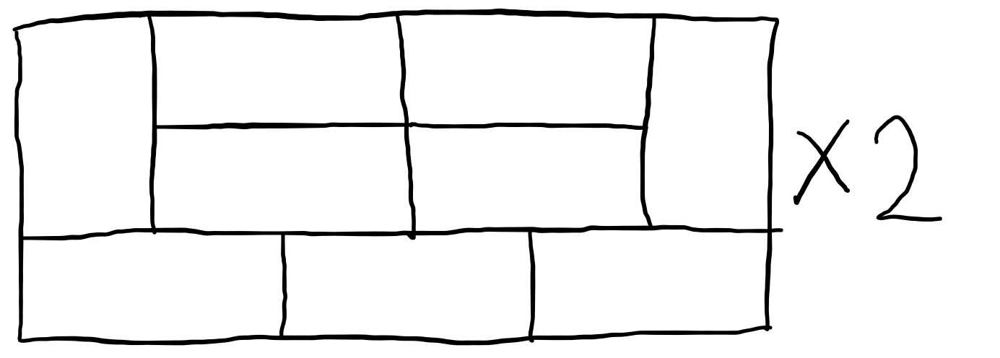
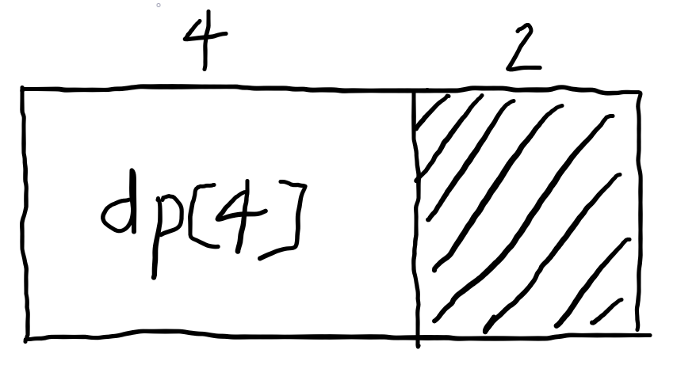

# DP.gold

## 1520 내리막길 - 메모리:127124KB	시간:232ms
* 인강에서 매우 유사한 등산경로라는 문제를 풀었어서 그대로 풀었더니 시간초과가 나온다
  ```python
  def DFS(x, y):
      global cnt
      if x==m-1 and y==n-1:
          cnt+=1
      else:
          for i in range(4):
              xx=x+dx[i]
              yy=y+dy[i]
              if 0<=xx<n and 0<=yy<n and ch[xx][yy]==0 and board[x][y]>board[xx][yy]:
                  ch[xx][yy]=1
                  DFS(xx, yy)
                  ch[xx][yy]=0
  ```
* `캐쉬 값이 0인 경우에 탐색하지 않았던 곳으로 판별`하는 것이라서 `다른 경로로 같은 지점을 방문할 시에 또 탐색`하는 낭비가 벌어져서 그런것 같아서 캐쉬를 손봐야겠다고 생각이 들었다.
* 아예 cnt 변수에다가 경로수를 지정하는게 아니고 `캐쉬가 해당 지점에서의 목적지까지의 경로수를 나타내면` 경로 수가 이미 있는 지점에 도달하면 해당 경로를 더하고 끝날것이라고 생각이 들었다.
  ```python
  def DFS(x, y):
      if x==m-1 and y==n-1:
          return 1
      else:
          if ch[x][y]==-1: #방문 하지 않은 곳일 경우
              ch[x][y]=0
              for i in range(4):
                  xx=x+dx[i]
                  yy=y+dy[i]
                  if 0<=xx<m and 0<=yy<n and board[x][y]>board[xx][yy]:
                      ch[x][y] += DFS(xx, yy) #재귀 호출과 동시에 캐쉬값에 앞선 경로들의 가지수를 더해준다
      return ch[x][y]
  ```
* 전과 다르게 `캐쉬 값을 -1로 초기화` 시키고 해당 지점에서 경로수를 저장하는 식으로 구현했다. 
## 2133 타일 채우기 - 메모리:113112KB	 시간:108ms
* 실버 타일 채우기와 다르게 생각할 패턴이 추가되어 훨씬 어려웠다. 규칙을 몇개 정해보자면
  1. `n이 홀수`일 경우에 `3*n도 홀수`가 되어 주어진 타일로 `채울 방법이 없다` 
  2. `n이 짝수`일 경우에 `1*2 타일을 짝수개 사용`해야 채울 수 있다
* 처음에 점화식을 세울 때 큰 변수가 없을 거라 생각하고 `dp[2]와 dp[4]`의 경우만 생각했다
  > * `dp[2]`의 경우 다음과 같은 가장 `최소의 단위길이`에서 생길 수 있는 형태 `3가지`가 나온다.
  >        
  > * `dp[4]`의 경우 길이를 2, 2로 나눠서 생각해보면 다음과 같은 `dp[2]`와 `정형화된 모양`이 나온다.
  >     
  > * 이외에 새로 생기는 다음과 같은 `고유모양`이 상하반전으로 `2가지`가 있다.   
  >     
  > * 이 과정을 통해 도출해낸 점화식은 `dp[i] = 3 * dp[i-2] + 2`

  <br/>   
  
* 당연하게 틀렸고 결국 `dp[6]과 그 이상`일 때를 생각해봤다.
  > * 6일때 새로 생겨나는 `고유문양`이 상하반전으로 `2가지`   
  >        
  > * dp[6]의 길이를 4, 2로 나눠서 생각하면 다음과 같은 `dp[4]`와 `정형화된 모양`이 나온다.
  >        
  > * 2, 4로 나눠서 생각하면 `dp[2]`와 `길이4에서 생긴 고유모양`이 나온다.
  > * n이 그 이상일 때를 대입해서 생각해보면 점화식은 다음과 같이 도출된다.
  > * dp[i] = 3 * dp[i-2] + dp[i-4] * 2 + dp[i-6] * 2 + ... + dp[2] * 2 + 2 

<br/>   

* dp 작성 부분 코드
  ```python
  for i in range(4, n+1):
    if i%2==0:
        dp[i]=3*dp[i-2] + 2*sum(dp[:i-2])
    else:
        dp[i]=0
  ```
* dp 점화식 마지막 +2를 더해주기 위해서 `dp[0]`을 `1`로 초기화 시켜준다.

## 2225 합분해 - 메모리:114488KB	시간:116ms
* `dp[n][k]`를 정수n을 k가지 정수로 `나누는 가지수`라고 하면
* 직접 경우의 수를 세어보면 `dp[n][k]`는 `(0, (n을 k-1개의 정수로 나눈 것))`, `(1, (n-1을 k-1개의 정수로 나눈 것))`, ... , `(n, (0을 k-1개의 정수로 나눈 것))`이 된다.
* 이를 점화식으로 나타내면 다음과 같다.
  ```python
  dp[n][k] = dp[n][k-1] + dp[n-1][k-1] + dp[n-2][k-1] + ... + dp[0][k-1]
  ```
* 이 단계에서 바로 코드를 작성하려 했으나 작성하다 보니 3중 반복문이 되어 시간복잡도가 O(N^3)으로 꽤 높게 나와서 어떻게 해결해야 하나 한참 고민했다. 
* 점화식의 (n-1, k) 일 때를 보면,
  ```python
  dp[n-1][k] = dp[n-1][k-1] + dp[n-2][k-1] + ... + dp[0][k-1]
  dp[n][k] = dp[n][k-1] + (dp[n-1][k-1] + dp[n-2][k-1] + ... + dp[0][k-1])
           = dp[n][k-1] + dp[n-1][k]
  ```
* dp 코드
  ```python
  for i in range(2, k+1):
      for j in range(2, n+1):
          dp[i][j]=dp[i-1][j]+dp[i][j-1]
  ``` 
## 2294 동전2 - 메모리:30840KB  시간:520ms
* 처음에 `dp[n][k]`를 `n번째 동전까지 사용`했을때 `k원을 채우는 최소 동전 개수`로 설정했었다.
* 입력 받은 동전을 작은 액수부터 정렬하고 dp를 k의 최대범위보다 큰수로 초기화 시켜준다.
  ```python
  dp=[[10001]*(n+1) for _ in range(k+1)]
  dp[0][n]=0
  for i in range(n):
      coin.append(int(input()))
  coin.sort()
  ```
* dp 작성 부분은 `해당 동전으로 k값을 나눌 수 있으면 그 값으로 저장`, 그게 아니라면 `그값만큼 k에서 빼준값의 dp값 +1`과 `해당 동전을 사용하지 않았을 때의 dp값`중 `작은 값` 저장
  ```python
  for i in range(1, k+1):
      for j in range(1, n+1):
          dp[i][j]=dp[i][j-1]
          if i%coin[j]==0:
              dp[i][j]=i//coin[j]
          elif i-coin[j]>=0:
              dp[i][j]=min(dp[i][j], dp[i-coin[j]][n]+1)
  ```
* 위 2차원 dp 코드를 작성하다보니 어차피 dp[i][j] 값을 정하는데 dp[i][x]의 정보는 거의 사용 하지 않는다는 생각이 들어 굳이 2차원 dp일 필요는 없겠다라는 생각이 들어 `k값을 채우는 최소 동전 개수`만 을 저장하는 1차원 `dp[k]`로 수정했다
  ```python
  for i in range(1, k+1):
      for j in range(1, n+1):
          if i<coin[j]:
              continue
          else:
              dp[i]=min(dp[i], dp[i-coin[j]]+1) 
  ```
* 자원 차이가 꽤 난다.
  |  |2차원 dp|1차원 dp|
  |:---:|:---:|:---:|
  |메모리|68536KB|30840KB|
  |시간|992ms|520ms|
   

## 3687 성냥개비 - 메모리:115272KB  시간:148ms
* 맞게 푼건지는 잘 모르겠지만 상당히 조잡하게 풀었다.
* `주어진 성냥개비의 개수 n`에 따라 만들 수 있는 `최대 숫자를 저장`하는 `dpMax[n]`
* `주어진 성냥개비의 개수 n`에 따라 만들 수 있는 `최소 숫자를 저장`하는 `dpMin[n]`
* 성냥개비 2개~7개까지 만들 수 있는 숫자는 다음과 같다.
  |성냥 개수|생성 가능 숫자|
  |:---:|:---:|
  |2|1|
  |3|7|
  |4|4|
  |5|2, 3, 5|
  |6|0, 6, 9|
  |7|8|
* n에 따른 최대 숫자는 1의 자리부터 최소치의 성냥개비개수를 사용하며 자리수를 늘려야 한다. 따라서 `가장 성냥개비를 적게 사용`하는 `'1'`로 채우면서 자리수를 올리며 `더 자리수를 늘릴 수 없을 때` `남은 성냥개비(2개 혹은 3개)`로 `가장 큰수(1 혹은 7)`를 첫자리로 한다. 
* 이를 점화식으로 나타내면 `dpMax[i]=dpMax[i-2]+dp[2]` 이다.
  ```python
  for i in range(4, n+1):
      dpMax[i]=dpMax[i-2]+dpMax[2]
  ```
* n에 따른 최소 숫자는 반대로 최대치의 성냥개비수를 사용하며, 또 그 값이 최대로 되게 하며 자리수를 늘려야 한다. 첫 자리에 0이 올 수 없는 규칙도 있다.
* n에 따른 최소치를 살펴보면 n이 `7까지는 각 성냥개비수로 만들 수 있는 수중에 최소값(0제외)이 최소 숫자`가 되고 8부터는 `n`을 `(n-x)`와 `x`로 `나눠서 생각`했을 때 `두 최소숫자를 합친(문자열의 개념으로)값이 최소 숫자`가 된다.
  |성냥 개수|2|3|4|...|8|9|10|11|
  |:-:|:-:|:-:|:-:|:-:|:-:|:-:|:-:|:-:|
  |최소 숫자|1|7|4|...|10|18|22|20|
  |n, x|1|7|4|...|2+6|2+7|5+5|5+6|
* 이를 점화식으로 나타내면 `dpMin[i]=dpMin[i-j]+dpMin[j]` 이다.
  ```python
  for i in range(8, n+1):
      for j in range(2, i):
          # j가 6일 때는 같은 성냥개수의 더 작은 값인 0을 더해준다
          if j==6:
              dpMin[i]=str(min(int(dpMin[i]), int(dpMin[i-j]+'0'))) 
          else:
              dpMin[i]=str(min(int(dpMin[i]), int(dpMin[i-j]+dpMin[j])))
  ```
* dp를 한 배열로 해서 각 요소를 Max값 Min값을 동시에 담는 리스트로 할까도 생각했는데 굳이 합쳐도 이득볼게 코드가 보기에 좋다는 점밖에 없어서 하지 않았다.

## 11066 파일합치기 - 메모리:126092KB	시간:1552ms
* i부터 j까지의 최소 비용합을 나타내는 dp를 구상하고 그 최소 비용합이 구해지는 원리를 살펴보자면 어떤 3개 이상의 수의 비용합을 구할 때는 `첫 단계의 비용합 + ... + 마지막 i부터 j까지의 비용의 합`의 형태이고 `마지막 i부터 j까지의 비용의 합`은 어떤 식으로 계산하던 고정이 된다.
  ```
  file = [40, 30, 30]
  (40 30) 30 = 첫 단계 비용합(70) + 마지막 단계 비용합(100) = 170
  40 (30 30) = 첫 단계 비용합(60) + 마지막 단계 비용합(100) = 160
  ```
* 따라서 최소 비용합을 결정하는 것은 마지막이 아닌 `그 이전의 비용`이다.

* 실패코드 - 여기에서 부분합을 이용해서 최종 최소 비용합을 구하는 아이디어를 생각해냄
  ```python
    for i in range(k):
        dp[i][i]=file[i]
    for i in range(k, -1, -1):
        if i<k-1:
            dp[i][i+1]=dp[i+1][i+1]+dp[i][i]
    j=2
    while j<k:
        for i in range(k-j):
            dp[i][i+j]=min(dp[i+1][i+j]+dp[i][i], dp[i][i+j-1]+dp[i+j][i+j])
            # 처음에는 min(2*dp[i+1][i+j]+dp[i][i], 2*dp[i][i+j-1]+dp[i+j][i+j])
            # 로 무식하게 두번 더해지는 요소 값을 계산해주는 방식으로 구현하려했다
            # 몇 번 실패뒤에 이 방식으론 k값이 커질수록(사실 3이상만 되도) 
            # 잘못된 최소 비용이 나온다는 것을 알고 다른 방법을 모색
        j+=1
  ```
  ```
  [40, 70, 100, 150]
  [0, 30, 60, 110]
  [0, 0, 30, 80]
  [0, 0, 0, 50]
  ```

* 코드 
  ```python
     dp=[[0]*k for _ in range(k)]
     for i in range(k-1):
         dp[i][i+1] = file[i] + file[i+1]
         for j in range(i+2, k):
             dp[i][j] = dp[i][j-1] + file[j]

     for d in range(2, k):
         for i in range(k-d):
             j=i+d
             dp[i][j] += min([dp[i][x] + dp[x+1][j] for x in range(i, j)])

     print(dp[0][k-1])
  ```
  ```
  [0, 70, 160, 300]
  [0, 0, 60, 170]
  [0, 0, 0, 80]
  [0, 0, 0, 0]
  ```